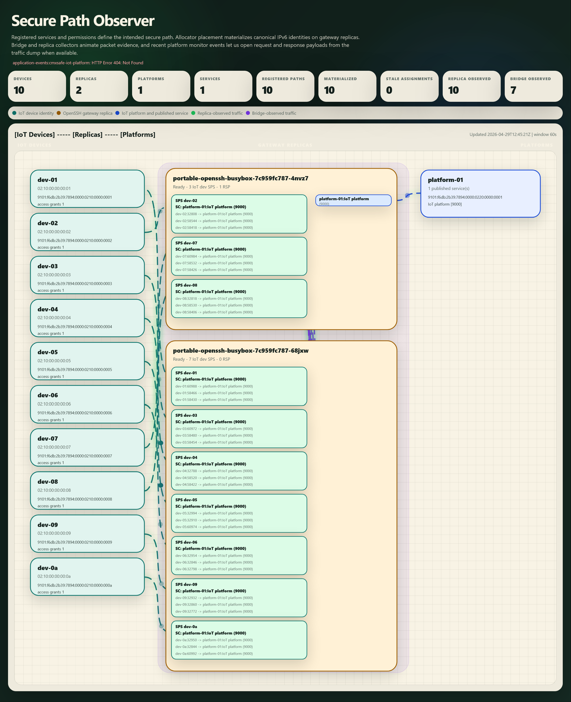
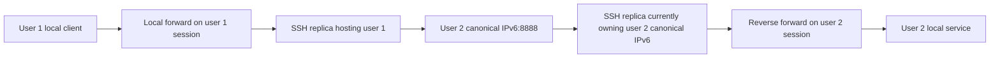
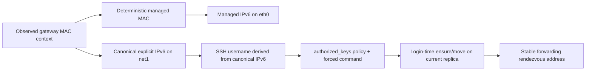

# CMXsafeMAC-IPv6

CMXsafeMAC-IPv6 is an identity-and-rendezvous system for OpenSSH in replicated Kubernetes environments.

The real product goal is:

- make `ssh -L` and `ssh -R` meet reliably when sessions are load-balanced across replicas
- preserve end-to-end connectivity even when the active SSH session moves to another pod replica
- provide resilience and scalability for proxy-layer relays without depending on a single SSH pod

The way it achieves that is by tying one logical identity across:

- deterministic pod MAC management
- deterministic managed IPv6 assignment
- canonical movable IPv6 identities on `net1`
- SSH usernames derived from those canonical IPv6 identities
- `authorized_keys` policy and forced-command hooks that ensure the canonical IPv6 is active on the replica currently hosting the SSH session




## Problem First

With one SSH replica, local forwarding and reverse forwarding can rendezvous through one shared `sshd` instance.

That breaks once Kubernetes load-balances SSH sessions across replicas:

- user A opens a local forward with `-L`
- user B opens a reverse forward with `-R`
- both connect through the same Service
- Kubernetes may place them on different replicas
- server-side `127.0.0.1` is replica-local, so the two sessions no longer share the same rendezvous point

So the real problem is:

> how can two SSH sessions that terminate on different replicas still find the same logical forwarding endpoint?

## Solution In One Picture



The key difference is the middle hop:

- user 1 does **not** target replica-local loopback
- user 1 targets user 2's canonical IPv6
- that canonical IPv6 moves to the replica currently hosting user 2's SSH session

This turns:

- "which replica did the other session land on?"

into:

- "where is this canonical identity currently active?"

## Identity Chain

The forwarding path works because the same logical identity is carried across multiple layers:

1. the pod gets a deterministic managed MAC
2. that MAC and gateway context produce deterministic IPv6 identities
3. one canonical explicit IPv6 becomes the movable rendezvous identity
4. the SSH username is derived from that canonical IPv6 with the colons removed
5. the SSH key policy and forced command ensure that identity is attached to the replica that accepted the session
6. other sessions forward traffic to that canonical IPv6 instead of to replica-local loopback



## Core Elements

These are the core identity engine that makes the OpenSSH forwarding goal possible:

- `net-identity-allocator`
  the control-plane service that decides MAC, managed IPv6, and canonical explicit IPv6 ownership
- PostgreSQL
  the persistent source of truth for allocations, explicit assignments, and the SSH dashboard state
- `CMXsafeMAC-IPv6-node-agent`
  the node-local executor that enters pod network namespaces and applies the desired identity
- Tetragon
  the main live runtime trigger for the node agent
- Multus `explicit-v6-lan`
  the shared `net1` secondary network where canonical explicit IPv6 identities live
- managed workload pods or SSH pods
  the actual replicas that receive and use those identities

If you stripped the project down to the minimum identity engine, this is the part you would keep.

## Primary SSH Surface

These pieces are the direct product-facing OpenSSH layer built on top of the core identity engine:

- `portable-openssh-busybox`
  the replicated SSH service that receives the actual `-L` and `-R` sessions
- `portable-openssh-dashboard`
  the PostgreSQL-backed UI and reconcile worker that renders users, groups, keys, and SSH policies
- the SSH PVC-backed runtime files
  the rendered `passwd`, `group`, `authorized_keys`, and runtime bundle used by the SSH pods

This is the layer that turns the lower-level identity engine into a usable SSH forwarding system.

## Add-Ons And Observation

Not every component is equally essential to the main goal.

These are useful add-ons rather than the core forwarding engine itself:

- PHP monitor
  operational visibility into allocator and traffic data
- traffic collector
  flow visibility on the explicit `net1` lane
- toolbox
  convenience for in-cluster testing and benchmarking
- MkDocs site and generated reference pages
  reader-facing documentation and code navigation

Observation:

- if the goal is the OpenSSH forwarding product, the allocator, PostgreSQL, node agent, Multus lane, OpenSSH pods, and SSH dashboard are the meaningful center
- the monitor, collector, toolbox, and docs site are supporting surfaces that can be added or removed without changing the core identity-and-rendezvous design

## How The Core Engine Works

The core engine manages network identity for pods that are explicitly marked for allocator handling.

By default, a pod is managed only if it has this label:

```yaml
  pods-mac-allocator/enabled: "true"
```

For those managed pods:

- MAC allocation is automatic and deterministic
- one managed allocator IPv6 can be assigned automatically on `eth0`
- one automatic managed IPv6 can be assigned automatically on `net1`
- additional canonical explicit IPv6 addresses can be added later on `net1` from outside the pod namespace
- the application container does not need `ip`, `NET_ADMIN`, or custom networking logic
- the explicit `net1` path requires Multus plus the `explicit-v6-lan` network attachment
- sample manifests attach the shared secondary network with:

```yaml
  k8s.v1.cni.cncf.io/networks: '[{"name":"explicit-v6-lan","interface":"net1"}]'
```

In the Kubernetes deployment path, the allocator stores its state in PostgreSQL through:

- one `StatefulSet`
- one `Service`
- one `PVC`
- one Secret-backed credential template

## Managed MAC And IPv6 Model

The base managed MAC for a pod is derived automatically from:

- the original gateway MAC head 4 bytes
- a stable 2-byte collision counter

So the managed MAC format is:

```text
GW_HEAD_4 | COUNTER_2
```

The managed allocator IPv6 is also derived automatically from the allocator IPv6 prefix plus that counter-based index.

This means the allocator can deterministically derive one managed MAC and one managed IPv6 for each currently active managed pod allocation.

Managed IPv6 characteristics:

- interface: `eth0`
- purpose: the pod's allocator-owned primary IPv6 identity
- shape: `configured /64 + (counter + 1)`
- lifecycle: one managed IPv6 per managed allocation row

## Automatic Managed net1 IPv6 Model

Each managed pod can also receive one automatic `net1` IPv6 derived from the same gateway MAC and managed counter.

The current layout is:

```text
AUTO_PREFIX_2_BYTES | MAC_GW_6_BYTES | (counter + 1) | 00:00:00:00:00:00
```

In the current manifest, `AUTO_PREFIX_2_BYTES` is configured as `fd00`.

Automatic managed `net1` IPv6 characteristics:

- interface: `net1`
- purpose: deterministic secondary-lane identity for the managed pod itself
- shape: `AUTO_PREFIX_2_BYTES | MAC_GW_6_BYTES | (counter + 1) | 00..00`
- lifecycle: one automatic `net1` IPv6 per managed allocation row
- storage: exposed on the allocation row as `auto_managed_explicit_ipv6`; not stored as a caller-driven explicit assignment row

## Explicit Extra IPv6 Model

Extra IPv6 addresses are attached on demand as canonical explicit identities.

The explicit IPv6 layout is:

```text
PREFIX_2_BYTES | MAC_GW_6_BYTES | 0000 | MAC_DEV_6_BYTES
```

Where:

- `PREFIX`
  a 2-byte tag chosen by the caller
- `MAC_GW`
  the original 6-byte gateway MAC stored in the pod allocation row
- `MAC_DEV`
  a 6-byte caller-defined value used to differentiate multiple extra IPv6 identities under the same prefix and gateway-MAC scope

In the current design:

- the explicit IPv6 always uses canonical counter `0000`
- the real managed allocation counter is kept only as allocator metadata for the currently targeted pod
- the same explicit IPv6 can therefore be moved from one managed pod to another
- before the node agent applies that canonical explicit IPv6 to a new target pod, it removes the same explicit IPv6 from any other managed pod that still owns it

Because of that rule, the canonical explicit IPv6 stays unique across the active managed pods on the node in this single-node design.

In the current single-node design:

- the explicit IPv6 is attached on `net1`, not on `eth0`
- `net1` comes from a Multus secondary network called `explicit-v6-lan`
- pods share that secondary IPv6 LAN on the node
- the node agent installs an on-link prefix route such as `4444::/16 dev net1`
- pods using the same explicit prefix can then communicate east-west over `net1`

Explicit IPv6 characteristics:

- interface: `net1`
- purpose: extra caller-driven IPv6 identities in addition to the managed IPv6
- shape: `PREFIX_2_BYTES | MAC_GW_6_BYTES | 0000 | MAC_DEV_6_BYTES`
- lifecycle: zero or more explicit IPv6s per managed pod
- concurrency model:
  different canonical explicit IPv6s can be assigned in parallel when the target prefix route is already present; the same explicit IPv6 stays serialized so canonical moves remain safe

Example:

```text
PREFIX  = 1111
MAC_GW  = 4a:0c:f4:10:7f:dd
MAC_DEV = aa:bb:cc:dd:ee:02

IPv6    = 1111:4a0c:f410:7fdd:0000:aabb:ccdd:ee02
```

For another explicit IPv6 in the same prefix/gateway-MAC scope, the canonical address normally keeps the same `PREFIX`, `MAC_GW`, and `0000`, and only changes `MAC_DEV`.

## Pod-To-Pod IPv6 Communication

The `CMXsafeMAC-IPv6-node-agent` runs as its own node-local control pod. It is separate from the managed workload pods and is the component that enters their network namespaces from the outside to apply the managed MAC, managed IPv6, explicit IPv6s, and routing state.

That applies to:

- the automatically managed allocator IPv6 on `eth0`
- the automatic managed `net1` IPv6 derived from `counter + 1`
- extra explicit IPv6 addresses added later on `net1`

The `net-identity-allocator` also runs as its own control pod. For allocator-to-node-agent forwarding, the allocator stores the current node-agent pod name, UID, and IP on each managed allocation row, and explicit IPv6 requests reuse that stored endpoint first before falling back to a fresh Kubernetes lookup if needed.

So multiple managed pods can communicate east-west over their assigned explicit IPv6 addresses, while keeping their primary managed IPv6 intact on `eth0`.

## Repository Layout

- `docs/`
  Detailed architecture, component, and deployment documentation.
- `k8s/`
  Kubernetes manifests for the allocator stack, monitor, and sample workloads.
- `net-identity-allocator/`
  The `net-identity-allocator` Python API and PostgreSQL-backed control-plane service.
- `CMXsafeMAC-IPv6-node-agent/`
  The `CMXsafeMAC-IPv6-node-agent`, Tetragon integration, and debug helpers.
- `CMXsafeMAC-IPv6-php-monitor/`
  The separate PHP monitor image and API-merging dashboard.
- `CMXsafeMAC-IPv6-ssh-dashboard/`
  The PostgreSQL-backed dashboard and async reconcile worker for the Portable OpenSSH sample.
- `CMXsafeMAC-IPv6-traffic-collector/`
  The separate tshark-based traffic collector used for live explicit-lane flow capture.
- `CMXsafeMAC-IPv6-toolbox/`
  An optional lightweight Linux toolbox image for in-cluster shell access and in-cluster test execution.
- `tools/`
  Operational helpers, build helpers, documentation generators, and developer utilities.
- `tools/tests/`
  Repeatable validation, benchmark, and OpenSSH proof harnesses.

## Automated Local Setup And Regression Validation

For the validated Docker Desktop `kind` single-node workflow, the project now includes two PowerShell entry points:

```powershell
powershell -NoProfile -ExecutionPolicy Bypass -File .\tools\install-docker-desktop-kind-stack.ps1
powershell -NoProfile -ExecutionPolicy Bypass -File .\tools\tests\core\test-local-e2e.ps1
powershell -NoProfile -ExecutionPolicy Bypass -File .\tools\tests\benchmarks\benchmark-control-plane.ps1 -CleanupSamplesAfter
powershell -NoProfile -ExecutionPolicy Bypass -File .\tools\tests\benchmarks\benchmark-parallel-canonical-batches.ps1 -CleanupSamplesAfter
```

`install-docker-desktop-kind-stack.ps1`:

- validates Docker, `kubectl`, cluster access, and the presence of Tetragon
- ensures Multus and the required CNI plugins are available on the node
- applies the shared `explicit-v6-lan` definitions
- fingerprints each image source tree and reuses local Docker images and node images when the source is unchanged
- supports `-ForceRebuild` and `-ForceImageImport` when you intentionally want a fresh build/import cycle
- builds or reuses the allocator, node-agent, PHP monitor, and traffic-collector images
- deploys the core stack, the traffic collector, and the optional PHP monitor

`test-local-e2e.ps1`:

- starts from a clean sample-workload state
- refreshes the allocator database before the validation run
- validates a `Deployment` phase with 4 replicas:
  managed MAC, managed IPv6, automatic managed `net1` IPv6, automatic `net1` connectivity between replicas, 5 explicit IPv6s per replica, shared-prefix routing, new-prefix routing, canonical explicit IPv6 moves, and pod replacement after deletion

`benchmark-control-plane.ps1`:

- verifies that the live allocator is using PostgreSQL
- measures allocator-only `POST /allocations/ensure` write latency and effective rate
- measures end-to-end explicit IPv6 assignment latency on real managed pods
- measures a parallel explicit IPv6 assignment burst for distinct canonical addresses under an already-known prefix
- measures canonical explicit IPv6 move latency until another managed pod can reach the moved address
- supports `-CleanupSamplesAfter` so the benchmark can leave the cluster clean afterward

The validation script intentionally runs those workload groups sequentially, not simultaneously, so the result stays deterministic in the current single-node shared counter space.

The benchmark's parallel explicit-assignment phase uses a narrower assumption set:

- no two concurrent requests try to assign the same canonical explicit IPv6 to different pods
- the explicit prefix route for that burst is already present on the managed pods
- under those conditions, distinct explicit IPv6 assignments can be processed in parallel while same-address moves remain serialized

`benchmark-parallel-canonical-batches.ps1`:

- runs four serial scenarios with `10`, `30`, `60`, and `100` canonical explicit IPv6 operations in parallel
- prepares one shared 4-replica Deployment sample and reuses the same replicas across all scenarios
- clears only the caller-driven explicit IPv6 state between scenarios through the node agent while preserving the baseline automatic `net1` identity on each replica, so replica churn does not dominate the measurements
- reports both true request latency and whole-batch completion timing for parallel canonical explicit IPv6 creation from scratch
- then reports the same two views for parallel moves of those same canonical explicit IPv6s to different pods
- verifies final ownership and samples reachability after each create and move batch
- supports `-CleanupSamplesAfter` so the benchmark can leave the cluster clean afterward

Optional in-cluster Linux toolbox:

```powershell
powershell -NoProfile -ExecutionPolicy Bypass -File .\tools\deploy-toolbox.ps1
powershell -NoProfile -ExecutionPolicy Bypass -File .\tools\connect-toolbox.ps1
```

That toolbox is useful when you want to run timing checks from inside the cluster instead of from the Windows host. It reduces client-side PowerShell, port-forward, and Windows-process overhead in the measurement harness, while leaving the allocator and node-agent implementation unchanged.

Linux in-cluster parallel canonical benchmark:

- [tools/tests/benchmarks/benchmark-parallel-canonical-batches.sh](./tools/tests/benchmarks/benchmark-parallel-canonical-batches.sh)
- intended to run from inside the toolbox after the script and the required manifests are present in the toolbox workspace
- uses direct cluster-DNS access to the allocator instead of a host-side port-forward
- defaults to `10/30/60/100`, but also accepts custom `--batch-sizes` such as `500`, `1000`, or `5000`

## Start Here

- [Documentation Index](./docs/README.md)
- [System Overview](./docs/system-overview.md)
- [Architecture](./docs/CMXsafeMAC-IPv6-architecture.md)
- [Deployment And Samples](./docs/deployment-and-samples.md)

## Documentation Site

The repository now also includes a MkDocs Material site that combines:

- the existing hand-written architecture and flow documentation
- generated Python API reference via `mkdocstrings`
- a generated Kubernetes manifest inventory

The rendered site is intended to be published through GitHub Pages at:

- [https://cmxsafe.github.io/CMXsafeMAC-IPv6/](https://cmxsafe.github.io/CMXsafeMAC-IPv6/)

Build it locally with Docker:

```powershell
powershell -NoProfile -ExecutionPolicy Bypass -File .\tools\build-docs-site.ps1
```

Serve it locally with Docker:

```powershell
powershell -NoProfile -ExecutionPolicy Bypass -File .\tools\serve-docs-site.ps1
```

The GitHub Pages deployment workflow lives in:

- [./.github/workflows/docs-site.yml](./.github/workflows/docs-site.yml)

> **Funding Acknowledgment**  
> This work was supported by the European Union’s Horizon Europe research and innovation programme under the Marie Skłodowska-Curie Actions grant agreement No. 101149974 ([Project CMXsafe](https://cordis.europa.eu/project/id/101149974)).

