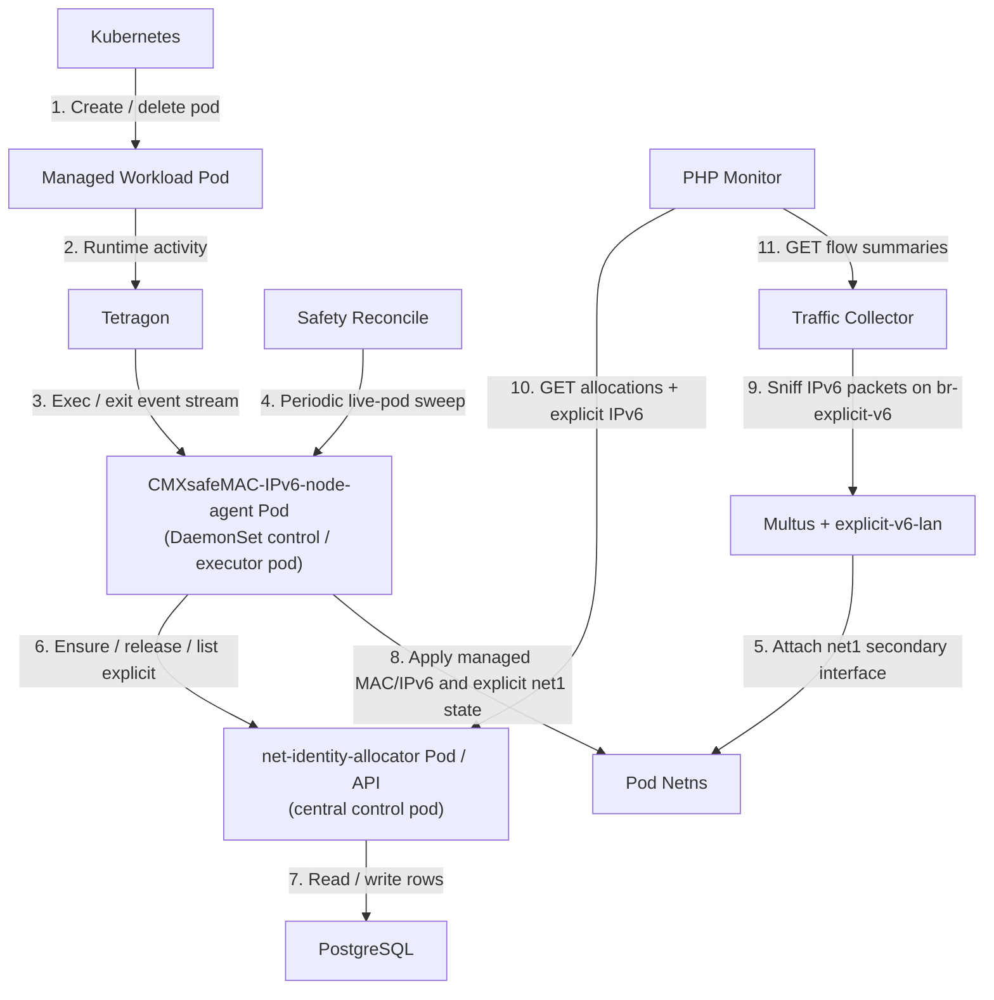
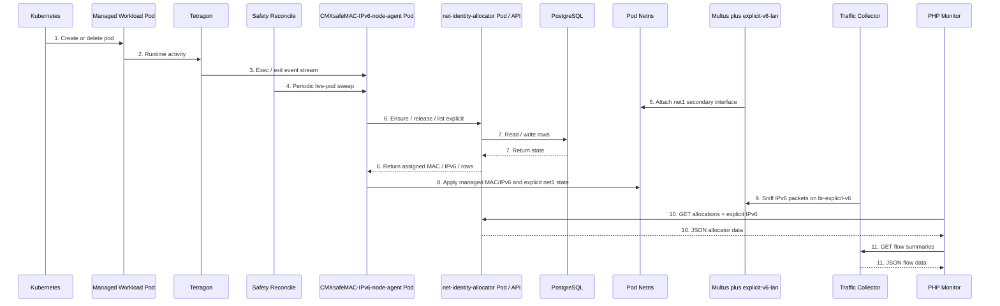
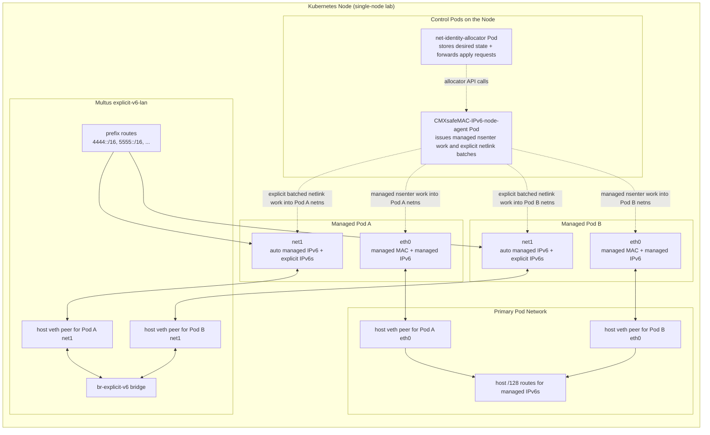
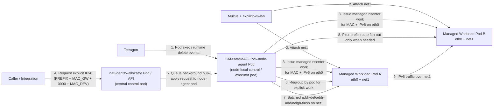
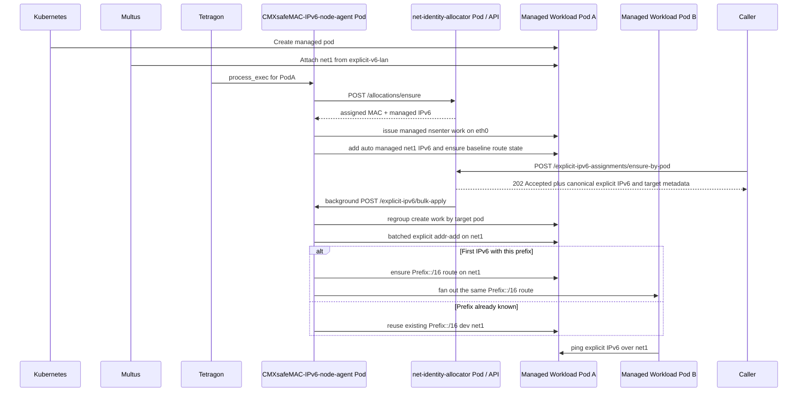
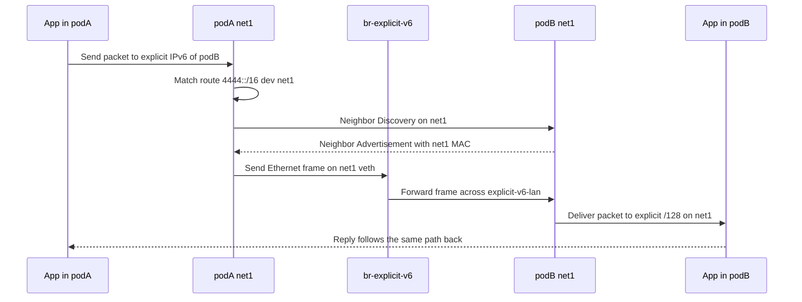
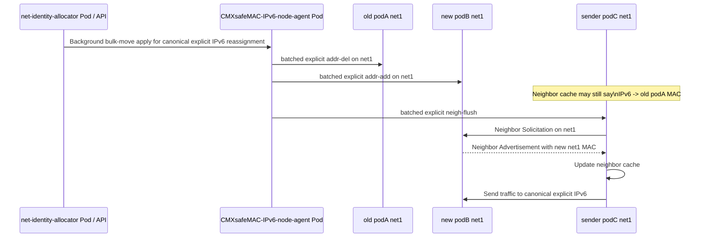

# CMXsafeMAC-IPv6 Architecture

This document explains how the OpenSSH forwarding problem, the identity-management engine, and the supporting Kubernetes resources fit together.

It is intentionally more detailed than the service README. The README is the quick-start. This file is the implementation and operations guide.

If you want the full system in one reader-friendly map before diving into the implementation details, start with [system-overview.md](./system-overview.md).

Related documents:

- [system-overview.md](./system-overview.md)
- [README.md](./README.md)
- [net-identity-allocator.md](./net-identity-allocator.md)
- [CMXsafeMAC-IPv6-node-agent.md](./CMXsafeMAC-IPv6-node-agent.md)
- [explicit-ipv6-apply-move-pipeline.md](./explicit-ipv6-apply-move-pipeline.md)
- [kubernetes-manifests.md](./kubernetes-manifests.md)
- [deployment-and-samples.md](./deployment-and-samples.md)

## 1. Goal

The product goal is:

- let SSH local forwarding (`-L`) and reverse forwarding (`-R`) meet successfully even when the two sessions land on different replicas
- do that without depending on one fixed SSH pod or one replica-local loopback namespace

The identity engine underneath that goal provides:

- deterministic MAC addresses for selected pods
- deterministic managed IPv6 addresses for selected pods
- explicit extra IPv6 addresses that can be added later to a running pod
- canonical explicit IPv6 identities that can move from one replica to another
- external network configuration from the node side, without running `ip` or other network tools inside the application pod

Support surfaces layered on top of that engine include:

- the Portable OpenSSH sample and SSH dashboard
- the PHP monitoring dashboard
- the traffic collector for live explicit-lane visibility

The main design idea is:

- Kubernetes still creates and schedules the pods
- a node-local agent detects relevant pod lifecycle activity
- the agent calls a central allocator service
- the allocator decides what MAC and IPv6 values should exist
- the node agent enters the pod network namespace from the outside and applies them
- the OpenSSH layer uses those identities as stable forwarding rendezvous points

## 2. High-Level Architecture

### 2.1 Component View



Actor distinction:

- the managed workload pod is the application pod whose `eth0` and `net1` state is being changed
- the `CMXsafeMAC-IPv6-node-agent` pod is the node-local control and executor pod that receives Tetragon events and applies managed `eth0` state plus batched explicit `net1` state into workload pod network namespaces
- the `net-identity-allocator` pod is the central control pod that stores desired state in PostgreSQL and tells the node-agent pod what to apply

### 2.2 High-Level Interaction Sequence



Number reference:

1. Kubernetes creates or deletes the pod object and pod sandbox.
2. The managed pod generates runtime activity that Tetragon can observe.
3. Tetragon produces exec or exit events that the node agent consumes through the gRPC `GetEvents` stream.
4. A low-frequency safety reconcile loop lists the current managed pods on the node to catch missed events.
5. Multus attaches the shared `net1` secondary interface from the `explicit-v6-lan` network.
6. The node agent calls the allocator API to ensure or release managed state, and to read explicit IPv6 assignments.
7. The allocator reads or updates the PostgreSQL tables that store managed allocations and explicit IPv6 assignments.
8. The node agent enters the pod network namespace and applies MAC, managed IPv6, explicit IPv6s, and routes.
9. The traffic collector sniffs IPv6 packets on `br-explicit-v6` and keeps recent flow summaries.
10. The PHP monitor reads allocator data from the API.
11. The PHP monitor also reads live flow summaries from the traffic collector.

In this sequence, the node-agent pod is an explicit actor because it is the component that actually crosses into the managed workload pod network namespace and performs the node-local Linux networking operations.

### 2.3 Logical Network Topology

This project uses two distinct network paths inside each managed pod:

- `eth0`
  - the normal Kubernetes pod interface created by the primary CNI
  - carries the deterministic managed MAC
  - carries the managed allocator IPv6 from `fd42:4242:4242:10::/64`
  - uses host-side `/128` routes plus the managed `/64` route handling on the node
- `net1`
  - the Multus secondary interface attached from `explicit-v6-lan`
  - carries one automatic managed `net1` IPv6 derived as `AUTO_MANAGED_EXPLICIT_TAG + GW_MAC + (counter + 1) + 00..00`
  - also carries zero or more caller-driven explicit IPv6 `/128` addresses
  - uses on-link prefix routes such as `4444::/16 dev net1`
  - provides the shared single-node IPv6 LAN for explicit east-west traffic

Logical topology:



Practical interpretation:

- managed IPv6 traffic and explicit IPv6 traffic are intentionally separated
- managed IPv6 traffic stays on `eth0` and depends on the node agent restoring the host routing state for each managed `/128`
- automatic managed `net1` IPv6 traffic and caller-driven explicit IPv6 traffic stay on `net1` and behave like a small shared IPv6 LAN on the node through `br-explicit-v6`
- the node-agent pod is not a data-plane hop on this topology; it is the control pod on the node that applies managed namespace work and explicit batched netlink work to the workload pod netns
- Multus is what gives the pod the extra `net1` attachment; the node-agent pod is what makes that interface useful by adding explicit IPv6s and the needed prefix routes
- `br-explicit-v6` is a single shared Linux bridge for the whole `explicit-v6-lan` network, not one bridge per explicit prefix
- prefix routes such as `4444::/16 dev net1` and `5555::/16 dev net1` are Layer 3 routes that reuse that same shared bridge-backed `net1` network

#### 2.3.1 Adding another explicit IPv6 under an existing prefix

If an explicit IPv6 is added to an already managed pod and its prefix bucket is already active, the logic is simple:

1. the allocator stores the new explicit IPv6 row
2. the node agent adds the new explicit `/128` to that pod's `net1`
3. before adding it, the node agent removes that same canonical explicit IPv6 from any other managed pod that still owns it
4. if that canonical explicit IPv6 moved between pods, the node agent flushes the matching `net1` neighbor entry on the other managed pods
5. the agent marks the assignment as applied
6. no extra global prefix distribution is needed, because the other managed pods should already have the matching route such as `4444::/16 dev net1`

Practical meaning:

- the only new data-plane element is the additional `/128` on the target pod
- uniqueness is preserved because the canonical explicit IPv6 is evicted from any previous target before it is attached to the new one
- immediate reachability after a move is preserved because the node agent clears stale `net1` neighbor entries that still point at the old pod MAC
- the shared bridge and the shared prefix route are already in place
- full connectivity to and from other managed pods should work without any extra operator action

#### 2.3.1.1 Parallel explicit IPv6 assignment under an existing prefix

The current implementation supports a narrower parallel-assignment model for explicit IPv6s.

Assumptions:

- no two concurrent requests try to assign the same canonical explicit IPv6 to different pods
- the relevant explicit prefix route is already present on the managed pods
- the requests are therefore only adding or moving `/128` addresses, not introducing a new prefix bucket

Under those conditions:

- the allocator can process different explicit IPv6 writes in parallel on PostgreSQL without a process-wide store write lock
- the allocator reads the managed target row once, then reuses the stored node-agent endpoint and stored runtime snapshot when queuing explicit apply
- the node agent serializes only by `requested_ipv6`, so the same canonical explicit IPv6 still moves atomically
- the node agent validates the stored runtime snapshot locally and uses its own managed-pod registry for owner eviction, neighbor flush, and prefix fan-out
- when that in-memory registry is incomplete, the agent can complement it from allocator-managed rows for the current node instead of relisting pods from the Kubernetes API
- different canonical explicit IPv6s can be attached in parallel because they do not need one-time prefix-route fan-out work
- for already-known prefixes, the steady-state hot path only adds or removes the `/128`; it no longer replays `ip -6 route replace` on the target pod for every explicit address

Practical meaning:

- safe parallelism is keyed by the explicit IPv6 itself, not by the whole allocator process
- canonical move semantics are preserved because one explicit IPv6 still has exactly one owner at a time
- the explicit create / move hot path no longer needs a fresh Kubernetes pod lookup or a relist of managed pods
- the target pod's prefix route is treated as an invariant established during managed setup or repaired during reconcile, rather than something rewritten on every explicit add
- if a request introduces a brand-new prefix, it falls back to the broader route-distribution path described in the next subsection
- if explicit cleanup removes the last live owner of a prefix, the distributed prefix route is also retracted from the other managed pods so the deployment returns to its baseline state

For a focused walkthrough of the current high-concurrency create and move pipelines, including the measured `5000`-request example, batching stages, metric definitions, and tuning knobs, see [explicit-ipv6-parallelism.md](./explicit-ipv6-parallelism.md).

#### 2.3.2 Adding an explicit IPv6 under a new prefix

If the explicit IPv6 introduces a prefix bucket that is not yet active, one more step is required:

1. the allocator stores the new explicit IPv6 row
2. the node agent removes that same canonical explicit IPv6 from any other managed pod that still owns it
3. the node agent adds the new explicit `/128` to the target pod's `net1`
4. the node agent detects that this is the first live use of that prefix
5. the node agent distributes the new prefix route, for example `6666::/16 dev net1`, to all currently managed pods that have `net1`

Practical meaning:

- a new explicit prefix creates a new Layer 3 route bucket
- the bridge is still the same shared `br-explicit-v6`
- what changes is the set of on-link prefix routes installed inside the managed pods
- after that prefix route has been distributed once, later explicit IPv6s under the same prefix follow the simpler existing-prefix path above

## 3. Main Components

### 3.1 Allocator service

File:

- [app.py](../net-identity-allocator/app.py)

Responsibility:

- keep the allocation tables in PostgreSQL for the Kubernetes deployment
- assign deterministic MAC addresses
- assign deterministic managed IPv6 addresses
- derive the automatic managed `net1` IPv6 returned on allocation rows
- store explicit IPv6 assignments
- expose the JSON API

Important endpoints:

- `GET /healthz`
  Simple liveness check used by probes and quick operational checks.
- `GET /stats`
  Returns summary counts for managed allocation rows and explicit IPv6 rows grouped by status.
- `GET /allocations`
  Returns the managed allocation rows, including assigned MAC, managed IPv6, derived automatic managed `net1` IPv6, pod identity, and status.
- `POST /allocations/ensure`
  Creates or reuses the deterministic managed MAC and managed IPv6 allocation for a pod.
- `POST /allocations/release`
  Marks a managed allocation as no longer active when the pod has been deleted or completed.
- `POST /allocations/touch`
  Refreshes the allocator's `last_seen_at` timestamp for a still-live managed pod.
- `POST /reconcile/live-pods`
  Compares allocator state with a supplied live pod set and marks orphaned rows accordingly.
- `POST /allocations/clear-stale`
  Deletes stale managed allocation rows from the database.
- `POST /admin/reset`
  Clears both allocator tables so automated regression phases can start from a clean state without deleting the PostgreSQL PVC.
- `POST /admin/reset-explicit`
  Marks active explicit IPv6 rows as released, and when called with `clear_runtime=true`, also tells the node-agent pod to remove those explicit `/128`s and related runtime state from live pods.
- `GET /explicit-ipv6-assignments`
  Returns the stored explicit IPv6 assignment rows and their target pod mapping.
- `POST /explicit-ipv6-assignments/ensure`
  Accepts a canonical explicit IPv6. For a new assignment it needs target pod identity such as `pod_uid` or `target_assigned_mac`; otherwise it can only reuse the already stored target mapping for that same explicit IPv6.
- `POST /explicit-ipv6-assignments/ensure-by-pod`
  Accepts `pod_uid + gw_tag + mac_dev`, derives the canonical explicit IPv6 internally with counter `0000`, stores it, and queues node-agent apply work.
- `POST /explicit-ipv6-assignments/applied`
  Records that the node agent successfully attached the explicit IPv6 to the live pod interface.
- `POST /explicit-ipv6-assignments/applied-batch`
  Internal bulk variant used when many explicit IPv6 rows are marked applied together.

Operational note:

- by default, explicit apply work is queued on an allocator background worker pool, so callers usually receive an accepted response before the node-agent pod finishes the live explicit work
- the allocator now prefers grouped calls to the node-agent `/explicit-ipv6/bulk-apply` and `/explicit-ipv6/bulk-move` endpoints instead of forwarding one explicit operation per HTTP call
- the allocator now reuses PostgreSQL sessions through a bounded connection pool instead of opening a fresh database connection for every request

### 3.2 Node agent

File:

- [agent.py](../CMXsafeMAC-IPv6-node-agent/agent.py)

Responsibility:

- run on each Kubernetes node as a privileged `DaemonSet`
- detect selected pods
- ask the allocator what MAC and IPv6 values should exist
- locate the pod sandbox PID
- use managed `nsenter` work for `eth0` state and namespace-aware netlink batching for the explicit `net1` hot path
- set the MAC on `eth0`
- add the managed allocator IPv6 on `eth0`
- add explicit IPv6 addresses on `net1`
- maintain prefix-level on-link routes for explicit IPv6 prefixes on `net1`
- regroup move work by old-owner, new-owner, and observer pod
- release rows when pods are deleted

Important implementation detail:

- the application pod itself does not need `ip`, `NET_ADMIN`, or root
- all network changes happen from outside the pod
- in the optimized explicit path, repeated `addr-add`, `addr-del`, and `neigh-flush` operations are issued through persistent per-pod netlink sessions rather than by spawning one shell command per IPv6 change

Node-local HTTP endpoints:

- `GET /healthz`
- `POST /explicit-ipv6/apply`
- `POST /explicit-ipv6/bulk-apply`
- `POST /explicit-ipv6/bulk-move`
- `POST /explicit-ipv6/clear`

### 3.3 Tetragon

Responsibility:

- provide early runtime events for pod activity
- wake the node agent quickly when a managed pod starts doing work

Current role in this implementation:

- Tetragon is the primary live event source
- the node agent consumes Tetragon gRPC events directly from the mounted Unix socket
- a low-frequency safety reconcile loop remains as the missed-event fallback

This means the current implementation no longer uses a Kubernetes pod watch, but it still keeps a safety sweep for environments where some Tetragon lifecycle events are missed.

Event model in practice:

- create / assignment:
  - driven by Tetragon `process_exec` events that already contain pod identity
- delete / release:
  - driven primarily by Tetragon `process_exec` events for `/usr/local/bin/containerd-shim-runc-v2`
  - the event arguments must contain `delete`
  - the event arguments must contain `-id <sandbox-id>`
  - the node agent maps that sandbox ID back to the pod through CRI metadata
- secondary signal:
  - `process_exit` is still subscribed, but it is not the main delete trigger in this local environment

### 3.4 PHP monitor

Files:

- [index.php](../CMXsafeMAC-IPv6-php-monitor/index.php)
- [api.php](../CMXsafeMAC-IPv6-php-monitor/api.php)
- [php-monitor-deployment.yaml](../k8s/php-monitor-deployment.yaml)

Responsibility:

- server-rendered PHP dashboard
- reads allocator state from the existing allocator API
- reads live flow summaries from the separate traffic collector
- merges both views into one dashboard response
- exists to simplify integration into a PHP-based dashboard

### 3.5 Traffic collector

Files:

- [collector.py](../CMXsafeMAC-IPv6-traffic-collector/collector.py)
- [Dockerfile](../CMXsafeMAC-IPv6-traffic-collector/Dockerfile)
- [traffic-collector.yaml](../k8s/traffic-collector.yaml)

Responsibility:

- run `tshark` separately from the allocator and node agent
- sniff IPv6 packets on `br-explicit-v6`
- aggregate recent flows in memory
- expose a small HTTP API for the PHP monitor

Important point:

- the traffic collector is an observability component
- it does not assign MACs or IPv6s
- it is not in the control path for allocator or node-agent behavior

## 4. Kubernetes Resources

Main manifests:

- [allocator-stack.yaml](../k8s/allocator-stack.yaml)
- [explicit-v6-network.yaml](../k8s/explicit-v6-network.yaml)
- [demo-statefulset.yaml](../k8s/demo-statefulset.yaml)
- [demo-deployment.yaml](../k8s/demo-deployment.yaml)
- [php-monitor-deployment.yaml](../k8s/php-monitor-deployment.yaml)
- [traffic-collector.yaml](../k8s/traffic-collector.yaml)

Core resources:

- `Deployment/net-identity-allocator`
- `Service/net-identity-allocator`
- `DaemonSet/cmxsafemac-ipv6-node-agent`
- `DaemonSet/cmxsafemac-ipv6-traffic-collector`
- `Service/cmxsafemac-ipv6-traffic-collector`
- `Deployment/net-identity-allocator-php-monitor`
- `Service/net-identity-allocator-php-monitor`

## 5. Pod Selection

Only selected pods are managed.

Current selector:

- label key: `pods-mac-allocator/enabled`
- label value: `"true"`

If a pod does not carry that label, the node agent ignores it.

Current optional annotation:

- `pods-mac-allocator/mac-dev`
- `k8s.v1.cni.cncf.io/networks`

The `pods-mac-allocator/mac-dev` annotation is stored as metadata in the allocator row. It is no longer part of MAC generation.

The Multus annotation is how the sample pods receive the shared `net1` interface from the `explicit-v6-lan` network.

## 6. MAC Allocation Model

### 6.1 Managed MAC format

The assigned pod MAC is derived from:

- the first 4 bytes of the configured canonical gateway MAC when present, otherwise the host gateway MAC
- a 16-bit collision counter

Format:

```text
GW1 : GW2 : GW3 : GW4 : CTR1 : CTR2
```

Example:

- canonical gateway MAC: `f6:db:2b:39:78:94`
- counter `0003`
- assigned pod MAC: `f6:db:2b:39:00:03`

### 6.2 Why the configured 6-byte gateway MAC matters

The full configured `canonical_gateway_mac` is stored as shared system configuration because:

- it is the stable identity root embedded into canonical IPv6 usernames
- it prevents identities from changing when a gateway replica is restarted, rescheduled, or given a different live CNI MAC
- it lets the allocator derive per-replica managed MACs by adding counters while keeping endpoint canonical identities at counter `0000`

If `canonical_gateway_mac` is not configured, the allocator falls back to the gateway MAC reported by the node agent for compatibility with older deployments.

## 7. Managed IPv6 Model

Managed IPv6 is optional and is derived from:

- a configured `/64`
- the same collision counter used by the net-identity-allocator

Format:

- network prefix = configured `/64`
- host value = `counter + 1`

Example:

- prefix: `fd42:4242:4242:10::/64`
- counter `3`
- managed IPv6: `fd42:4242:4242:10::4`

This IPv6 is the allocator-owned primary IPv6 for the pod.

It is different from the explicit extra IPv6 addresses described later.

## 7.1 Managed IPv6 vs Explicit IPv6

The system intentionally uses two IPv6 categories with different roles.

Managed IPv6:

- count per pod:
  one
- interface:
  `eth0`
- owner:
  allocator-managed primary pod identity
- shape:
  `managed /64 prefix + (counter + 1)`
- purpose:
  stable allocator-owned IPv6 for the managed pod

Explicit IPv6:

- count per pod:
  zero or more
- interface:
  `net1`
- owner:
  caller-driven extra IPv6 identities stored in allocator state
- shape:
  `Prefix-2-bytes | original GW_MAC-6-bytes | 0000 | MAC_DEV-6-bytes`
- purpose:
  add extra IPv6 addresses without replacing the managed one

So the current split is:

- `eth0` for the deterministic base identity
- `net1` for additional explicit IPv6 identities and their shared-LAN communication path

## 8. Explicit IPv6 Model

Explicit IPv6 assignments are extra IPv6 addresses added to the pod after it already exists.

These do not replace the managed IPv6.

A pod can therefore have:

- 1 managed allocator IPv6
- 0 or more explicit IPv6 addresses

In the current single-node design:

- the managed allocator IPv6 stays on `eth0`
- explicit IPv6 addresses are attached on `net1`
- `net1` comes from a shared Multus network
- explicit prefixes are routed as on-link networks such as `4444::/16 dev net1`

### 8.1 Explicit IPv6 layout

The explicit IPv6 format is:

```text
Prefix-2-bytes | original GW_MAC-6-bytes | 0000 | MAC_DEV-6-bytes
```

Mapped to IPv6 hextets:

```text
hextet1 : Prefix
hextet2 : original GW_MAC bytes 1-2
hextet3 : original GW_MAC bytes 3-4
hextet4 : original GW_MAC bytes 5-6
hextet5 : canonical explicit counter (always 0000)
hextet6 : MAC_DEV bytes 1-2
hextet7 : MAC_DEV bytes 3-4
hextet8 : MAC_DEV bytes 5-6
```

Example:

```text
Prefix  = 6666
GW_MAC  = 4a:0c:f4:10:7f:dd
MAC_DEV = aa:bb:cc:dd:31:01

IPv6    = 6666:4a0c:f410:7fdd:0000:aabb:ccdd:3101
```

### 8.2 Meaning of `MAC_DEV`

`MAC_DEV` in explicit IPv6 is:

- a 6-byte caller-provided value
- stored with the assignment
- useful for expressing different extra IPv6 identities on the same pod

If you create more explicit IPv6s for the same pod while keeping:

- the same `Prefix`
- the same original `GW_MAC`
- the same canonical `0000`

then the only part that changes is `MAC_DEV`.

## 9. Data Model

The allocator keeps two main allocation tables in its configured backend.

In the current implementation, that backend is PostgreSQL both in Kubernetes and in direct local allocator runs.

### 9.1 `mac_allocations`

Purpose:

- one row per managed pod allocation

Important fields:

- `assigned_mac`
- `gw_mac`
- `counter`
- `assigned_ipv6`
- `namespace`
- `pod_name`
- `pod_uid`
- `node_name`
- `status`

### 9.2 `explicit_ipv6_assignments`

Purpose:

- one row per explicit extra IPv6 assignment

Important fields:

- `requested_ipv6`
- `gw_tag_hex`
- `target_gw_mac`
- `target_counter`
  the real managed allocation counter of the pod currently targeted by that canonical explicit IPv6
- `target_assigned_mac`
- `mac_dev`
- `namespace`
- `pod_name`
- `pod_uid`
- `node_name`
- `status`

## 10. Status Meanings

Managed allocation statuses:

- `ALLOCATED`: the row is active and bound to a current pod
- `RELEASED`: the row was explicitly retired, usually after a clean pod deletion event
- `STALE`: the row looked obsolete during reconciliation, so it was marked indirectly

Explicit IPv6 statuses:

- `ACTIVE`: the extra IPv6 is active
- `RELEASED`: it was intentionally retired
- `STALE`: it is obsolete but reached that state indirectly

## 11. Pod Identity Model

The current implementation is intentionally stateless at the managed-allocation layer.

That means:

- active managed identity is keyed by the current `pod_uid`
- while that exact pod stays alive, repeated ensure operations refresh the same active row
- when Kubernetes replaces a pod and the `pod_uid` changes, the replacement is treated as a new managed pod instance
- managed MAC and managed IPv6 are therefore not reused across pod recreation

This simplifies the allocator model and matches Deployment-style replicas directly.

## 12. Runtime Flow

### 12.1 Startup reconcile

When the node agent starts:

1. it lists target pods already present on the node
2. it calls allocator reconciliation with the live pod UID set
3. visible deleting or terminal pods can be marked `RELEASED`
4. rows that have already disappeared can still be marked `STALE`
5. it applies managed state to the live pods

After startup, it starts:

- the local HTTP server
- the safety reconcile thread
- the Tetragon gRPC event loop

### 12.2 Pod create or restart

Typical flow:

1. Kubernetes creates the pod
2. Multus attaches `net1` from `explicit-v6-lan`
3. Tetragon emits a relevant event
4. the node agent resolves the pod and sandbox PID
5. the node agent calls `POST /allocations/ensure`
6. the allocator returns the assigned MAC and managed IPv6 and stores the current node-agent pod name, UID, and IP on that managed allocation row
7. the node agent applies managed namespace work and explicit replay work to:
   - set the MAC on `eth0`
   - set the managed IPv6 on `eth0`
   - ensure active explicit prefix routes on `net1`
   - reapply tracked explicit IPv6s on `net1`
8. the node agent patches pod annotations with the assigned values

### 12.3 Explicit IPv6 add or replay

Typical flow:

1. a caller sends `POST /explicit-ipv6-assignments/ensure-by-pod`
2. the allocator resolves the pod's `gw_mac` and real managed `counter`
3. the allocator stores the canonical explicit IPv6 assignment row, copies over the node-agent pod name, UID, and IP from the managed allocation row, and keeps the real managed counter only as metadata
4. by default, the allocator queues background explicit-apply work and returns an accepted response to the caller
5. the allocator worker forwards grouped work to the node-agent IP already stored on that row, usually through `POST /explicit-ipv6/bulk-apply` or `POST /explicit-ipv6/bulk-move`
6. if that stored node-agent IP is missing or stale, the allocator falls back once to a live Kubernetes lookup for the node-agent pod on that node
7. the node agent validates the stored runtime snapshot and opens the target pod network namespace for batched netlink work
8. the node agent applies explicit work in grouped per-pod batches:
   - add the explicit IPv6 on `net1`
   - evict the same canonical explicit IPv6 from any previous target pod
   - flush stale `net1` neighbor entries when that address moved
   - install the `Prefix::/16 dev net1` route if needed
   - install that same prefix route on the other managed pods when the prefix appears for the first time
9. the allocator records the explicit IPv6 row as applied on `net1`
10. during later tracked replays, the node agent re-checks the allocator row before reattaching any explicit IPv6 so a moved address is skipped on the old pod

Concurrency note:

- managed allocation updates are still treated conservatively because they mutate the pod's primary `eth0` identity and host-managed `/128` routing state
- explicit IPv6 updates are narrower: on PostgreSQL the allocator allows different canonical explicit IPv6 writes to proceed in parallel, and the node agent serializes only per `requested_ipv6`
- this parallel model is intended for the common case where the explicit prefix route already exists; first use of a new prefix can still trigger one-time route propagation

### 12.4 Why the safety reconcile still exists

The current implementation uses:

- Tetragon as the live event source
- a low-frequency safety reconcile loop

Why:

- this local Docker Desktop / kind environment does not deliver every useful lifecycle signal reliably enough through one Tetragon path alone
- the safety sweep lets us converge newly created pods and mark missing pods without reintroducing the old Kubernetes watch thread

So the current design is:

- live path: Tetragon stream
- fallback path: safety reconcile

### 12.5 Pod deletion

When the node agent sees a usable runtime delete-triggered deletion signal:

1. it calls `POST /allocations/release`
2. the row is marked `RELEASED`

In the current implementation, the primary live delete signal is a Tetragon `process_exec` event for:

- `/usr/local/bin/containerd-shim-runc-v2`
- with arguments ending in `delete`
- whose `-id` value matches the pod sandbox ID

The node agent resolves that sandbox ID back to the Kubernetes pod through CRI metadata, then runs the existing release check flow.

If the runtime delete signal is missed but the pod is still visible as deleting or completed during safety reconcile, the row also becomes `RELEASED`.

Only if the pod has already disappeared and can no longer be identified directly does the row fall back to `STALE`.

## 13. External Network Mutation

All network mutation happens from the node side.

The node agent uses:

- `crictl` to find the pod sandbox
- the sandbox PID
- namespace entry for managed-interface work and namespace-aware netlink for explicit-interface work

From there it can:

- set the MAC on `eth0`
- add the managed IPv6 on `eth0`
- add explicit IPv6 addresses on `net1`
- add routes inside the pod
- keep the host-peer route behavior for the managed IPv6 path on `eth0`

The application container does not need:

- `ip`
- root
- `NET_ADMIN`

## 14. Explicit IPv6 Routing

An explicit IPv6 is not enough by itself. It also has to be routed.

The node agent therefore does more than `ip addr add`.

For explicit IPv6 it:

- adds the IPv6 to `net1`
- keeps `net1` on a shared single-node Multus LAN
- installs one on-link route per active prefix bucket, for example `4444::/16 dev net1`
- reuses that prefix route for later explicit IPv6s with the same prefix instead of resynchronizing per address

Current route aggregation behavior:

- explicit route prefixes are grouped by `EXPLICIT_IPV6_ROUTE_PREFIX_LEN`
- current value is `16`

That is why prefixes such as:

- `4444::/16`
- `5555::/16`
- `6666::/16`

can be synchronized across managed pods and used for east-west communication.

### 14.1 Component view for address allocation and routing



### 14.2 Sequence for new pod and new explicit IPv6



### 14.3 Packet path example: explicit IPv6 on podA to explicit IPv6 on podB

Example scenario:

- `podA` owns `4444:7e46:f8e0:2d3f:0:aabb:ccdd:0001` on `net1`
- `podB` owns `4444:7e46:f8e0:2d3f:0:aabb:ccdd:1101` on `net1`
- both pods already have the prefix route `4444::/16 dev net1`

What happens to one packet:

1. an application in `podA` sends to `4444:7e46:f8e0:2d3f:0:aabb:ccdd:1101`
2. `podA` matches that destination against `4444::/16 dev net1`
3. `podA` performs IPv6 Neighbor Discovery on `net1`
4. `podB` answers for its explicit IPv6 on `net1`
5. the frame leaves `podA` through the `net1` veth
6. the host bridge `br-explicit-v6` forwards it across the shared Multus LAN
7. the frame enters `podB` through its `net1` veth
8. `podB` accepts the packet because that explicit `/128` is assigned locally on `net1`

Important distinction:

- `data path` means the path followed by each real traffic packet after the network has already been configured
- in this example, the data path is just:
  `app in podA -> podA net1 -> host veth -> br-explicit-v6 -> host veth -> podB net1 -> app in podB`
- `control path` means the setup path that runs before traffic, where the system decides and installs the MAC, IPv6, and route state
- in this example, the control path includes:
  Tetragon event detection, allocator API calls, and node-agent namespace-aware work that adds the explicit IPv6 and the `4444::/16 dev net1` route
- once that setup is done, the packet does not go through the allocator, Tetragon, or the node-agent HTTP API on every send
- those components are only involved again when something changes, such as a new pod, a new explicit IPv6, or a pod deletion



### 14.4 Packet path after a canonical explicit IPv6 moves

When the same canonical explicit IPv6 is moved from one managed pod to another, there is one more Layer 2 detail to handle.

Example scenario:

- the canonical explicit IPv6 `bbbb:7e46:f8e0:2d3f:0:aabb:ccdd:ee61` originally belongs to old `podA`
- the allocator is updated so that the same canonical explicit IPv6 now belongs to new `podB`
- another managed pod, `podC`, was already talking to that IPv6 on `net1`

Without extra cleanup, `podC` can still hold a stale IPv6 neighbor-cache entry like:

- `bbbb:7e46:f8e0:2d3f:0:aabb:ccdd:ee61 -> old podA net1 MAC`

That is not ARP. In IPv6 this is NDP, the Neighbor Discovery Protocol.

What the node agent does:

1. it removes the canonical explicit IPv6 from old `podA`
2. it adds the same canonical explicit IPv6 to new `podB`
3. it flushes the matching `net1` neighbor-cache entry on the other managed pods
4. the next sender must resolve that IPv6 again
5. Linux sends a Neighbor Solicitation on `net1`
6. the new owner, `podB`, replies with a Neighbor Advertisement
7. the sender updates its neighbor cache with `podB`'s `net1` MAC
8. traffic then flows to the new pod immediately

Why this matters:

- if we skipped the flush, traffic could still be sent to the old `net1` MAC and fail even though the allocator row already points to the new pod
- the flush keeps the canonical explicit IPv6 move consistent in both the control plane and the data plane



## 15. API Usage Patterns

### 15.1 Managed allocation

The node agent uses:

- `POST /allocations/ensure`

to create or reuse the managed allocation row.

### 15.2 Explicit IPv6 by full encoded address

Call:

- `POST /explicit-ipv6-assignments/ensure`

Body:

- `ipv6_address`
- optionally one of:
  - `pod_uid`
  - `target_assigned_mac`

Use this if the caller already knows the full canonical explicit IPv6.

For a brand-new canonical explicit IPv6, one of those target identity fields is needed so the allocator knows which currently managed pod should receive it. If the same canonical explicit IPv6 already exists in allocator state, the allocator can reuse that stored target mapping.

### 15.3 Explicit IPv6 by pod UID

Call:

- `POST /explicit-ipv6-assignments/ensure-by-pod`

Body:

- `pod_uid`
- `gw_tag`
- `mac_dev`

Use this when the caller already knows the target pod instance and wants the allocator to derive:

- the original `gw_mac`
- the real managed `counter`
- the final explicit IPv6

This is the higher-level API and is usually the easier one for integrations.

## 16. PHP Monitor

Served by a separate PHP deployment.

Current local access depends on how it is exposed. In the current local environment it is available by port-forward.

The PHP page is intentionally server-rendered so it can be integrated more easily into a PHP dashboard stack.

## 17. Current Local Access

In the current development environment:

- Allocator API:
  - [http://localhost:18080/healthz](http://localhost:18080/healthz)
- PHP monitor:
  - [http://localhost:18082/](http://localhost:18082/)

These local URLs are convenience access paths, not part of the in-cluster service contract.

## 18. What Was Verified

The current implementation has already been tested for:

- StatefulSet-managed pods
- Deployment-managed pods in the standard 3-replica sample manifest
- a separate fresh 4-replica Deployment validation for canonical explicit IPv6 move behavior
- deterministic MAC assignment
- managed IPv6 assignment
- multiple explicit IPv6s per pod
- explicit IPv6 communication between pods
- PHP monitor rendering
- live explicit-lane flow capture through the separate traffic collector

Recent deployment test result:

- a fresh 4-replica Deployment namespace was created on the single node
- each replica had the expected deterministic MAC and managed IPv6 on `eth0`
- canonical explicit IPv6 addresses were added on `net1` under both an existing prefix and a new prefix
- the same canonical explicit IPv6 was moved from the counter-2 replica to the counter-0 replica
- after the move, the old pod no longer had that explicit `/128`, the allocator row targeted the new pod with `target_counter` updated as metadata, and the canonical IPv6 remained reachable immediately from the other replicas

## 19. Operational Caveats

### 19.1 Docker Desktop / kind overhead

In this environment the control-plane runs inside one container:

- `desktop-control-plane`

That means CPU can look high even when application pods are light.

### 19.2 Tetragon on local Docker Desktop

Tetragon worked more reliably in the current single-node `kind` setup than in the earlier Docker Desktop Kubernetes path.

### 19.3 Allocator storage

The allocator now uses PostgreSQL inside the cluster:

- one `StatefulSet`
- one `Service`
- one PVC
- one Secret-backed credential manifest

That means allocator data survives allocator pod recreation, which is much better for persistent in-cluster state than the earlier `emptyDir` model.

The main local-testing consequence is different now:

- for clean regression phases, the tooling uses `POST /admin/reset` to clear allocator rows without deleting the PostgreSQL PVC

### 19.4 Deployment replicas are not stable slots

Deployment replicas can be replaced with new pod names and UIDs.

The system still manages them correctly while alive, but StatefulSet gives better reuse semantics if stable slot identity matters.

## 20. Recommended Future Improvements

- reduce the remaining managed-state allocator serialization now that explicit IPv6 writes already use the narrower PostgreSQL-backed concurrency path
- if allocator throughput becomes a real bottleneck, consider a staged migration path:
  first Python plus MySQL or PostgreSQL with the same API, then optionally a Go implementation behind the same API contract
- prefer treating the datastore and transaction model as the first scaling lever, because the remaining write bottleneck is now more about allocator-side serialization than raw database capability
- consider a Go plus PostgreSQL allocator if sustained write bursts, multi-replica allocator instances, or higher control-plane throughput become important
- decide whether the remaining safety reconcile can be reduced further once the local Tetragon path is fully reliable
- introduce a stronger stable identity model for Deployment-backed pods if reuse across replacement matters
- centralize the monitor styling if the PHP dashboard becomes the primary user interface
- consider adding a persistent store or export path for long-lived traffic history if the PHP dashboard needs more than a recent in-memory flow window

## 21. File Map

Core implementation files:

- [app.py](../net-identity-allocator/app.py)
- [index.php](../CMXsafeMAC-IPv6-php-monitor/index.php)
- [api.php](../CMXsafeMAC-IPv6-php-monitor/api.php)
- [collector.py](../CMXsafeMAC-IPv6-traffic-collector/collector.py)
- [agent.py](../CMXsafeMAC-IPv6-node-agent/agent.py)

Kubernetes manifests:

- [allocator-stack.yaml](../k8s/allocator-stack.yaml)
- [php-monitor-deployment.yaml](../k8s/php-monitor-deployment.yaml)
- [traffic-collector.yaml](../k8s/traffic-collector.yaml)
- [demo-statefulset.yaml](../k8s/demo-statefulset.yaml)
- [demo-deployment.yaml](../k8s/demo-deployment.yaml)
