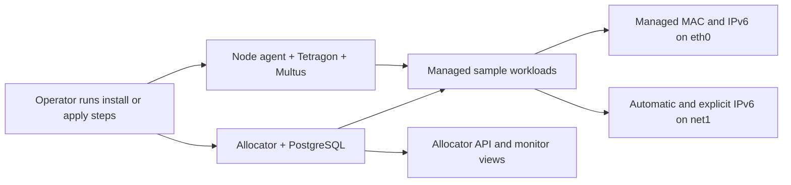
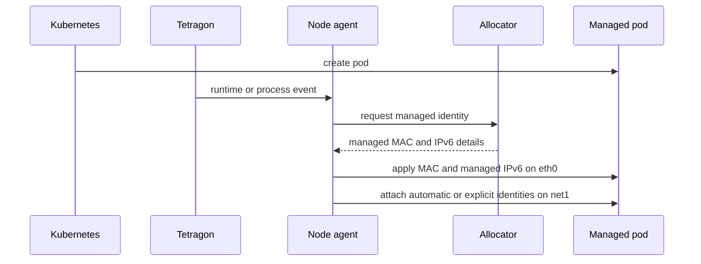

# Deployment And Samples

This document explains how to deploy the allocator stack, expose the allocator API and PHP monitor, and run the sample workloads that validate deterministic MAC and IPv6 management.



## Automated Scripts

For the validated Docker Desktop `kind` single-node environment, the repository now includes an automated install path and an automated end-to-end regression path.

Install the stack:

```powershell
powershell -NoProfile -ExecutionPolicy Bypass -File .\tools\install-docker-desktop-kind-stack.ps1
```

Run the end-to-end validation:

```powershell
powershell -NoProfile -ExecutionPolicy Bypass -File .\tools\tests\core\test-local-e2e.ps1
```

Run the control-plane benchmark:

```powershell
powershell -NoProfile -ExecutionPolicy Bypass -File .\tools\tests\benchmarks\benchmark-control-plane.ps1 -CleanupSamplesAfter
```

Run the serial parallel-batch benchmark:

```powershell
powershell -NoProfile -ExecutionPolicy Bypass -File .\tools\tests\benchmarks\benchmark-parallel-canonical-batches.ps1 -CleanupSamplesAfter
```

Optional in-cluster Linux toolbox:

```powershell
powershell -NoProfile -ExecutionPolicy Bypass -File .\tools\deploy-toolbox.ps1
powershell -NoProfile -ExecutionPolicy Bypass -File .\tools\connect-toolbox.ps1
```

Use that toolbox when you want to run API checks or ad-hoc timing from inside the cluster itself. It keeps a long-lived Linux shell available with `bash`, `curl`, `jq`, `kubectl`, `python3`, and network tools, which can help separate Windows-host harness overhead from true in-cluster control-plane cost.

Linux in-cluster benchmark script:

- [benchmark-parallel-canonical-batches.sh](../tools/tests/benchmarks/benchmark-parallel-canonical-batches.sh)
- this is the Linux/bash entry point for the parallel canonical explicit IPv6 benchmark
- it is designed to run inside the toolbox with direct cluster-DNS access to the allocator and Kubernetes API
- it defaults to `10/30/60/100`, but it also accepts custom `--batch-sizes`
- it reuses one shared 4-replica Deployment sample and clears only the explicit IPv6 state between scenarios
- the toolbox RBAC therefore includes the minimal `pods/exec` plus sample-workload create/scale/delete permissions needed by this benchmark path

What the install script does:

- validates `kubectl`, Docker, cluster access, and the presence of Tetragon
- ensures Multus and the required CNI plugins are available
- applies the `explicit-v6-lan` network definitions
- applies the PostgreSQL Secret template and allocator stack manifests
- fingerprints each image source tree and reuses local Docker images and node images when the source is unchanged
- supports `-ForceRebuild` and `-ForceImageImport` when you intentionally want a fresh build/import cycle
- builds or reuses the allocator, node-agent, PHP monitor, and traffic-collector images
- deploys the allocator stack, the traffic collector, and the optional PHP monitor

What the regression script validates:

- a `Deployment` phase with 4 replicas:
  managed MAC, managed IPv6, automatic managed `net1` IPv6, automatic `net1` connectivity between replicas, 5 explicit IPv6s per replica, shared-prefix routing, new-prefix routing, canonical explicit IPv6 moves, and deployment pod replacement after deletion
- before that validation begins, the script resets allocator state with `POST /admin/reset`
- that keeps the PostgreSQL-backed deployment deterministic without deleting the PostgreSQL PVC between runs

What the benchmark script measures:

- allocator-only `POST /allocations/ensure` latency and effective write rate
- end-to-end explicit IPv6 assignment latency on the real node-agent path
- a parallel explicit IPv6 assignment burst for distinct canonical addresses under an already-known prefix
- canonical explicit IPv6 move latency until a different managed pod can reach the moved address
- confirmation that the live allocator pod is actually using PostgreSQL before the measurements begin

The benchmark's parallel explicit burst assumes:

- no two concurrent requests target the same canonical explicit IPv6
- the relevant prefix route already exists on the managed pods
- the measured work is therefore the allocator plus node-agent `/128` apply path, not first-time prefix propagation

What the serial parallel-batch benchmark measures:

- by default, four serial scenarios with `10`, `30`, `60`, and `100` canonical explicit IPv6 operations in parallel
- fresh-from-scratch parallel creation latency for those canonical explicit IPv6 addresses on one reused 4-replica Deployment
- parallel move latency when those same canonical explicit IPv6 identities are reassigned to different pods
- both true request latency and whole-batch completion timing
- final ownership verification plus sampled reachability after each batch
- between scenarios, the benchmark now calls `POST /admin/reset-explicit` with `clear_runtime=true` so only explicit IPv6 runtime state is removed; the 4 replicas stay in place and are not redeployed between scenarios
- that cleanup preserves the baseline automatic managed `net1` IPv6 already present on each replica

## What This Deployment Does

At a high level, this deployment installs a small control stack that assigns deterministic network identity to selected pods and then demonstrates that behavior with sample workloads.

The end result is:

- managed pods receive a deterministic MAC address on `eth0`
- managed pods can also receive one deterministic allocator-managed IPv6 address on `eth0`
- managed pods also receive one deterministic automatic managed IPv6 on `net1`
- managed pods also join a shared secondary Multus network on `net1`
- managed pods can receive additional explicit IPv6 addresses on `net1` without replacing the existing ones
- the allocator API and PHP monitor expose the allocator table and explicit IPv6 assignments
- sample workloads let you verify both the assigned identity and pod-to-pod IPv6 communication

Runtime control flow:



## What Gets Deployed

The core deployment includes these elements:

- `net-identity-allocator` Deployment
  The central HTTP API for managed MAC and IPv6 state.
- `net-identity-allocator-postgres` StatefulSet
  The in-cluster PostgreSQL backend used by the allocator deployment.
- `net-identity-allocator-postgres` Secret template
  The Secret manifest that supplies database name, user, password, host, port, and SSL mode.
- `CMXsafeMAC-IPv6-node-agent` DaemonSet
  The node-local component that reacts to Tetragon events, looks up pod runtime state, and mutates pod networking from outside the pod namespace.
- `net-identity-allocator` Service
  The in-cluster Service fronting the allocator API.
- optional `net-identity-allocator-php-monitor` Deployment and Service
  A separate PHP image that reads allocator state plus traffic-collector flow data and presents the same state in a PHP-friendly form.
- `cmxsafemac-ipv6-traffic-collector` DaemonSet and Service
  A separate tshark-based collector that sniffs the explicit `net1` lane on `br-explicit-v6` and exposes live flow JSON for the PHP monitor.
- Multus secondary networking
  Used to attach a shared `net1` interface to the managed sample pods for explicit IPv6 traffic.
- `explicit-v6-network.yaml`
  Creates the sample namespaces and an `explicit-v6-lan` `NetworkAttachmentDefinition` in each namespace.

The sample deployment section then adds:

- a `StatefulSet` demo in namespace `mac-demo`
- a `Deployment` demo in namespace `mac-deployment-demo`
- an optional `portable-openssh-busybox` sample in namespace `mac-ssh-demo`

## How Pods Are Managed

Only pods that are labeled for management are handled by the node agent.

By default, a pod must have this label to be managed:

```text
  pods-mac-allocator/enabled: "true"
```

This is the default selector used by the node agent code in [agent.py](../CMXsafeMAC-IPv6-node-agent/agent.py).

In the provided samples, that label is already present in:

- [demo-statefulset.yaml](../k8s/demo-statefulset.yaml)
- [demo-deployment.yaml](../k8s/demo-deployment.yaml)

For a managed pod, the flow is:

1. Kubernetes creates the pod and its normal runtime network.
2. Tetragon observes the relevant runtime or pod process activity.
3. The node agent identifies the pod and asks the allocator for the expected MAC and managed IPv6.
4. The node agent enters the pod network namespace from outside the pod and applies the MAC plus the managed IPv6 on `eth0`.
5. Multus also provides a shared secondary interface `net1` for managed sample pods.
6. As part of the same management flow, the node agent also adds one automatic managed `net1` IPv6 derived as `Prefix - MAC_GW - (counter + 1) - 00..00`.
7. Later, caller-driven explicit IPv6 addresses can be added to that same pod through the allocator API, again from outside the pod, but they are attached on `net1`.

The network identity rules used in this project are:

- managed MAC address:
  derived from the configured canonical gateway MAC head 4 bytes plus a 2-byte collision counter when configured, otherwise from the observed gateway MAC
- managed allocator IPv6:
  derived from the configured allocator prefix plus the stable counter-based index
- automatic managed `net1` IPv6:
  derived as `AUTO_MANAGED_EXPLICIT_TAG + GW_MAC + (counter + 1) + 00..00`
- explicit IPv6:
  encoded canonically as `Prefix-2-bytes | canonical_gateway_mac-6-bytes | 0000 | MAC_DEV-6-bytes`

This means:

- the base managed MAC and managed IPv6 are deterministic for the allocation row
- each managed pod also gets one deterministic automatic `net1` IPv6 derived from the same configured gateway identity root and counter
- explicit IPv6 addresses no longer expose the real managed counter in the IPv6 itself
- the real managed counter is kept only as allocator metadata for the currently targeted pod
- new explicit IPv6 addresses in the same prefix/canonical-gateway-MAC scope typically differ only by `MAC_DEV`
- the same canonical explicit IPv6 can be moved between managed pods, and the node agent removes it from any previous target before attaching it to the new one
- explicit IPv6 traffic stays on the shared `net1` LAN and is routed by prefix bucket, for example `4444::/16 dev net1`

## Where To Configure Pod Selection

There are two places to be aware of:

- workload manifests
  Add the management label to the pod template metadata of the workloads you want the agent to manage.
- node agent configuration
  The agent defaults to the selector key `pods-mac-allocator/enabled` and selector value `"true"`. If you want a different managed-pod label, change `SELECTOR_KEY` and, if needed, `SELECTOR_VALUE` in the `CMXsafeMAC-IPv6-node-agent` section of [allocator-stack.yaml](../k8s/allocator-stack.yaml) and apply the updated manifest.

Example pod template labels:

```yaml
metadata:
  labels:
    app: my-app
    pods-mac-allocator/enabled: "true"
  annotations:
    k8s.v1.cni.cncf.io/networks: '[{"name":"explicit-v6-lan","interface":"net1"}]'
```

If the management label is missing, the pod is ignored by the MAC/IPv6 management flow.

If the Multus annotation is missing, the pod can still receive the managed MAC and managed IPv6 on `eth0`, but explicit IPv6s on `net1` will not work because the secondary interface will not exist.

## 1. Prerequisites

Expected environment:

- Kubernetes cluster available
- Tetragon available
- Multus installed
- `kubectl` working
- Docker available for building images

Current local development flow assumes a kind-style node container where custom images may need to be loaded into the node runtime.

Validated local testbed for this document:

- Docker Desktop Kubernetes in `kind` single-node mode
- Tetragon already installed and healthy
- Multus installed from the upstream manifest
- project deployed from a fresh clone of the repository

The automated install script assumes that Tetragon is already present and healthy. It validates that prerequisite before continuing, but it does not install Tetragon for you.

Persistent storage requirement:

- the PostgreSQL StatefulSet expects a working default StorageClass so its PVC can bind successfully

## 2. Install Multus And The Sample Secondary Network

Install Multus:

```powershell
kubectl apply -f https://raw.githubusercontent.com/k8snetworkplumbingwg/multus-cni/master/deployments/multus-daemonset.yml
kubectl rollout status daemonset/kube-multus-ds -n kube-system --timeout=180s
```

In the tested Docker Desktop `kind` environment, the node image did not initially include the `bridge` CNI plugin required by the sample `NetworkAttachmentDefinition`. If `bridge` is missing from `/opt/cni/bin` inside the node, install the official plugin bundle there before continuing.

One tested way to do that is:

```powershell
docker exec desktop-control-plane sh -lc "cd /opt/cni/bin && wget -q https://github.com/containernetworking/plugins/releases/download/v1.8.0/cni-plugins-linux-amd64-v1.8.0.tgz && tar -xzf cni-plugins-linux-amd64-v1.8.0.tgz && rm -f cni-plugins-linux-amd64-v1.8.0.tgz"
docker exec desktop-control-plane sh -lc "ls /opt/cni/bin | sort | grep -E '^(bridge|host-local|multus)$'"
```

Apply the sample namespaces and `explicit-v6-lan` attachment definitions:

```powershell
kubectl apply -f .\k8s\explicit-v6-network.yaml
```

The `explicit-v6-lan` network creates a shared single-node IPv6 LAN on `net1` for the sample workloads.

## 3. Review The PostgreSQL Secret Template

Before deploying the core stack, review:

```powershell
.\k8s\net-identity-allocator-postgres-secret.yaml
```

At minimum, update:

- `POSTGRES_PASSWORD`

The validated local test flow can use the checked-in placeholder value, but any longer-lived environment should replace it.

## 4. Build The Custom Images

Allocator:

```powershell
docker build -t net-identity-allocator:docker-desktop-v10 .\net-identity-allocator
```

Node agent:

```powershell
docker build -t cmxsafemac-ipv6-node-agent:docker-desktop-v23 .\CMXsafeMAC-IPv6-node-agent
```

PHP monitor:

```powershell
docker build -t cmxsafemac-ipv6-php-monitor:docker-desktop-v1 .\CMXsafeMAC-IPv6-php-monitor
```

Traffic collector:

```powershell
docker build -t cmxsafemac-ipv6-traffic-collector:docker-desktop-v1 .\CMXsafeMAC-IPv6-traffic-collector
```

Important:

- the node-agent image tag should match the image tag currently referenced in [allocator-stack.yaml](../k8s/allocator-stack.yaml)
- at the time of this validation, that tag is `docker-desktop-v23`
- the component is named `CMXsafeMAC-IPv6-node-agent`, but the Docker image uses lowercase because image names must be lowercase

## 5. Make Custom Images Available To The Cluster

If your cluster can already see host Docker images, you can skip this.

In the current local single-node setup, one working approach is:

```powershell
docker save -o .\tmp\net-identity-allocator.tar net-identity-allocator:docker-desktop-v10
docker cp .\tmp\net-identity-allocator.tar desktop-control-plane:/root/net-identity-allocator.tar
docker exec desktop-control-plane ctr -n k8s.io images import /root/net-identity-allocator.tar

docker save -o .\tmp\cmxsafemac-ipv6-node-agent.tar cmxsafemac-ipv6-node-agent:docker-desktop-v23
docker cp .\tmp\cmxsafemac-ipv6-node-agent.tar desktop-control-plane:/root/cmxsafemac-ipv6-node-agent.tar
docker exec desktop-control-plane ctr -n k8s.io images import /root/cmxsafemac-ipv6-node-agent.tar
```

Validation note:

- in the tested Docker Desktop `kind` environment, copying the tarballs to `/tmp` did not reliably leave the files visible inside the node container
- copying them to `/root` worked consistently and was used for the successful end-to-end validation
- in the same validation, the `docker-desktop-v23` node-agent image re-asserted managed IPv6 host routes after a DaemonSet restart, revalidated tracked explicit IPv6 ownership before reattach, flushed stale `net1` neighbor entries after canonical moves, and both the managed `eth0` IPv6 path and the explicit `net1` IPv6 path were re-tested successfully

If you want to import the monitor and traffic-collector images manually too, use the same pattern:

```powershell
docker save -o .\tmp\cmxsafemac-ipv6-php-monitor.tar cmxsafemac-ipv6-php-monitor:docker-desktop-v1
docker cp .\tmp\cmxsafemac-ipv6-php-monitor.tar desktop-control-plane:/root/cmxsafemac-ipv6-php-monitor.tar
docker exec desktop-control-plane ctr -n k8s.io images import /root/cmxsafemac-ipv6-php-monitor.tar

docker save -o .\tmp\cmxsafemac-ipv6-traffic-collector.tar cmxsafemac-ipv6-traffic-collector:docker-desktop-v1
docker cp .\tmp\cmxsafemac-ipv6-traffic-collector.tar desktop-control-plane:/root/cmxsafemac-ipv6-traffic-collector.tar
docker exec desktop-control-plane ctr -n k8s.io images import /root/cmxsafemac-ipv6-traffic-collector.tar
```

## 6. Deploy The Core Services

Apply the allocator stack:

```powershell
kubectl create namespace mac-allocator --dry-run=client -o yaml | kubectl apply -f -
kubectl apply -f .\k8s\net-identity-allocator-postgres-secret.yaml
kubectl apply -f .\k8s\allocator-stack.yaml
```

Wait for PostgreSQL and the allocator to be ready:

```powershell
kubectl rollout status statefulset/net-identity-allocator-postgres -n mac-allocator --timeout=180s
kubectl rollout status deployment/net-identity-allocator -n mac-allocator --timeout=180s
kubectl rollout status daemonset/cmxsafemac-ipv6-node-agent -n mac-allocator --timeout=180s
kubectl get pods -n mac-allocator -o wide
```

## 7. Deploy The Traffic Collector

```powershell
kubectl apply -f .\k8s\traffic-collector.yaml
kubectl rollout status daemonset/cmxsafemac-ipv6-traffic-collector -n mac-allocator --timeout=180s
```

## 8. Deploy The PHP Monitor

The PHP monitor now ships as its own image and reads:

- allocator state from `net-identity-allocator`
- live flow data from `cmxsafemac-ipv6-traffic-collector`

Deploy it:

```powershell
kubectl apply -f .\k8s\php-monitor-deployment.yaml
kubectl rollout status deployment/net-identity-allocator-php-monitor -n mac-allocator --timeout=180s
```

## 9. Expose The Allocator API And PHP Monitor Locally

Allocator API:

```powershell
kubectl port-forward -n mac-allocator svc/net-identity-allocator 18080:8080
```

PHP monitor:

```powershell
kubectl port-forward -n mac-allocator svc/net-identity-allocator-php-monitor 18082:80
```

Current local URLs:

- Allocator API: `http://localhost:18080/healthz`
- PHP monitor: `http://localhost:18082/`

## 10. Deploy The Samples

### 10.1 StatefulSet sample

```powershell
kubectl apply -f .\k8s\demo-statefulset.yaml
kubectl get pods -n mac-demo -o wide
```

### 10.2 Deployment sample

```powershell
kubectl apply -f .\k8s\demo-deployment.yaml
kubectl get pods -n mac-deployment-demo -o wide
```

The sample workloads already include both the management label and the Multus annotation:

- `pods-mac-allocator/enabled: "true"`
- `k8s.v1.cni.cncf.io/networks: '[{"name":"explicit-v6-lan","interface":"net1"}]'`

### 10.3 Portable OpenSSH sample

The repository also includes an optional multi-replica OpenSSH sample that uses the same allocator-managed identity model:

- [busybox-portable-openssh-test.yaml](../k8s/busybox-portable-openssh-test.yaml)

Apply it when you want to validate SSH sessions and application-layer forwarding rather than only allocator-level address assignment:

```powershell
kubectl apply -f .\k8s\busybox-portable-openssh-test.yaml
kubectl rollout status deployment/portable-openssh-busybox -n mac-ssh-demo --timeout=180s
```

That sample has its own detailed guides:

- [busybox-portable-openssh.md](./busybox-portable-openssh.md)
- [portable-openssh-dashboard.md](./portable-openssh-dashboard.md)
- [portable-openssh-canonical-routing.md](./portable-openssh-canonical-routing.md)

## 11. Verify Managed MAC Assignment

Example:

```powershell
kubectl exec -n mac-deployment-demo <pod-name> -- cat /sys/class/net/eth0/address
Invoke-RestMethod http://localhost:18080/allocations
```

The live `eth0` MAC should match the allocator row for that pod.

## 12. Verify The Secondary Explicit IPv6 LAN

Example:

```powershell
kubectl exec -n mac-deployment-demo <pod-name> -- sh -lc "ip -6 addr show dev net1 | grep 'inet6'"
kubectl exec -n mac-deployment-demo <pod-name> -- sh -lc "ip -6 route show dev net1"
```

Expected:

- `net1` exists
- it has a Multus-provided IPv6 from `fd42:4242:ff::/64`
- it also has the automatic managed `net1` IPv6 derived from `AUTO_MANAGED_EXPLICIT_TAG + GW_MAC + (counter + 1) + 00..00`
- after explicit IPv6 assignment, it also shows the explicit IPv6s and a prefix route such as `4444::/16 dev net1`

## 13. Add Explicit IPv6 Addresses

Recommended higher-level API:

```powershell
$body = @{
  pod_uid = "<pod-uid>"
  gw_tag = "6666"
  mac_dev = "aa:bb:cc:dd:31:01"
} | ConvertTo-Json

Invoke-RestMethod -Method Post `
  -Uri http://localhost:18080/explicit-ipv6-assignments/ensure-by-pod `
  -ContentType "application/json" `
  -Body $body
```

Repeat with different `MAC_DEV` values to create more extra IPv6 addresses for the same pod.

## 14. Verify IPv6 Presence

Example:

```powershell
kubectl exec -n mac-deployment-demo <pod-name> -- sh -lc "ip -6 addr show dev eth0 | grep 'inet6'"
kubectl exec -n mac-deployment-demo <pod-name> -- sh -lc "ip -6 addr show dev net1 | grep 'inet6'"
```

Expected:

- `eth0` shows the managed allocator IPv6
- `net1` shows the automatic managed `net1` IPv6 and zero or more additional caller-driven explicit IPv6s
- adding a new explicit IPv6 does not replace the existing ones

## 15. Verify Pod-To-Pod Communication

Example:

```powershell
kubectl exec -n mac-deployment-demo <source-pod> -- sh -lc "ping -6 -c 1 -W 2 <target-explicit-ipv6>"
```

In the current verified demo:

- 2 StatefulSet pods
- 5 explicit IPv6s on each StatefulSet pod
- both directions of cross-pod explicit IPv6 ping checks passed
- 3 Deployment replicas in the sample manifest
- 5 explicit IPv6s per Deployment replica
- all cross-replica explicit IPv6 ping checks passed

Separate from that repeatable sample verification, the project was also revalidated with a fresh 4-replica Deployment specifically to confirm that a canonical explicit IPv6 can move from one replica to another while remaining unique and immediately reachable.

Because the explicit IPv6s live on the shared `net1` LAN, this communication path validates both the allocator identity model and the prefix-level routing model on that secondary interface.

## 16. Cleanup

Remove the samples:

```powershell
kubectl delete -f .\k8s\demo-statefulset.yaml --ignore-not-found
kubectl delete -f .\k8s\demo-deployment.yaml --ignore-not-found
kubectl delete -f .\k8s\explicit-v6-network.yaml --ignore-not-found
```

Remove the PHP monitor:

```powershell
kubectl delete -f .\k8s\php-monitor-deployment.yaml --ignore-not-found
```

Remove the traffic collector:

```powershell
kubectl delete -f .\k8s\traffic-collector.yaml --ignore-not-found
```

Remove the core stack:

```powershell
kubectl delete -f .\k8s\allocator-stack.yaml --ignore-not-found
```
