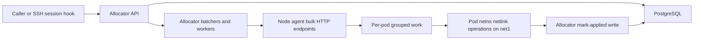
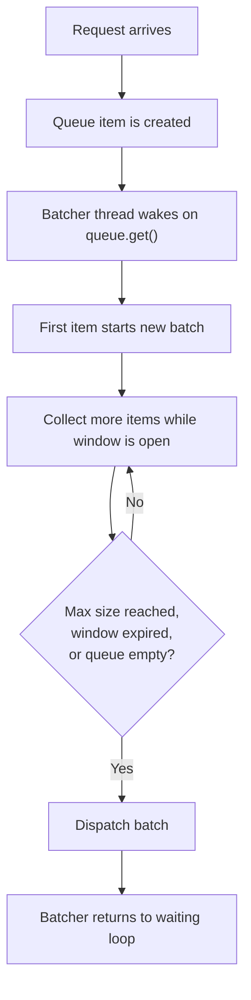
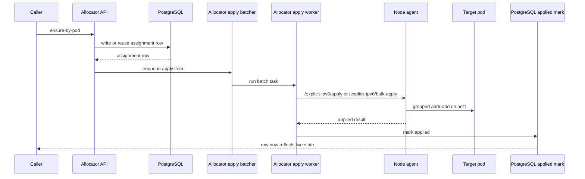
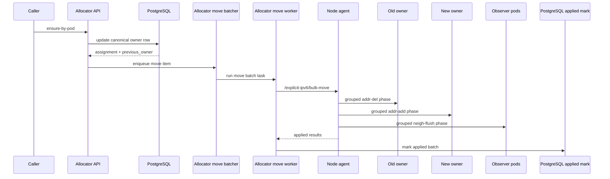
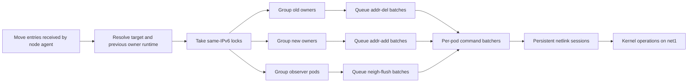
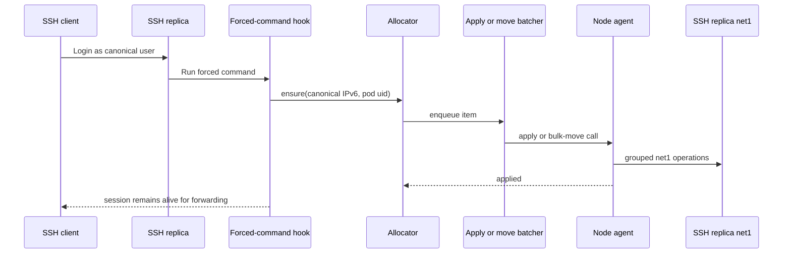
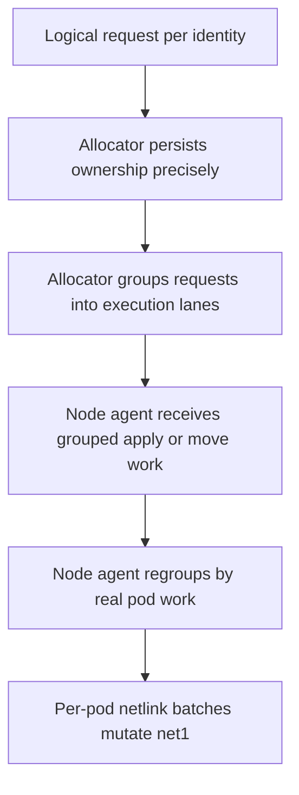

# Explicit IPv6 Apply And Move Pipeline

This page explains, in detail, how the explicit IPv6 `apply` and `move` pipeline works in the current implementation.

It is the mechanics companion to:

- [system-overview.md](./system-overview.md)
- [CMXsafeMAC-IPv6-architecture.md](./CMXsafeMAC-IPv6-architecture.md)
- [explicit-ipv6-parallelism.md](./explicit-ipv6-parallelism.md)

Use this page when you want to understand:

- what happens after one explicit IPv6 request enters the allocator
- how `apply` differs from `move`
- where batching begins
- how one SSH session login can become part of a batched move pipeline
- which Python functions own each stage
- why session storms can still collapse into fewer, larger network operations

The main mental split is:

- the allocator owns the logical truth
- the node agent owns the live network truth

## 1. Why This Page Exists

The project now has two different but related stories:

The architecture story covers:

- allocator
- PostgreSQL
- node agent
- Tetragon
- Multus
- SSH dashboard

The execution story covers:

- a request arrives
- a row is written
- work is queued
- batches are formed
- grouped node-agent work runs
- the live state is marked applied

The architecture documents already explain the first story well.

This page focuses on the second one.

## 2. First Mental Model: One Logical Request, Several Physical Layers

The most important thing to keep in mind is that one explicit IPv6 request is not the same thing as one kernel operation.

One logical request can pass through several layers:

1. one caller request
2. one allocator persistence update
3. one allocator queue item
4. one allocator-to-node-agent bulk call
5. many grouped per-pod netlink operations inside the node agent

That is why it is possible for a burst of many session-driven requests to still be processed efficiently: the system keeps the logical ownership precise, but it deliberately groups the live network work later.

## 3. Where This Fits In The Architecture

Read this as:

- the allocator is where logical ownership changes
- the node agent is where live namespace mutations happen
- batching exists on both sides, but for different reasons

## 4. The Three Batching Layers

There are really three batching stories in the implementation.

### 4.1 Layer A: Logical request batching in the allocator

This is where many requests can be coalesced before the node agent is called.

Relevant functions in [app.py](../net-identity-allocator/app.py):

- `explicit_apply_batcher()`
- `explicit_move_batcher()`
- `run_explicit_ipv6_apply_batch_task()`
- `run_explicit_ipv6_move_batch_task()`
- `apply_explicit_ipv6_batch_on_node()`
- `apply_explicit_ipv6_move_batch_on_node()`

This layer is about:

- reducing allocator-to-node-agent call count
- reducing queue explosion under bursts
- grouping requests that belong to the same execution lane

### 4.2 Layer B: Bulk HTTP shape between allocator and node agent

The allocator uses bulk endpoints so the node agent receives grouped work rather than one tiny HTTP request per IPv6 change.

Relevant node-agent endpoints in [agent.py](../CMXsafeMAC-IPv6-node-agent/agent.py):

- `/explicit-ipv6/apply`
- `/explicit-ipv6/bulk-apply`
- `/explicit-ipv6/bulk-move`

This layer is about:

- transporting grouped work efficiently
- preserving room for multiple logical items in one call

### 4.3 Layer C: Per-pod execution batching inside the node agent

This is where the real network work is grouped around pod namespaces and netlink sessions.

Relevant functions in [agent.py](../CMXsafeMAC-IPv6-node-agent/agent.py):

- `explicit_pod_batcher()`
- `queue_explicit_pod_commands()`
- `wait_batched_explicit_commands()`
- `apply_explicit_netlink_batch()`
- `apply_explicit_ipv6_requests_bulk()`

This layer is about:

- persistent per-pod netlink sessions
- per-pod command queues
- grouped `addr-add`, `addr-del`, and `neigh-flush` work

## 5. How A Batch Starts

The batch does not start because a fixed counter is reached.

It starts because the first queued item arrives and wakes a background loop.

The pattern is:

1. enqueue first item
2. batcher thread wakes on `queue.get()`
3. first item becomes the start of a new batch
4. collect more items during a short window, or until max batch size is reached
5. dispatch the batch
6. go back to waiting

So the trigger is:

- the first queued item

not:

- a fixed timer flush
- a fixed exact request count

### 5.1 Batch initiation diagram

## 6. Current Batch Windows And Sizes

In the current manifests, the important values are:

### 6.1 Allocator-side values

From [app.py](../net-identity-allocator/app.py) and [allocator-stack.yaml](../k8s/allocator-stack.yaml):

- `EXPLICIT_APPLY_BATCH_WINDOW_MS = 5`
- `EXPLICIT_MOVE_BATCH_WINDOW_MS = 5`
- `EXPLICIT_APPLY_BATCH_MAX_ITEMS = 128`
- `EXPLICIT_MOVE_BATCH_MAX_ITEMS = 64`
- `EXPLICIT_MOVE_MIN_BATCH_ITEMS = 32`
- `EXPLICIT_MOVE_DISPATCH_SHARDS = 2`

Important nuance for move batching:

- when backlog is already high, the move batcher can use `0 ms` extra wait and dispatch immediately

That behavior is controlled by:

- `effective_move_batch_max_items()`
- the `collect_window_ms = 0.0 if backlog_items >= target_batch_max ...` logic

### 6.2 Node-agent values

From [agent.py](../CMXsafeMAC-IPv6-node-agent/agent.py) and [allocator-stack.yaml](../k8s/allocator-stack.yaml):

- `EXPLICIT_OP_BATCH_WINDOW_MS = 5`
- `EXPLICIT_OP_BATCH_MAX_COMMANDS = 256`
- `EXPLICIT_POD_BATCH_SHARDS = 4`
- `EXPLICIT_MOVE_SUBBATCH_MAX_ITEMS = 256`

So the current design has:

- one short collection window in the allocator
- another short collection window inside each per-pod node-agent batcher

## 7. Apply Path: Step By Step

An `apply` means:

- the explicit IPv6 is being attached to its target pod
- there is no old owner to evict

This is the easier path.

### 7.1 Main functions

Allocator-side in [app.py](../net-identity-allocator/app.py):

- `ensure_explicit_ipv6_by_pod()`
- `dispatch_explicit_ipv6_apply()`
- `explicit_apply_batcher()`
- `run_explicit_ipv6_apply_batch_task()`
- `apply_explicit_ipv6_batch_on_node()`

Node-agent-side in [agent.py](../CMXsafeMAC-IPv6-node-agent/agent.py):

- `apply_explicit_ipv6_requests_bulk()`
- `queue_explicit_pod_commands()`
- `apply_explicit_netlink_batch()`

### 7.2 Apply sequence

### 7.3 Important nuance: single-item apply can still take the singular path

Inside `run_explicit_ipv6_apply_batch_task()`:

- if the active batch has exactly one item, the allocator can call `apply_explicit_ipv6_on_node()`
- that uses the singular node-agent endpoint `/explicit-ipv6/apply`

If the batch has more than one item:

- it calls `apply_explicit_ipv6_batch_on_node()`
- which uses `/explicit-ipv6/bulk-apply`

So create/apply is not strictly "always bulk." It is:

- single-item fast path for one item
- bulk path when there is a real batch

### 7.4 What the node agent does for bulk apply

In `apply_explicit_ipv6_requests_bulk()`:

1. resolve the target runtime
2. register that managed pod in the node-agent registry
3. for each requested IPv6, queue per-pod `addr-add` work
4. wait for those batched per-pod command items to complete
5. return applied results

This is where the important optimization lives:

- multiple `addr-add` requests for the same pod can share one per-pod batcher and one netlink session

## 8. Move Path: Step By Step

A `move` means:

- the same canonical IPv6 already exists
- ownership changes from one pod to another

This path is harder because it must:

1. remove old state
2. add new state
3. make peers forget the old owner

### 8.1 Main functions

Allocator-side in [app.py](../net-identity-allocator/app.py):

- `ensure_explicit_ipv6_by_pod()`
- `dispatch_explicit_ipv6_apply()`
- `explicit_move_batch_key()`
- `explicit_move_batcher()`
- `run_explicit_ipv6_move_batch_task()`
- `apply_explicit_ipv6_move_batch_on_node()`

Node-agent-side in [agent.py](../CMXsafeMAC-IPv6-node-agent/agent.py):

- `explicit_state_locks()`
- `chunked_entries()`
- `queue_explicit_pod_commands()`
- `apply_explicit_netlink_batch()`
- the move bulk implementation path under `/explicit-ipv6/bulk-move`

### 8.2 Move sequence

### 8.3 Important nuance: move uses bulk shape even for one logical move once queued

Unlike single-item apply, the move worker path is designed around:

- `apply_explicit_ipv6_move_batch_on_node()`

So once a move item is queued through the move batcher, the allocator uses the bulk move shape even if there is only one active logical item in that batch.

This is helpful because the node-agent move implementation already expects to regroup and run the move in explicit phases.

### 8.4 What "observer pods" means

In the move path, "observer pods" are not owners of the canonical IPv6.

They are the other managed pods on the shared `net1` LAN that may still remember the old Layer 2 mapping for that moved IPv6. Before the move, one of those pods may have cached something like:

- `requested_ipv6 -> old owner MAC`

After the move, that cached neighbor entry can be wrong. So the node agent treats those other managed pods as observers of the move and batches neighbor-cache cleanup per observer pod.

That is why the move path has three distinct regrouping roles:

- old-owner groups
  remove the IPv6 from the previous pod
- new-owner groups
  add the IPv6 to the new pod
- observer groups
  flush stale neighbor knowledge on the other pods

The important distinction is:

- observers do not own the IPv6
- they are simply peers that may still have stale knowledge about who owns it

## 9. What The Node Agent Actually Does During A Move

The node-agent move implementation does not treat a move as one opaque step.

It expands one logical move into grouped per-pod work.

### 9.1 Move regrouping model

### 9.2 The three phases

Inside the move bulk implementation in [agent.py](../CMXsafeMAC-IPv6-node-agent/agent.py):

1. **Evict phase**
- build `delete_groups`
- queue `addr-del`

2. **Set phase**
- build `add_groups`
- queue `addr-add`

3. **Flush phase**
- compute observer work
- queue `neigh-flush` or `neigh-flush-all`

That is why move is more expensive than apply:

- apply mainly collapses around the target pod
- move naturally fans back out to old owners and observers

## 10. How The Per-Pod Command Batchers Work

At the bottom of the stack, the node agent uses `ExplicitPodCommandBatcher`.

This class:

- owns one queue for one `(batch_key, op_name, shard)` lane
- waits on `queue.get()`
- collects more values during `EXPLICIT_OP_BATCH_WINDOW_MS`
- reuses a persistent netlink session into the target pod namespace
- applies a batch of commands with `apply_explicit_netlink_batch()`

### 10.1 Why this matters

Without this layer, a high request burst would tend to degenerate into:

- one Python request
- one HTTP call
- one shell command
- one address operation

repeated many times.

With this layer, many logical requests aimed at the same pod and same operation can turn into:

- one batcher wakeup
- one netns session
- one batched run of `addr-add`, `addr-del`, or `neigh-flush`

## 11. How One SSH Login Fits Into This

The canonical SSH example uses the same pipeline.

### 11.1 The trigger

The trigger is:

- a successful SSH login for a canonical user

The forced-command hook in [busybox-portable-openssh-test.yaml](../k8s/busybox-portable-openssh-test.yaml):

1. reads the username
2. reconstructs the exact canonical IPv6 from the username
3. reads runtime context from `/var/run/ssh-canonical.env`
4. calls `/explicit-ipv6-assignments/ensure` with the full canonical IPv6 and the current gateway `pod_uid`
5. waits for the row to point at the current `pod_uid` with `last_applied_at` set

### 11.2 The important batching truth

One SSH login is still just one logical request.

But it enters the same pipeline:

- the allocator may queue it into apply or move batching
- the allocator may transport it to the node agent via bulk shape
- the node agent still executes through grouped per-pod batched netlink work

So:

- session-triggered traffic is logically per login
- execution is still batched under the hood

### 11.3 SSH login flow diagram

## 12. Why High Session Loads Can Still Batch Well

This is the key practical conclusion.

When many sessions start close together:

- each session still creates its own logical identity request
- but many of those requests can collapse into fewer execution units

That happens because:

1. allocator batchers collect requests during a short window
2. move work is split into a small number of dispatch shards
3. node-agent bulk endpoints accept grouped work
4. node-agent per-pod command batchers regroup work again around the real execution boundary: the pod network namespace

So the evidence for batching under load is not that "one request becomes one batch."

The evidence is that the system has multiple grouping points that progressively turn:

- many logical requests

into:

- fewer allocator-to-node-agent calls
- fewer per-pod netlink sessions
- fewer live kernel round trips

## 13. The Simplest Accurate Mental Model

If you only remember one model from this page, remember this one:

That is the whole point of the current design.

The allocator stays precise.
The node agent stays efficient.

## 14. Function Map By Stage

### 14.1 Allocator request and routing

In [app.py](../net-identity-allocator/app.py):

- `ensure_explicit_ipv6_by_pod()`
- `assignment_node_agent()`
- `dispatch_explicit_ipv6_apply()`

### 14.2 Allocator batching

In [app.py](../net-identity-allocator/app.py):

- `effective_move_batch_max_items()`
- `explicit_apply_batcher()`
- `explicit_move_batcher()`
- `run_explicit_ipv6_apply_batch_task()`
- `run_explicit_ipv6_move_batch_task()`
- `apply_explicit_ipv6_batch_on_node()`
- `apply_explicit_ipv6_move_batch_on_node()`

### 14.3 Node-agent batch intake

In [agent.py](../CMXsafeMAC-IPv6-node-agent/agent.py):

- `apply_explicit_ipv6_requests_bulk()`
- the move bulk implementation path under `/explicit-ipv6/bulk-move`

### 14.4 Node-agent grouped execution

In [agent.py](../CMXsafeMAC-IPv6-node-agent/agent.py):

- `explicit_state_locks()`
- `chunked_entries()`
- `queue_explicit_pod_commands()`
- `wait_batched_explicit_commands()`
- `explicit_pod_batcher()`
- `apply_explicit_netlink_batch()`

## 15. Where To Read Next

After this mechanics guide:

- use [system-overview.md](./system-overview.md) for the full component map and identity story
- use [CMXsafeMAC-IPv6-architecture.md](./CMXsafeMAC-IPv6-architecture.md) for the broader architecture
- use [explicit-ipv6-parallelism.md](./explicit-ipv6-parallelism.md) for measured `5000`-request evidence and performance tuning
- use [portable-openssh-canonical-routing.md](./portable-openssh-canonical-routing.md) for the multi-replica SSH example that exercises this same pipeline from login to forwarded traffic
