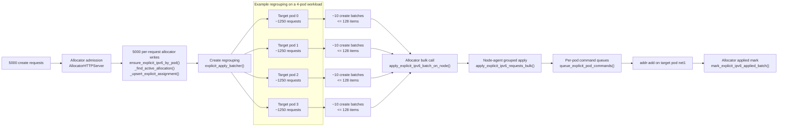
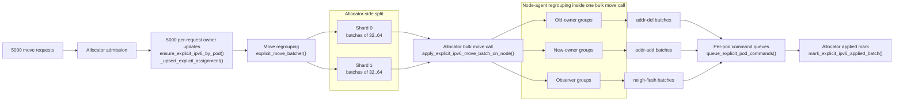

# Explicit IPv6 Create And Move Parallelism

This page explains the explicit IPv6 `create` and `move` operations, why large concurrent bursts are hard, and how the current design processes a measured `5000`-request burst.

If you want the mechanics of the pipeline itself rather than the measured performance story, read [explicit-ipv6-apply-move-pipeline.md](./explicit-ipv6-apply-move-pipeline.md) alongside this page.

The goal is to build intuition, not just list functions. The important mental split is:

- the allocator owns the logical truth
- the node agent owns the live network truth

By the time the flows in this page start, the pod already exists, the managed identity on `eth0` already exists, and the pod already has the automatic managed `net1` identity. What remains is to create or move the caller-facing explicit IPv6 on `net1`.

## 1. What These Operations Are For

### 1.1 Create

An explicit IPv6 `create` operation means:

1. a caller asks for a canonical explicit IPv6 to be attached to a target managed pod
2. the allocator stores that ownership decision in PostgreSQL
3. the node agent adds the `/128` to the pod `net1`
4. the allocator records that the network-side apply completed

At logic level, `create` is a `new ownership` operation.

It is comparatively simple because:

- there is no old owner to clean up
- no peer should still be sending traffic to a previous pod
- the work naturally collapses by target pod

Typical functions in this path:

- `ensure_explicit_ipv6_by_pod()`
- `_find_active_allocation()`
- `_upsert_explicit_assignment()`
- `dispatch_explicit_ipv6_apply()`
- `apply_explicit_ipv6_batch_on_node()`
- `apply_explicit_ipv6_requests_bulk()`

### 1.2 Move

An explicit IPv6 `move` operation means:

1. the same canonical explicit IPv6 already exists
2. the allocator changes its logical owner from one pod to another
3. the node agent removes it from the old owner
4. the node agent adds it to the new owner
5. the node agent clears stale neighbor knowledge on the other pods
6. the allocator records that the move completed

At logic level, `move` is an `ownership transfer`.

This is why `move` is always harder than `create`:

- `create` only adds new state
- `move` must remove old state, add new state, and make the rest of the shared `net1` LAN converge to the new owner

Typical functions in this path:

- `ensure_explicit_ipv6_by_pod()`
- `_upsert_explicit_assignment()`
- `dispatch_explicit_ipv6_apply()`
- `explicit_move_batcher()`
- `apply_explicit_ipv6_move_batch_on_node()`
- `apply_explicit_ipv6_move_requests_bulk()`

## 2. The Mental Model

Before looking at `5000` requests, it helps to think of the system in layers.

### 2.1 Layer 1: The Allocator Makes The Decision

The allocator decides:

- which pod should own the explicit IPv6
- which row in PostgreSQL represents that ownership
- which node agent should apply the network change

This layer is about correctness and persistence.

### 2.2 Layer 2: The Node Agent Makes The Network Match The Decision

The node agent applies the decision to the live pod network namespaces.

This layer is about:

- adding or deleting `/128` addresses
- preserving same-IPv6 serialization
- converging stale neighbor knowledge during moves

### 2.3 Layer 3: Parallelism Is Useful Only Where It Matches The Real Work

This is the key intuition:

- requests arrive one by one
- allocator decisions are written one by one
- network mutations should not be executed one by one if many of them affect the same pod

So the architecture tries to do this:

- keep request persistence precise
- group later work where grouping actually reduces cost

That is why:

- `create` is grouped by target pod
- `move` is grouped by node-agent lane first, then regrouped by old-owner, new-owner, and observer pod

## 3. The Measured 5000-Request Example

The current worked example in this page is a real Ubuntu run with:

- `5000` parallel create requests
- `5000` parallel move requests
- a reused 4-pod benchmark deployment
- the currently strongest tested move configuration:
  - `EXPLICIT_MOVE_DISPATCH_SHARDS=2`
  - `EXPLICIT_MOVE_BATCH_MAX_ITEMS=64`
  - `EXPLICIT_MOVE_MIN_BATCH_ITEMS=32`

### 3.1 Summary

| Metric | Create | Move | What It Tells Us |
| --- | ---: | ---: | --- |
| `ReqAvg` | `3266.34 ms` | `2184.9 ms` | Average latency once a request actually started |
| `ReqP95` | `4995.09 ms` | `3440.49 ms` | Tail latency for slower requests |
| `BatchAvg` | `5278.44 ms` | `4631.27 ms` | Average completion offset from common release |
| `BatchMax` | `8371.65 ms` | `7823.59 ms` | Time until the last request in the burst completed |
| Derived throughput | `597.25 ops/s` | `639.09 ops/s` | `5000 / (BatchMax / 1000)` |
| `PingSample` | `8` | `8` | Number of sample explicit IPv6s verified after the phase |

The simplest way to read this is:

- `Req*` metrics describe one request once it has actually started
- `Batch*` metrics describe how long the whole burst took to drain

### 3.2 What The Run Already Tells Us

The `5000` run shows something important:

- the real network mutations inside the node agent are now relatively small
- the remaining cost is dominated by allocator-side waiting and coordination

That is why the later sections focus heavily on:

- `queue_wait_ms`
- `node_call_ms`

and not only on:

- `evict_ms`
- `set_ms`
- `flush_ms`

## 4. How To Read The Metrics

This section is intentionally explicit, because the benchmark has several layers of timing.

### 4.1 Main Summary Metrics

These are the high-level numbers printed by the benchmark summary.

| Metric | Meaning | Intuition |
| --- | --- | --- |
| `BatchSize` | Number of operations launched in the phase | Here, `5000` |
| `CreateReqAvg` / `MoveReqAvg` | Average true request latency | "How long did one request take once it started?" |
| `CreateReqP95` / `MoveReqP95` | 95th percentile request latency | "How bad were the slower requests?" |
| `CreateBatchAvg` / `MoveBatchAvg` | Average completion offset from common batch release | Includes some client fanout spread |
| `CreateBatchMax` / `MoveBatchMax` | Last completion offset in the burst | Best number for burst throughput |
| Derived throughput | `BatchSize / (BatchMax / 1000)` | "How fast did the whole burst drain?" |
| `PingSample` | Number of sample addresses ping-tested afterward | Quick validation, not full coverage |

### 4.2 Client Fanout Metrics

These explain how much time the client spent launching the burst itself.

| Metric | Meaning |
| --- | --- |
| `create_ready_avg` / `move_ready_avg` | Average time until a worker reached the release barrier |
| `create_ready_max` / `move_ready_max` | Slowest worker to reach the release barrier |
| `create_start_skew_avg` / `move_start_skew_avg` | Average spread between common release and actual request start |
| `create_start_skew_max` / `move_start_skew_max` | Worst-case spread between release and actual start |

These numbers matter because a parallel benchmark can look slower even when the service is healthy if the client itself cannot launch all workers at exactly the same instant.

### 4.3 Trace Sources

The trace summaries come from explicit log records in the allocator and node agent.

| Source | Main Fields | Meaning |
| --- | --- | --- |
| `allocator-handler` | `client_to_allocator_ms` | Time from client send to allocator handler entry |
| `allocator-request` | `allocation_lookup_ms`, `upsert_ms`, `total_ms` | Synchronous allocator DB path before the request returns |
| `allocator-worker` | `queue_wait_ms`, `node_call_ms`, `applied_db_ms`, `total_ms` | Async apply path after the row is already persisted |
| `allocator-applied` | `db_update_ms` | Time to mark the assignment as applied in PostgreSQL |
| `allocator-applied-handler` | `node_callback_to_allocator_ms` | Callback ingress time if that path is used |
| `node-agent-handler` | `allocator_to_agent_ms`, `client_to_agent_ms` | Time until the request enters the node agent |
| `node-agent` | `resolve_runtime_ms`, `evict_ms`, `set_ms`, `flush_ms`, `total_ms` | Real network-side execution time |

### 4.4 The Most Important Fields In Practice

In the current architecture, the most useful fields are:

- `queue_wait_ms`
  Time a persisted operation waited before a worker actually started it
- `node_call_ms`
  Time the allocator spent waiting on the node-agent bulk call
- `evict_ms`
  Time to remove the IPv6 from the old owner during a move
- `set_ms`
  Time to add the IPv6 to the new owner
- `flush_ms`
  Time to clear stale neighbor knowledge on observer pods

These fields tell us where the system is really spending time.

## 5. The 5000-Request Create Path

### 5.1 Plain-Language Intuition

`Create` parallelizes well because many requests often target a small number of pods.

So even if `5000` requests arrive, the live network work does not need to remain `5000` separate flows. After the allocator persists them, the system can collapse them by target pod and apply them in batches.

That is why `create` is the easier path.

### 5.2 Flow Diagram

The important point is not the exact count of create batches. The important point is the shape:

- `5000` request writes go in
- a much smaller number of grouped apply calls comes out

### 5.3 Stages

| Stage | What It Does | Main Functions | Why It Exists | Main 5000 Signals |
| --- | --- | --- | --- | --- |
| Admission | Accept the burst without early resets | `AllocatorHTTPServer` | Protect front-door ingress | `client_to_allocator_ms ~= 1275.36 ms` |
| Request write path | Persist each ownership decision | `ensure_explicit_ipv6_by_pod()`, `_find_active_allocation()`, `_upsert_explicit_assignment()` | Keep allocator truth precise | `total_ms ~= 25.66 ms` |
| Create regrouping | Collapse many requests by target pod | `dispatch_explicit_ipv6_apply()`, `explicit_apply_batcher()` | Reduce downstream call count | `queue_wait_ms ~= 6623.35 ms` |
| Allocator-to-node-agent call | Send grouped work to the right node | `apply_explicit_ipv6_batch_on_node()` | Convert many request decisions into fewer apply calls | `node_call_ms ~= 744.98 ms` |
| Node-agent grouped apply | Add the IPv6s on `net1` | `apply_explicit_ipv6_requests_bulk()` | Perform real network mutation | `set_ms ~= 11.51 ms` |
| Applied mark | Mark completion back in PostgreSQL | `mark_explicit_ipv6_applied_batch()` | Make DB state reflect live state | `applied_db_ms ~= 118.86 ms` |

### 5.4 What The Numbers Mean For Create

The create run tells a fairly clean story:

- allocator DB work is not the main problem
- node-agent per-entry add work is not the main problem
- allocator-side waiting before apply is still the larger cost

That is why `queue_wait_ms` matters much more than the raw `set_ms`.

## 6. The 5000-Request Move Path

### 6.1 Plain-Language Intuition

`Move` is harder because one request touches more than one pod.

Every moved explicit IPv6 creates three kinds of work:

1. remove it from the old owner
2. add it to the new owner
3. make other pods forget that the old owner used to hold it

This means move work naturally fans out again even after batching.

### 6.2 Flow Diagram

The move path has two useful regrouping points:

1. a small allocator-side split so one giant queue does not form
2. a richer node-agent-side regrouping that matches the real per-pod network work

The second regrouping is the important one. That is where the work is reshaped into:

- old-owner pod batches
- new-owner pod batches
- observer pod batches

### 6.3 Stages

| Stage | What It Does | Main Functions | Why It Exists | Main 5000 Signals |
| --- | --- | --- | --- | --- |
| Admission | Accept the burst | `AllocatorHTTPServer` | Prevent early connection collapse | `client_to_allocator_ms ~= 1052.12 ms` |
| Request update path | Change logical ownership in PostgreSQL | `ensure_explicit_ipv6_by_pod()`, `_upsert_explicit_assignment()` | Keep one canonical owner in DB | `total_ms ~= 28.68 ms` |
| Move regrouping | Feed move lanes instead of one giant queue | `dispatch_explicit_ipv6_apply()`, `explicit_move_batch_key()`, `explicit_move_batcher()` | Keep enough allocator parallelism without over-fragmenting | `queue_wait_ms ~= 14449.83 ms` |
| Allocator-to-node-agent bulk move | Send grouped move work to the node agent | `apply_explicit_ipv6_move_batch_on_node()` | Turn request decisions into move work | `node_call_ms ~= 1196.12 ms` |
| Node-agent move regrouping | Regroup by the pods that must actually be touched | `apply_explicit_ipv6_move_requests_bulk()` | Match batching to real network namespaces | `total_ms ~= 13.36 ms` |
| Old-owner phase | Remove the IPv6 from the previous pod | `queue_explicit_pod_commands()` | Prevent split ownership | `evict_ms ~= 4.03 ms` |
| New-owner phase | Add the IPv6 to the new pod | `queue_explicit_pod_commands()` | Establish new ownership | `set_ms ~= 4.06 ms` |
| Observer phase | Flush stale neighbor knowledge | `queue_explicit_pod_commands()` | Stop peers sending to the old MAC | `flush_ms ~= 5.1 ms` |
| Applied mark | Persist completion | `mark_explicit_ipv6_applied_batch()` | Make DB state reflect live state | `applied_db_ms ~= 204.95 ms` |

### 6.4 What The Numbers Mean For Move

The move run shows the current architecture very clearly:

- the real network-side work is now small
- the dominant costs are still allocator-side waiting and allocator coordination around bulk node-agent calls

That means the system is no longer mainly bottlenecked by:

- raw `addr-del`
- raw `addr-add`
- raw `neigh-flush`

Instead, it is bottlenecked more by:

- how work waits before being dispatched
- how the allocator shapes bulk move calls

## 7. Why The Current Split Looks The Way It Does

The tuning work showed three useful lessons.

### 7.1 Too Much Allocator Fragmentation Hurts

If the allocator divides move work too aggressively:

- `node_call_ms` tends to grow
- too many medium-sized bulk calls are created
- downstream coordination cost increases

### 7.2 Too Little Allocator Splitting Also Hurts

If the allocator collapses move work into one single queue per node-agent endpoint:

- `queue_wait_ms` grows sharply
- total move latency regresses

So full allocator simplification was attractive in theory, but too centralized in practice.

### 7.3 The Best Current Middle Ground

The current best tested balance is:

- a small allocator-side split
- richer regrouping only inside the node agent

This keeps the allocator from becoming one giant waiting line while still letting the node agent regroup work where grouping really matters: by pod network namespace.

## 8. Tuning Knobs

This is the short practical map of the knobs that matter most.

### 8.1 Allocator Admission

| Knob | What It Tunes | Practical Effect |
| --- | --- | --- |
| `ALLOCATOR_REQUEST_QUEUE_SIZE` | HTTP backlog size | Prevents early connection resets during large bursts |

### 8.2 Create Path

| Knob | What It Tunes | Practical Effect |
| --- | --- | --- |
| `EXPLICIT_APPLY_WORKERS` | Concurrent allocator create apply workers | Higher values reduce waiting until another bottleneck appears |
| `EXPLICIT_APPLY_BATCH_WINDOW_MS` | How long the allocator waits to collect a create batch | Larger window can reduce call count but adds waiting |
| `EXPLICIT_APPLY_BATCH_MAX_ITEMS` | Maximum items per create batch | Larger batches reduce HTTP calls but increase tail risk |

### 8.3 Move Path

| Knob | What It Tunes | Practical Effect |
| --- | --- | --- |
| `EXPLICIT_MOVE_DISPATCH_SHARDS` | Number of allocator move lanes | Too low increases queueing; too high increases fragmentation |
| `EXPLICIT_MOVE_BATCH_WINDOW_MS` | Time spent waiting to collect a move batch | Small values reduce waiting; large values can increase latency |
| `EXPLICIT_MOVE_BATCH_MAX_ITEMS` | Upper bound for a move batch | Bigger batches lower call count but can create long tails |
| `EXPLICIT_MOVE_MIN_BATCH_ITEMS` | Lower bound used when the move queue adapts under pressure | Helps control batch size when backlog changes |

### 8.4 Node-Agent Per-Pod Execution

| Knob | What It Tunes | Practical Effect |
| --- | --- | --- |
| `EXPLICIT_POD_BATCH_SHARDS` | Parallel lanes for per-pod command queues | Raises same-pod concurrency for different IPv6s |
| `EXPLICIT_OP_BATCH_WINDOW_MS` | How long the node agent waits to collect per-pod work | Larger window improves grouping but adds delay |
| `EXPLICIT_OP_BATCH_MAX_COMMANDS` | Max work per internal pod batch | Bigger batches reduce overhead but can increase tails |

## 9. Function Map By Stage

### 9.1 Create

Allocator:

- `ensure_explicit_ipv6_by_pod()`
- `_find_active_allocation()`
- `_upsert_explicit_assignment()`
- `dispatch_explicit_ipv6_apply()`
- `explicit_apply_batcher()`
- `run_explicit_ipv6_apply_batch_task()`
- `apply_explicit_ipv6_batch_on_node()`
- `mark_explicit_ipv6_applied_batch()`

Node agent:

- `apply_explicit_ipv6_requests_bulk()`
- `queue_explicit_pod_commands()`
- `ExplicitPodCommandBatcher`
- `resolve_runtime_for_identity()`

### 9.2 Move

Allocator:

- `ensure_explicit_ipv6_by_pod()`
- `_upsert_explicit_assignment()`
- `dispatch_explicit_ipv6_apply()`
- `explicit_move_batch_key()`
- `explicit_move_batcher()`
- `run_explicit_ipv6_move_batch_task()`
- `apply_explicit_ipv6_move_batch_on_node()`
- `mark_explicit_ipv6_applied_batch()`

Node agent:

- `apply_explicit_ipv6_move_requests_bulk()`
- `queue_explicit_pod_commands()`
- `ExplicitPodCommandBatcher`
- `explicit_state_lock()`
- `resolve_runtime_for_identity()`

## 10. The Core Intuition To Keep

When reading the charts and the traces, the most important rule is this:

> allocator decisions must stay precise, but live network work should be grouped by the pods that actually need to be touched

That is the thread connecting the whole design:

- `create` gets cheaper when many requests collapse by target pod
- `move` gets cheaper when work is regrouped by old-owner, new-owner, and observer pod
- performance gets worse when the allocator introduces too many extra waiting lines before the node agent can perform that real regrouping

That is also why low CPU plus high latency is a warning sign. It usually means the system is waiting in orchestration instead of spending time doing real network work.
