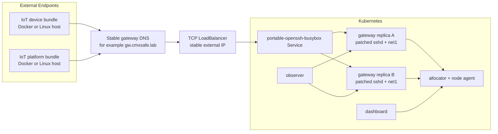
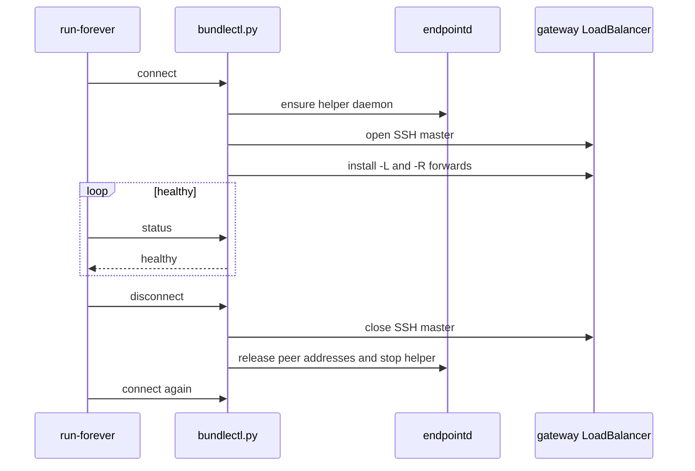

# External Endpoint Rollout

This page explains the next deployment mode after the in-cluster Kubernetes proof:

- keep the CMXsafe gateway layer inside Kubernetes
- move IoT devices and IoT platforms outside Kubernetes
- let those external endpoints connect inward through CMXsafe bundles

The goal is not to expose "Kubernetes" as a whole. The stable external identity should belong to the CMXsafe SSH gateway entrypoint.

## Why This Mode Matters

The current fan-out proof is intentionally convenient:

- 10 IoT devices run as pods
- 1 IoT platform runs as a pod
- 2 patched Portable OpenSSH gateways run as pods

That is excellent for repeatable validation, but it is not the final operational shape. In the target model:

- the gateway layer remains replicated inside Kubernetes
- the allocator, dashboard, and observer remain inside Kubernetes
- IoT devices and IoT platforms are ordinary Linux endpoints outside the cluster

Those endpoints can be:

- real Linux machines
- Docker containers started outside Kubernetes
- lightweight edge appliances

## Recommended Decisions

The rollout choices agreed for the next stage are:

1. expose the CMXsafe SSH gateway through a TCP `LoadBalancer`
2. give that gateway entrypoint one stable IP address and one stable DNS name
3. begin with Docker containers outside Kubernetes before moving to real hardware
4. build one reusable CMXsafe endpoint runtime image and mount small per-endpoint bundles into it
5. ship a `run-forever` shell wrapper in every dashboard-generated bundle
6. keep the current Python plus `iproute2` helper for now, while documenting the path to a future static helper binary

## Resulting Topology



The important point is that the external endpoints only need outbound connectivity to the stable gateway DNS name and port.

## Why A LoadBalancer Is The Right First Choice

The gateway entrypoint needs:

- one stable IP
- one stable DNS name
- TCP pass-through semantics
- health checks
- support for long-lived SSH sessions

That matches a `LoadBalancer` better than application-layer ingress.

The load balancer should front:

- the `portable-openssh-busybox` Service
- the SSH port only

It should not terminate SSH or rewrite the TCP stream. The CMXsafe logic depends on the SSH sessions reaching one of the gateway replicas intact.

## Stable DNS And Name Resolution

The stable DNS name should identify the gateway entrypoint, not the cluster itself.

Good examples:

- `gw.cmxsafe.lab`
- `ssh-gateway.example.internal`

For a small lab, name resolution can be done with:

- `/etc/hosts` on Linux systems
- `--add-host` on Docker containers
- Windows `hosts` entries on the workstation

For a larger environment, proper internal DNS is cleaner.

The bundle should always point at that stable DNS name. If no real DNS record exists for that name yet, a local host entry is required on the endpoint or container runtime, otherwise the bundle will not be able to resolve the gateway.

That keeps the downloaded configuration the same whether the endpoint is:

- a Docker container
- a VM
- a real IoT device

## Reusable Endpoint Image

The repository now includes a reusable endpoint runtime image build:

```powershell
powershell -NoProfile -ExecutionPolicy Bypass -File .\tools\build-cmxsafe-endpoint-image.ps1
```

That image contains:

- patched CMXsafe Portable OpenSSH in `/opt/openssh`
- `python3`
- `iproute2`
- `endpointd.py`
- `cmxsafe-ssh`
- `bundlectl.py`
- `connect-platform`, `run-forever`, `send-message`, and `disconnect`

It expects:

- a bundle mounted at `/bundle`
- `CAP_NET_ADMIN` when helper mode is enabled
- gateway DNS or local host-name resolution

This gives us one immutable shared runtime image and many small identity-specific bundles.

## Bundle Formats

The dashboard now supports two endpoint bundle formats:

- `runtime-image`
  the recommended option for Docker or Linux endpoints using the shared image
- `self-contained`
  the legacy full bundle for direct extraction on a host

The `runtime-image` bundle keeps the per-endpoint payload focused on:

- `config.json`
- keys
- wrapper scripts
- logs directory

while the shared runtime image carries the common helper and OpenSSH runtime.

## External Docker Endpoints

Using Docker outside Kubernetes is a very good intermediate step.

It gives:

- realistic "external to the cluster" behavior
- easy repeatability
- easy teardown
- the same bundle shape later used on real Linux endpoints

The main operational requirement is that the container must be able to:

- resolve the gateway DNS name
- open outbound TCP to the gateway SSH port
- create the local helper interface when helper mode is enabled

That means helper-enabled containers should typically run with:

- `--cap-add NET_ADMIN`

With the reusable endpoint image, an example shape is:

```sh
docker run --rm -it \
  --cap-add NET_ADMIN \
  --add-host gw.cmxsafe.lab:192.168.1.60 \
  -v "$PWD/cmxsafe-endpoint-<identity>:/bundle" \
  cmxsafemac-ipv6-endpoint-base:docker-desktop-v1
```

The image entrypoint switches into `/bundle` and runs `./run-forever` by default.

To send one message manually:

```sh
docker run --rm -it \
  --cap-add NET_ADMIN \
  --add-host gw.cmxsafe.lab:192.168.1.60 \
  -v "$PWD/cmxsafe-endpoint-<identity>:/bundle" \
  cmxsafemac-ipv6-endpoint-base:docker-desktop-v1 ./send-message "hello from device"
```

The exact image can be slimmer later. The point of this first stage is behavioral realism and clean repeatability, not endpoint minimization yet.

## Bundle Requirements Today

The current self-contained bundle expects:

- `python3`
- `iproute2`
- a CMXsafe-compatible OpenSSH client
- permission to create and manage a dummy interface such as `cmx0`

The recommended `runtime-image` bundle expects instead:

- the shared endpoint image
- `CAP_NET_ADMIN`
- a mounted bundle directory
- gateway DNS or local host-name resolution

### Why `iproute2` Is Needed

The helper currently uses the Linux `ip` command to:

- create the dummy interface
- bring it up
- add canonical `/128` IPv6 addresses
- delete those canonical `/128` IPv6 addresses
- observe interface and address state

So `iproute2` is not an arbitrary dependency. It is how the current helper speaks to Linux networking.

### Why Python Is Needed

The current endpoint helper daemon is implemented in Python because that made it fast to iterate on:

- the socket RPC surface
- owner and refcount tracking
- address reaping
- the mirror-address lifecycle

That is a development convenience, not a conceptual requirement.

## Future Dependency Reduction

Yes, the Python helper and `iproute2` can be replaced.

The clean future shape is:

- one static helper binary
- direct netlink calls instead of shelling out to `ip`
- no Python dependency
- no `iproute2` dependency

That would leave the endpoint bundle with only:

- the patched SSH client
- the helper binary
- the small shell wrappers

For now, the current Python helper remains the fastest path to a reliable external pilot.

## Why The Helper Is Still Useful Outside Kubernetes

Even when the endpoint is external, the helper still matters whenever the local application should see canonical addresses rather than loopback-only semantics.

The helper gives the endpoint a local place to bind:

- its own canonical IPv6
- peer canonical IPv6 addresses needed for mirror and direct socket behavior

That preserves the CMXsafe socket model end to end.

If an endpoint only needs "communication works" and does not care about canonical IPv6 visibility at the local application boundary, helper-less variants are possible later. They are not the preferred mode for the identity-preserving CMXsafe path.

## Reconnect Supervision

The current dashboard-generated bundle now ships two connection entrypoints:

- `connect-platform`
  one-shot setup of `endpointd`, the SSH master, and configured forwards
- `run-forever`
  the preferred persistent mode

`run-forever` does this:

1. start the bundle connection
2. poll bundle health through `bundlectl.py status`
3. if the SSH master becomes unhealthy, disconnect cleanly
4. sleep briefly
5. reconnect and reinstall forwards

That gives the external endpoint a simple operational model without requiring a full init system yet.



## Identity And Trust Still Work The Same Way

Moving the endpoint outside Kubernetes does not weaken the canonical identity model.

The trusted identity still comes from:

- the SSH username
- the dashboard-issued key
- the gateway-side canonical address derivation

It does not come from the external endpoint claiming an arbitrary source IPv6 locally.

So an external endpoint may sit behind:

- NAT
- a home router
- a lab bridge
- a Docker network

and the gateway still emits traffic using the canonical IPv6 tied to the authenticated account.

## Recommended Rollout Order

1. expose the SSH gateway through a stable TCP `LoadBalancer`
2. bind one stable DNS name to that gateway entrypoint
3. generate a dashboard bundle that points to that DNS name
4. run one IoT device as a Docker container outside Kubernetes
5. run one IoT platform as a Docker container outside Kubernetes
6. validate the observer view and mark those endpoints as external instead of pod-backed
7. move the same bundle shape to real Linux devices later

## Relationship To The Existing Kubernetes Proof

The existing fan-out proof remains useful.

It proves:

- multi-replica rendezvous
- canonical identity preservation
- direct plus reverse forwarding correctness
- resilience when the platform session moves across replicas

The external-endpoint rollout does not replace that proof. It builds on it.

For the in-cluster proof and terminology mapping, see:

- [tests/portable-openssh-iot-fanout-testbed.md](./tests/portable-openssh-iot-fanout-testbed.md)

For the dashboard and bundle model, see:

- [portable-openssh-dashboard.md](./portable-openssh-dashboard.md)
