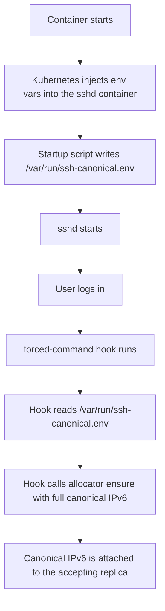
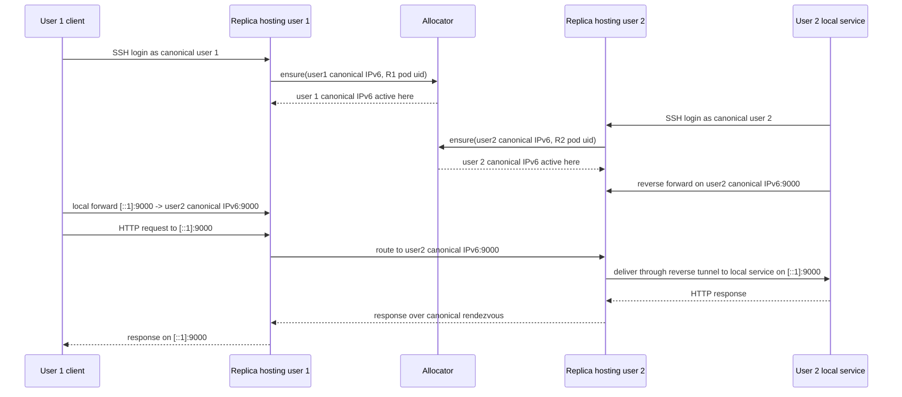

# Portable OpenSSH Canonical Routing Example

This document walks through a complete multi-replica SSH example built on top of the MAC and IPv6 allocator.

The example answers one concrete question:

> How can two SSH users connect through the same SSH Service, land on different replicas, and still forward traffic end to end to each other?

The answer is:

- give each logical SSH user a stable canonical IPv6 identity
- move that canonical IPv6 to the replica currently hosting that user's SSH session
- use the canonical IPv6, not pod-local loopback, as the rendezvous address for SSH forwarding

For the exact allocator and node-agent batching mechanics behind that move, see [explicit-ipv6-apply-move-pipeline.md](./explicit-ipv6-apply-move-pipeline.md).

This turns a "which replica did I land on?" problem into a "where is this canonical identity currently active?" solution.

## The Problem

With one SSH replica, a reverse tunnel and a local tunnel can meet on the same `sshd` instance easily:

- user 2 opens a reverse listener on the SSH server
- user 1 opens a local forward to that listener
- traffic reaches the target service behind user 2

That simple mental model breaks when the SSH Service load-balances across multiple replicas.

If user 1 and user 2 connect to different replicas, a loopback rendezvous such as:

- user 2: `-R 127.0.0.1:9000 -> user2 local service on 9000`
- user 1: `-L 127.0.0.1:9000 -> 127.0.0.1:9000 on the server side`

is no longer enough, because:

- `127.0.0.1:9000` exists only on the replica that accepted user 2
- user 1 may be connected to a different replica
- the two SSH sessions no longer share the same loopback namespace

So the real problem is not "can OpenSSH forward traffic?"

It is:

> how do two sessions that terminate on different replicas find the same logical rendezvous point?

## The Solution In One Picture


The key idea is the middle hop:

- user 1 does not target server-side `127.0.0.1`
- user 1 targets user 2's canonical IPv6

That canonical IPv6 moves with the active SSH session for user 2, so it remains the stable rendezvous address.

## Authoritative vs local mirror canonical IPv6

This design uses the same canonical IPv6 value in two different ways, and the distinction matters:

- `authoritative canonical IPv6`
  - allocator-managed
  - attached on `net1` inside the gateway replica that currently owns the SSH session
  - exactly one active owner at a time
  - used as the real rendezvous address for cross-replica forwarding

- `local mirror canonical IPv6`
  - endpoint-local only
  - attached on the endpoint helper's dummy interface, such as `cmx0`
  - many endpoints may host the same mirrored `/128` at the same time
  - used only for local socket source-address semantics
  - not advertised externally and not owned by the allocator

That means a platform service can have:

- one authoritative canonical IPv6 on one gateway replica
- many simultaneous local mirror copies of that same IPv6 across IoT device endpoints

without any conflict. The rule is:

- one authoritative owner at a time
- many local mirrors are valid and expected

## Example Topology

This example uses:

- `4` replicas of `portable-openssh-busybox`
- one Kubernetes Service in front of them
- two logical users
- one canonical IPv6 per logical user

The specific identities used in the validated test were:

- user 1
  - canonical IPv6: `7101:f6db:2b39:7894:0:aa55:0:1`
  - SSH username: `7101f6db2b3978940000aa5500000001`
- user 2
  - canonical IPv6: `7102:f6db:2b39:7894:0:aa55:0:2`
  - SSH username: `7102f6db2b3978940000aa5500000002`

The username is simply the fully expanded canonical IPv6 written as lowercase hex without colons.

In the current sample manifests, the middle 6 bytes come from the configured stable `canonical_gateway_mac`, defaulting to `f6:db:2b:39:78:94`. They no longer come from the live replica MAC that happened to accept the SSH session.

Why this works well:

- it is stable
- it is unique
- it can be reversed back into the canonical IPv6
- it carries the `gw_tag`, stable `canonical_gateway_mac`, canonical counter `0000`, and endpoint `mac_dev`

## Components Involved

### 1. The SSH replicas

The deployment in [busybox-portable-openssh-test.yaml](../k8s/busybox-portable-openssh-test.yaml) now runs:

- `replicas: 4`
- `pods-mac-allocator/enabled: "true"`
- a Multus extra interface `net1`

That gives each replica:

- its normal pod IP
- allocator-managed identity state
- a second interface where explicit IPv6 identities can be attached

### 2. The SSH dashboard

The dashboard in [portable-openssh-dashboard.md](./portable-openssh-dashboard.md) remains the source of desired SSH account state.

For this example it is used to:

- create the two canonical SSH users if they do not already exist
- generate and store their keypairs
- render `passwd`, `group`, and `authorized_keys`

### 3. The allocator

The allocator remains the source of truth for canonical IPv6 placement.

The important API used by this example is:

- `POST /explicit-ipv6-assignments/ensure`

That endpoint says, effectively:

> attach or move this canonical IPv6 so that it belongs to the pod that currently owns this SSH session

The request includes the accepting gateway `pod_uid` and the full canonical `ipv6_address` reconstructed from the SSH username. This is deliberate: the gateway hook should not rebuild the identity from the accepting replica's runtime MAC, because that would make the canonical IPv6 drift after a pod restart, node change, or CNI reallocation.

The older helper endpoint, `POST /explicit-ipv6-assignments/ensure-by-pod`, remains useful for tests and tools that start from `gw_tag` and `mac_dev`. When used now, it also honors the configured stable `canonical_gateway_mac`.

## Stable Canonical Gateway MAC

CMXsafe canonical IPv6 identities use this layout:

```text
2-byte gw_tag | 6-byte canonical_gateway_mac | 2-byte counter | 6-byte mac_dev
```

For endpoint identities, the canonical counter is always `0000`. Runtime replica allocation still uses per-pod counters for uniqueness, but those counters are not part of the endpoint identity. This gives us two separate concepts:

- `canonical_gateway_mac`: logical identity-root MAC stored in the database and mirrored into allocator settings
- replica managed MAC: runtime pod MAC derived from the same configured root plus a per-pod counter

That separation is important. A user account must keep the same canonical IPv6 no matter which gateway replica accepts the SSH session. The replica may change; the identity must not.

## Why The SSH Username Is Derived From The Canonical IPv6

The forced command in `authorized_keys` runs inside the SSH session.

At that point it knows:

- which Unix username just logged in
- which pod accepted the SSH session

If the username is the canonical IPv6 in a reversible form, the hook can derive:

- the full canonical IPv6
- the stable `canonical_gateway_mac`
- the endpoint `mac_dev`

without a separate lookup table.

So the username is not just a label. It is a compact transport of the canonical identity.

## The Session Hook

The policy script is stored in the `portable-openssh-policy` ConfigMap inside [busybox-portable-openssh-test.yaml](../k8s/busybox-portable-openssh-test.yaml).

Its job is:

1. detect whether the SSH username is a 32-character lowercase hex canonical identity
2. reconstruct the full canonical IPv6 from that username
3. call the allocator to ensure that exact canonical IPv6 is assigned to the current pod
4. wait until the allocator shows that the move is applied
5. keep the forwarding session alive

That means the canonical move happens at SSH session start, not as a separate manual operation.

## Why `/var/run/ssh-canonical.env` Was Needed

One subtle runtime issue showed up in practice:

- the main container process had the allocator-related environment variables
- the user-session process started by `sshd` did not reliably see them

The values that mattered were:

- `ALLOCATOR_URL`
- `POD_UID`
- `EXPLICIT_IFACE`
- wait tuning values

The fix was to make the startup script write a small runtime file:

- `/var/run/ssh-canonical.env`

Then the forced-command hook reads that file before calling the allocator.

That turned an unreliable environment inheritance assumption into an explicit runtime contract.



## Why The Dashboard Renderer Needed A Fix

The dashboard originally wrote the canonical IPv6 string directly into the `comment` field of the rendered `passwd` entry.

That created an invalid `passwd` line because the GECOS field cannot contain raw colons.

The symptom was:

- the user existed on disk
- but `sshd` parsed the shell field incorrectly
- authentication failed before the forced-command hook could even run

The fix in [app.py](../CMXsafeMAC-IPv6-ssh-dashboard/app.py) was:

- sanitize `passwd` fields before rendering
- replace `:` with spaces in GECOS-style fields
- sanitize group names similarly

That is an important practical detail for any SSH design that derives usernames or comments from IPv6-like data.

## Step-By-Step Flow

### Step 1. Deploy the SSH workload

Apply the sample manifest:

- [busybox-portable-openssh-test.yaml](../k8s/busybox-portable-openssh-test.yaml)

This creates:

- the namespace
- the extra Multus network attachment
- the `4`-replica SSH deployment
- the SSH Service
- the policy ConfigMap

### Step 2. Prepare the canonical users

The helper script:

- [prepare-portable-openssh-canonical-test.ps1](../tools/tests/openssh/prepare-portable-openssh-canonical-test.ps1)

does the repetitive setup:

1. applies the SSH manifests
2. waits for the replicas
3. opens allocator and dashboard access
4. ensures the SSH pods have managed allocations
5. creates two canonical identities
6. creates the corresponding dashboard users if they do not already exist
7. queues a reconcile so the files land in the PVCs

This is the easiest reproducible path for the example.

### Step 3. User 2 starts a session

User 2 connects to the SSH Service. The Service may route the session to any replica.

When login succeeds:

- the forced-command hook reads the username
- reconstructs the exact canonical IPv6
- calls the allocator
- waits until user 2's canonical IPv6 is active on that replica

### Step 4. User 1 starts a session

User 1 also connects to the SSH Service, possibly landing on a different replica.

The same hook moves user 1's canonical IPv6 to the replica that accepted user 1.

At this point we have:

- one replica currently owning user 1's canonical IPv6
- another replica currently owning user 2's canonical IPv6

Those two placements can be different, and that is the whole point of the example.

### Step 5. User 2 publishes a reverse listener on its canonical IPv6 and keeps port `9000`

User 2 opens a reverse forward like this:

```bash
ssh -N \
  -R '[7102:f6db:2b39:7894:0:aa55:0:2]:9000:[::1]:9000' \
  7102f6db2b3978940000aa5500000002@<ssh-service>
```

The important detail is the bind address:

- it is user 2's canonical IPv6
- not the SSH server's `127.0.0.1`

That makes the reverse listener reachable through the identity that moves with user 2's session.

This also preserves the service port semantics:

- the service on user 2 listens on `9000`
- the relay publishes user 2's canonical IPv6 on `9000`

### Step 6. User 1 targets user 2's canonical IPv6 and also keeps port `9000`

User 1 opens a local tunnel:

```bash
ssh -N \
  -L '[::1]:9000:[7102:f6db:2b39:7894:0:aa55:0:2]:9000' \
  7101f6db2b3978940000aa5500000001@<ssh-service>
```

Now user 1's local `::1:9000` is connected to:

- user 2's canonical IPv6 on port `9000`

not to a replica-local loopback address.

### Step 7. The application request flows end to end

When user 1 runs:

```bash
wget -qO- http://[::1]:9000/
```

the request takes this path:


That is the traffic flow that was validated live.

## What The Patched OpenSSH Path Preserves

The patch, together with the endpoint helper, preserves two different things at once.

### A. The well-known service port stays the same along the forwarding chain

In the refined proof topology:

- user 2 local service listens on `9000`
- the relay exposes user 2's canonical IPv6 on `9000`
- user 1 opens the local forward on `9000`

That gives the forwarding chain the same service-facing port all the way through:


This is the part that matches the paper's identity-socket / mirror-socket goal of keeping the service port stable instead of remapping it to an unrelated relay-only port.

### B. The true origin source tuple is still preserved

The patched OpenSSH path also preserves the originator socket tuple for the forwarded leg:

- source IPv6
- source port, including ephemeral ports

So if a local client on user 1 opens an HTTP connection to `::1:9000` using ephemeral source port `48066`, the destination side can still observe:

- source IPv6 = user 1 canonical IPv6
- source port = `48066`

This is not a contradiction with the stable service port model. They are preserving different sides of the flow:

- destination service port remains `9000`
- originator source port remains whatever the real client used

That combination is what lets the design preserve:

- a stable service identity
- a stable machine identity
- and fine-grained origin attribution

## What Was Actually Validated

The live test proved three separate things.

### A. Canonical logins move the IPv6 to the accepting replica

A canonical user logging in to a replica caused the explicit assignment row to move to that replica's `pod_uid`.

That proves the SSH session hook and the allocator integration are connected correctly.

### B. The two canonical users can end up on different replicas

The validated run placed:

- user 1 on one replica
- user 2 on another replica

So the example is not relying on both sessions landing on the same `sshd` instance.

### C. Forwarded application traffic still works end to end, with identity preserved

In the validated proof:

- user 2's local service listened on `9000`
- the relay published user 2's canonical IPv6 on `9000`
- user 1 consumed the service on local `::1:9000`

The destination service observed:

```json
{"client":"7101:f6db:2b39:7894:0:aa55:0:1","port":48066}
```

That shows two things at once:

- the destination service still lived behind the well-known service port `9000`
- the final destination observed user 1's canonical IPv6 and the real ephemeral source port chosen by the originator

That is the application-layer proof that the canonical IPv6 identity is doing the rendezvous work we wanted while the patched OpenSSH path is preserving the true source socket identity.

## Why This Example Matters

The earlier explicit IPv6 benchmarks prove the control-plane behavior:

- create
- move
- reconcile
- apply timing

This SSH example proves the same idea at the application layer.

It shows that canonical IPv6 identities are not just database objects or ping targets. They can be used as stable rendezvous addresses for real forwarded traffic, even when sessions land on different replicas behind the same Service.

More specifically, it shows that the design can preserve:

- the well-known service port (`9000`) across the direct-plus-reverse chain
- the canonical IPv6 of the originating peer
- the real source port, including ephemeral ports, chosen by the originating client

## Summary

The multi-replica SSH problem is:

- reverse and local forwarding naturally want a stable rendezvous point
- but loopback is replica-local
- and Services may place different users on different pods

The solution is:

- give each logical SSH user a canonical IPv6 identity
- move that identity to the pod currently hosting the user's session
- bind reverse listeners to that canonical IPv6 on the same well-known service port
- target that canonical IPv6 from the other user on that same service port
- preserve the originating peer's source IPv6 and source port into the final destination connection

That is what made this end-to-end flow work:



That is the complete example the repository now supports.

For the larger Kubernetes scenario with 10 IoT device endpoints, 1 platform endpoint, and 2 gateway replicas, see:

- [portable-openssh-iot-fanout-testbed.md](./tests/portable-openssh-iot-fanout-testbed.md)

That harness provisions the canonical SSH users, starts the direct and reverse sessions, reports the natural Service-driven landing distribution across the two replicas, and then re-validates the platform rendezvous after moving the platform reverse session to the other replica.

Run it from the repository root:

```powershell
powershell -NoProfile -ExecutionPolicy Bypass -File .\tools\tests\openssh\test-cmxsafe-k8s-iot-fanout.ps1
```

The expected success condition is:

- all 10 device pods reach the IoT platform service through local port `9000`
- the platform service observes each device's canonical IPv6 as the client source address
- the platform service observes the real per-connection source port, including ephemeral ports
- the 10 device SSH session placements are reported as they naturally landed
- after the platform reverse session moves to the other gateway replica, all 10 devices still reach the platform service
