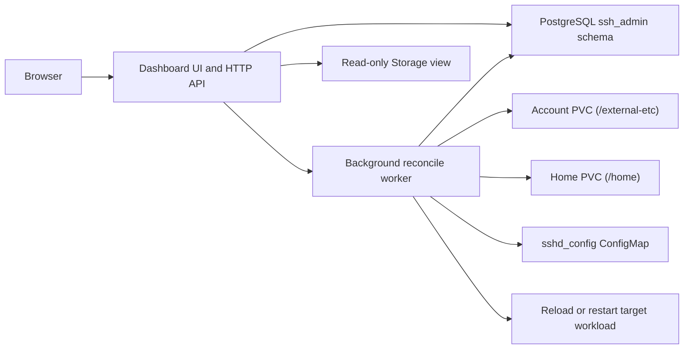
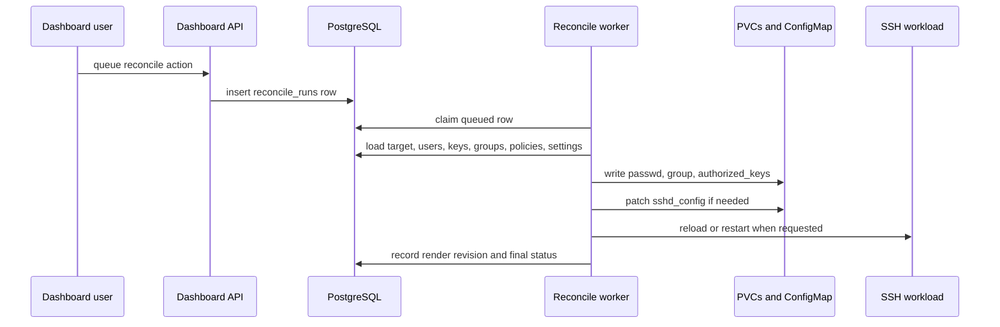

# Portable OpenSSH Dashboard

This page describes the first dashboard-backed control plane for the BusyBox Portable OpenSSH sample.

The goal is to keep one simple rule clear:

> PostgreSQL is the desired state, and the PVCs plus ConfigMaps are rendered state.

The dashboard pod owns the translation between those two layers.

## What The Dashboard Does

The dashboard manages:

- SSH targets
- users
- groups
- public keys
- stored private keys for generated or manually managed keypairs
- per-key policy profiles
- server settings that become `sshd_config`
- reconcile jobs

The first implementation keeps the UI/API and the async worker in the same pod.

That means:

- the HTTP layer stays responsive
- reconcile work is still background work
- there is no permanent seed pod

## Why The Current OpenSSH Sample Makes This Possible

The Portable OpenSSH sample already proved two critical behaviors:

1. `/etc/passwd` and `/etc/group` can be symlinked to `/external-etc`
2. new SSH logins can see account-file changes without recreating the SSH pod

That is why the dashboard can safely render:

- `passwd`
- `group`
- `authorized_keys`

and have those changes take effect for fresh logins.

One important practical detail came out of the canonical-IPv6 SSH example:

- user comments or other rendered account fields must be sanitized before they are written into `passwd`

Canonical IPv6 strings naturally contain `:`, but raw colons would corrupt the `passwd` field layout and make `sshd` misread the account record. The dashboard renderer now sanitizes those fields before writing `passwd` and `group`.

See:

- [portable-openssh-canonical-routing.md](./portable-openssh-canonical-routing.md)

## First-Version Scope

The first version is intentionally scoped to the validated sample target.

The dashboard pod mounts:

- `portable-openssh-etc`
- `portable-openssh-home`
- `portable-openssh-runtime`

So the first version is best read as:

- one dashboard deployment
- one mounted sample target
- one PostgreSQL-backed desired-state model

This is already enough to replace the old seed-pod workflow for the sample. A more generic multi-target version can come later.

The UI is now menu-driven instead of rendering every form at once. You choose:

- the target
- the section you want to manage
- the user you want to manage inside the Users section

That keeps the page much easier to work with once a target has several users and keys.

The `Users` section is now built as a two-pane management view:

- a left explorer pane for search, browsing, one-user creation, and batch user creation
- a right detail pane for the currently selected user

That left pane is intentionally wider than the first version so the search controls and creation forms remain readable even when the selected target has a larger user base.

The `Users` section now supports:

- substring search over usernames
- paged browsing through the full user list
- one-user-at-a-time editing
- automatic Ed25519 keypair generation when a user is created
- batch user creation from a text file with one username per line
- explicit endpoint role flags: `IoT device` and `IoT platform`

The batch flow creates, for each username:

- a unique UID
- a private primary group with a unique GID
- `/home/<username>`
- an initial generated keypair stored in PostgreSQL and rendered into the target home tree

There is now also a dedicated `Groups` section. This keeps shared primary groups explicit and manageable instead of assuming that every user must own a unique GID.

Endpoint role flags are dashboard metadata used by topology and observer views. They do not change the Linux username, UID, GID, SSH keys, or generated account files. Their purpose is to avoid guessing endpoint type from behavior. For example, an IoT device may publish a service later, but it should still be shown and reasoned about as an IoT device rather than being automatically treated as a platform.

There is now also a `Storage` section for the selected target. It is a read-only browser over the mounted PVC paths inside the dashboard pod, so you can inspect:

- account files
- home content
- runtime bundle content

This is useful for verifying that reconcile output really landed in the mounted storage and that the sample PVCs were seeded correctly.

## Component Layout



### Dashboard service

The dashboard service lives in:

- [app.py](../CMXsafeMAC-IPv6-ssh-dashboard/app.py)

It contains:

- a simple HTML dashboard
- small HTTP endpoints for state changes
- a reconcile worker thread

### Kubernetes wiring

The deployment manifest is:

- [portable-openssh-dashboard.yaml](../k8s/portable-openssh-dashboard.yaml)

It mounts the sample target PVCs read-write, and it has RBAC for:

- ConfigMap patch
- pod listing
- pod exec
- Deployment patch

The runtime PVC is mounted read-only, because the dashboard only needs to inspect it.

### Render targets

The reconcile worker writes:

- `/external-etc/passwd`
- `/external-etc/group`
- `/home/<user>/.ssh/authorized_keys`

It can also patch:

- `portable-openssh-etc:sshd_config`

## PostgreSQL Schema

The dashboard does not reuse the allocator tables directly.

Instead, it creates its own schema:

- `ssh_admin`

This keeps SSH state separate from allocator state such as:

- `mac_allocations`
- `explicit_ipv6_assignments`

### `ssh_admin.targets`

One row per managed SSH target.

In the dashboard, a target is the bridge to one SSH deployment. It groups together the Kubernetes workload to act on, the mounted account and home roots to render into, and the SSH ConfigMap that backs `sshd_config`.

Important fields:

- target name
- namespace
- workload kind and name
- label selector
- mounted account root path
- mounted home root path
- SSH ConfigMap name and key

### Target field meaning in the UI

The `Targets` form is intentionally operational rather than abstract. Each field answers one concrete question:

- `Target name`
  A friendly dashboard identifier for one SSH deployment.
- `Namespace`
  Which Kubernetes namespace contains the SSH workload and its related config objects.
- `Workload kind`
  Which workload type the dashboard should restart when a rollout is required, such as `Deployment`.
- `Workload name`
  The exact Kubernetes workload name for that SSH service.
- `Label selector`
  How the dashboard finds the live pod when it wants to reload `sshd` in place instead of restarting the workload.
- `Account root`
  The mounted path where rendered account files such as `passwd` and `group` live.
- `Home root`
  The mounted path where user home directories and `.ssh/authorized_keys` are rendered.
- `Runtime root`
  An optional read-only mount for the seeded OpenSSH runtime bundle. The dashboard mainly uses this in the `Storage` view.
- `ConfigMap name`
  Which ConfigMap stores the OpenSSH server configuration for that target.
- `ConfigMap key`
  Which key inside that ConfigMap contains the `sshd_config` text.

Taken together, those fields tell the dashboard:

- which SSH service it is managing
- where its rendered files live
- how to reload or restart that service when changes are applied

### `ssh_admin.policy_profiles`

Reusable policy bundles for SSH keys.

Important fields:

- forced command
- allow port forwarding
- allow PTY
- allow agent forwarding
- allow X11 forwarding
- `permitopen`
- `permitlisten`

### `ssh_admin.users`

Desired-state users for a target.

Important fields:

- username
- `uid`
- `gid`
- home directory
- shell
- enabled flag
- default policy profile
- `is_iot_device`
- `is_iot_platform`

### `ssh_admin.public_keys`

Public keys for one user.

Important fields:

- label
- key material
- optional stored private key material
- generated flag
- enabled flag
- optional policy override

### `ssh_admin.server_settings`

Rendered `sshd_config` settings.

The first version controls:

- listen port
- allow TCP forwarding
- `GatewayPorts`
- `PermitTunnel`
- `X11Forwarding`
- `LogLevel`

### `ssh_admin.render_revisions`

Tracks what was rendered and applied.

Stored hashes:

- `passwd_sha256`
- `group_sha256`
- `authorized_keys_sha256`
- `sshd_config_sha256`

### `ssh_admin.reconcile_runs`

Background work queue and audit trail.

Actions:

- `INITIALIZE`
- `RENDER_ONLY`
- `RENDER_AND_RELOAD`
- `RENDER_AND_RESTART`

States:

- `QUEUED`
- `RUNNING`
- `SUCCEEDED`
- `FAILED`

## Reconcile Flow

The worker loop does this:

1. claim one queued row with PostgreSQL row locking
2. load target, users, keys, policies, and server settings
3. render the files
4. write them atomically to the mounted PVCs
5. patch `sshd_config` in the ConfigMap
6. optionally reload or restart the SSH workload
7. store render hashes and details
8. finish the reconcile run

That makes the UI safe to use even when file rendering takes time.



## Rendered File Rules

### `passwd`

The dashboard always writes:

- `root`
- `sshd`

Then it appends every enabled dashboard user.

Before each line is written, account fields are sanitized so values such as canonical IPv6 comments do not inject raw `:` characters into the `passwd` format.

### `group`

The dashboard always writes:

- `root`
- `sshd`

Then it appends one group line per enabled dashboard user.

Group names are also sanitized before rendering so the on-disk `group` file keeps a valid field layout.

### `authorized_keys`

The dashboard writes one file per user:

- `/home/<user>/.ssh/authorized_keys`

Each line can include options such as:

- `command="..."`
- `no-pty`
- `no-agent-forwarding`
- `no-X11-forwarding`
- `no-port-forwarding`
- `permitopen="..."`
- `permitlisten="..."`

This is where the per-key policy lives.

## Default Policy

The first version bootstraps one profile:

- `forwarding-default`

It is intended to mean:

- port forwarding allowed by default
- PTY disabled by default
- forced command enabled by default

The forced command is:

- `/opt/ssh-policy/forward-only.sh`

The OpenSSH sample manifest now mounts that script so the dashboard has a stable command target for forwarding-style keys.

## User Creation Behavior

When a user is created or updated and that user does not already have any keys, the dashboard now generates and stores a default Ed25519 keypair automatically.

That means a new user gets:

- one stored public key
- one stored private key
- one enabled generated key record tied to the user

Those keys can still be edited, replaced, toggled, deleted, or supplemented later from the Users section.

## Which Changes Are Live

### Live for new logins

These can take effect without pod recreation:

- `passwd`
- `group`
- `authorized_keys`

That is possible because the SSH pod uses:

- `/external-etc`
- startup-created symlinks for `/etc/passwd` and `/etc/group`

### Requires reload

These should be followed by `sshd` reload:

- `sshd_config`

The dashboard performs reload by:

- listing target pods from the label selector
- execing `kill -HUP $(cat /var/run/sshd.pid)` inside the SSH pod

### Requires restart

These are restart-level operations:

- bigger runtime changes
- future host-key rotation flows

The first version handles restart by patching the Deployment pod template annotation.

## Practical Recommendation

This first dashboard is already useful enough to replace a one-shot seed pod in the sample flow:

1. bootstrap the sample target row
2. add users and keys in the dashboard
3. queue `INITIALIZE`
4. use `RENDER_ONLY` for normal account and key edits
5. use `RENDER_AND_RELOAD` for `sshd_config` edits
6. use `RENDER_AND_RESTART` for heavier changes

The main architectural boundary to keep in mind is:

> the dashboard pod can only reconcile the target storage that is mounted into that pod

That is why the first version is intentionally mounted around the sample target, and why a broader multi-target design would eventually need either more mounted target storage or per-target reconcile jobs.

## Endpoint Bundles And External Endpoints

The dashboard can also generate endpoint bundles for users. Those bundles are the bridge from dashboard registration into actual endpoint behavior.

The dashboard now supports two bundle formats:

- `runtime-image`
  the recommended option for Docker or Linux endpoints using the shared CMXsafe endpoint image
- `self-contained`
  a full Linux bundle for direct extraction on a host

Both bundle formats include:

- a generated `config.json`
- `connect-platform`
- `run-forever`
- `send-message`
- `disconnect`
- the stored private and public key

The important operational distinction is:

- `connect-platform`
  one-shot setup of helper, SSH master, and forwards
- `run-forever`
  the preferred persistent mode, because it reconnects if the SSH master becomes unhealthy and reinstalls forwards after reconnect

The `runtime-image` bundle relies on the shared endpoint image, built with:

```powershell
powershell -NoProfile -ExecutionPolicy Bypass -File .\tools\build-cmxsafe-endpoint-image.ps1
```

That image supplies:

- patched CMXsafe Portable OpenSSH in `/opt/openssh`
- `python3`
- `iproute2`
- `bundlectl.py`, `endpointd.py`, and `cmxsafe-ssh`

If you choose the `self-contained` bundle format instead, the bundle currently expects:

- `python3`
- `iproute2`
- permission to create the helper dummy interface, usually root or `CAP_NET_ADMIN`

`iproute2` is needed because the current helper manages canonical `/128` addresses through the Linux `ip` command. Python is used by the current helper implementation for the endpoint-side daemon and local control logic. A future static helper binary can remove both dependencies.

The bundle should normally point to a stable external gateway entrypoint, not to the cluster-local service name. In practice that means:

- one TCP `LoadBalancer`
- one stable DNS name
- one stable external IP

If that stable DNS name does not yet exist in real DNS, the endpoint still needs a local name-resolution entry such as `/etc/hosts`, a Windows `hosts` file entry, or Docker `--add-host`. Otherwise the generated bundle hostname will not resolve outside Kubernetes.

The dashboard already captures the gateway host and port at bundle download time, so the same dashboard user can be packaged either for:

- the in-cluster proof environment
- Docker containers outside Kubernetes
- real Linux endpoints later

For the full external-endpoint deployment model, see:

- [external-endpoint-rollout.md](./external-endpoint-rollout.md)
