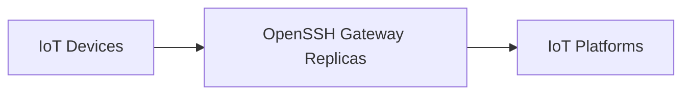
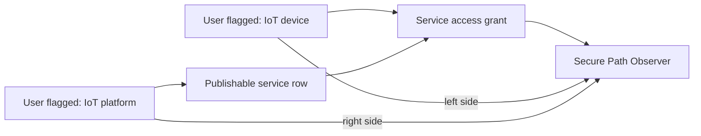
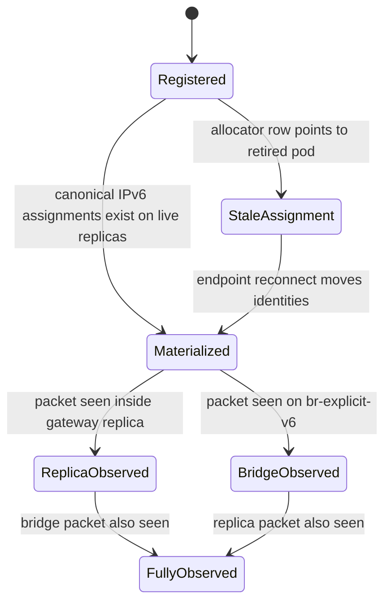
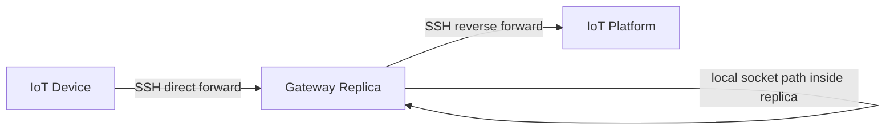
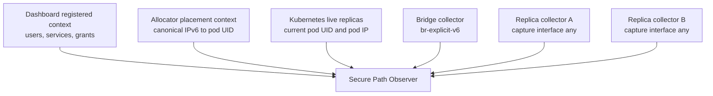

# Secure Path Observer Model

This note captures the current observer model so it can be expanded into the main architecture documentation later.

## Purpose

The observer presents the system as:

The goal is to show registered secure communication paths, where their canonical IPv6 identities are currently materialized, and whether traffic has been observed.

## Endpoint Roles

Endpoint placement is driven by explicit dashboard role flags, not by inference from service ownership:

- `IoT device`: shown on the left side.
- `IoT platform`: shown on the right side.
- A user may publish a service without becoming a platform. This is important because IoT devices may later publish services such as remote attestation or firmware-update endpoints.

The observer uses service and access-grant rows to decide which identities are relevant for the current secure-path view, then uses the role flags to place those identities. This avoids the earlier ambiguity where every published-service owner looked like a platform.

If an IoT device publishes a service, that service is still shown as a published socket inside the relevant gateway replica, but the identity remains an IoT device on the left. The role flag is the stable semantic source of truth.

## Path States

- Registered: dashboard service and access grant exist.
- Stale assignment: allocator state still has an active row, but that row names a gateway pod that is no longer one of the live replicas.
- Materialized: allocator state maps the device and platform canonical IPv6 addresses to currently live gateway pod replicas.
- Replica observed: a sidecar collector in a gateway replica saw packets for the path.
- Bridge observed: the node-level bridge collector saw packets on `br-explicit-v6`.
- Fully observed: both bridge and replica evidence exist in the current time window.

After a reboot or gateway rollout, stale assignment is a particularly useful state. It means the dashboard still knows the intended secure path, but the endpoint sessions need to reconnect so the OpenSSH session hook can move the canonical IPv6 identities onto the fresh replicas.

Registered paths do not store a replica name or pod UID. They are derived from dashboard data:

- the consumer identity
- the publishable service
- the service owner identity
- the access grant that permits the consumer to reach the service

Replica placement is resolved dynamically from the allocator snapshot every time the observer refreshes. Therefore, when a canonical IPv6 address moves from one gateway replica to another, the same registered path is redrawn through the new live replica. If an old allocator row points to a retired pod UID, the observer marks the path as `stale-assignment` instead of pretending that the old replica is still part of the path.

## Why Replica Collectors Are Needed

Bridge-only observation is incomplete. If a direct-forward side and reverse-forward side are satisfied inside the same gateway replica, packets may not cross `br-explicit-v6`.

In this case, the bridge collector may see no flow even though the secure path is working. A replica-local collector can still show the socket-level traffic without relying on bridge traversal.

The observer therefore combines two visibility layers:

This is intentionally broader than bridge-only monitoring. If packets cross `br-explicit-v6`, the bridge collector can prove the east-west path. If packets stay inside one gateway pod, the per-replica collector can still prove that the secure path has traffic.

## Visual Model

Inside each replica box:

- published sockets represent reverse-published service listeners such as `[platform-canonical-ipv6]:9000`
- identity sockets represent observed source canonical IPv6 plus ephemeral port tuples
- materialized addresses represent allocator-owned canonical IPv6 addresses currently assigned to that replica

Mirror sockets are intentionally not visualized yet because the observer does not inspect OpenSSH channel internals. The observer shows their observable effect as packet flows and socket tuples.

For the first version, the replica box exposes three kinds of evidence:

- published sockets: service-side listeners such as `[platform-canonical-ipv6]:9000`
- identity sockets: observed canonical source IPv6 plus port tuples from traffic captured inside the replica
- canonical addresses: explicit IPv6 assignments that the allocator says are currently placed on that live replica

## Payload Policy

Payload reconstruction is intentionally deferred. Packet collectors provide flow evidence. Application payloads should come later from application-level event streams, where message boundaries and decoded identity metadata are reliable.
