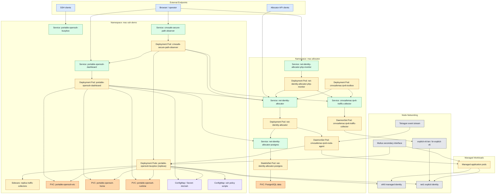
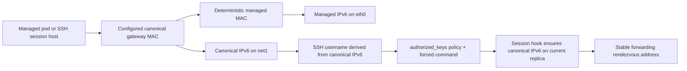
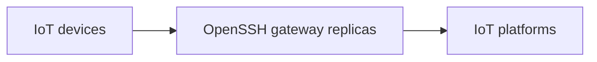
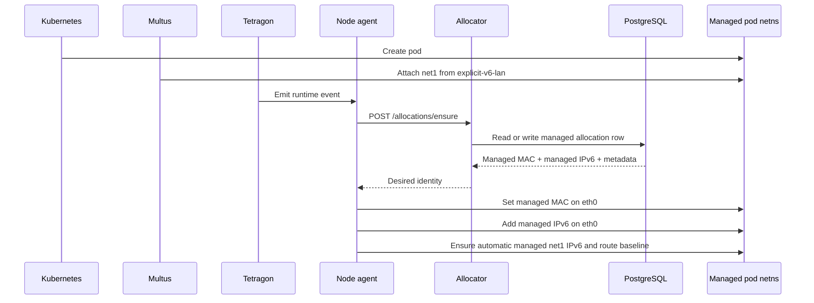
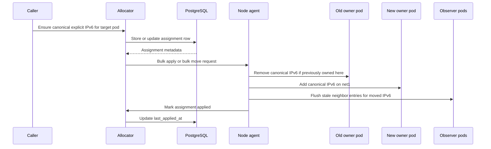
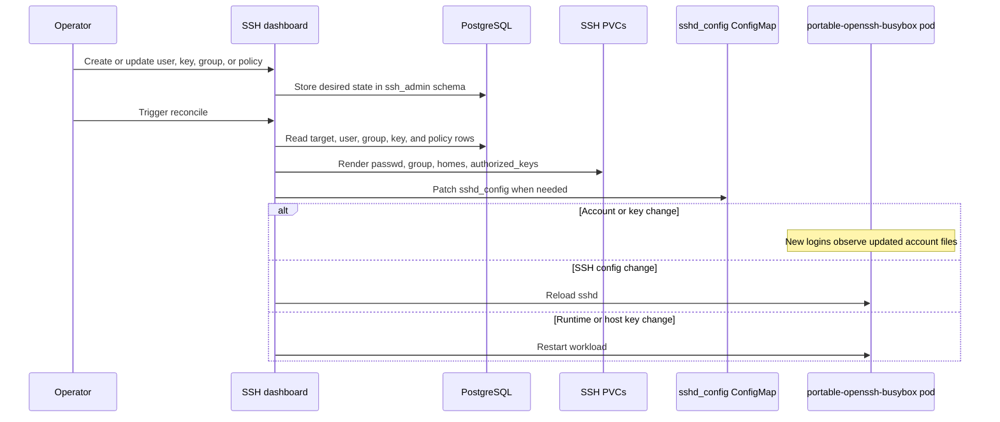
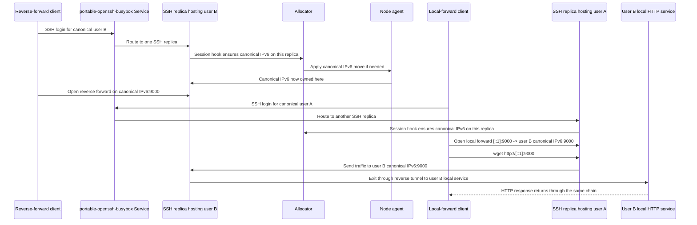

# System Overview

This page is the best place to start if you want the whole project in one view.

The main product goal of the system is to make SSH local forwarding (`-L`) and reverse forwarding (`-R`) meet reliably even when the two SSH sessions land on different Kubernetes replicas. The way it does that is by managing a stable identity across multiple layers:

- a deterministic managed MAC
- a deterministic canonical IPv6
- an SSH user account derived from that canonical IPv6
- a session hook that moves that canonical IPv6 to the replica currently hosting the SSH session

That identity chain is what lets traffic keep flowing end to end even though the active pod replica can change.

The same allocator and node-agent stack is the core identity engine underneath that SSH goal, and it provides the lower-level capability the forwarding system depends on:

- deterministic MAC assignment for selected pods
- deterministic managed IPv6 assignment on `eth0`
- deterministic automatic `net1` IPv6 assignment
- caller-driven extra explicit IPv6 addresses on `net1`
- canonical explicit IPv6 moves between replicas

## 1. Big Picture

At a high level, the project has four layers:

1. Kubernetes and networking foundations
2. Persistent state and rendered runtime files
3. Control-plane services that decide and apply identity
4. Product-facing and support surfaces layered on top of that identity engine

The core idea is simple:

- Kubernetes decides where a pod runs
- the allocator decides what its identity should be
- the node agent applies that identity inside the pod network namespace
- the OpenSSH layer uses that same identity as a stable rendezvous point

## 2. Full System Map

## 3. How To Read The Diagram

- Blue nodes are external entry points.
- Green nodes are Kubernetes Services.
- Yellow nodes are running workloads such as Deployments, DaemonSets, or StatefulSets.
- Orange nodes are PVC-backed persistent storage.
- Purple nodes are ConfigMaps or Secrets.
- Gray nodes are networking or runtime infrastructure.

The two namespaces are separated because they play different roles:

- `mac-allocator` holds the core identity-management stack
- `mac-ssh-demo` holds the primary multi-replica Portable OpenSSH product surface built on top of the identity engine

## 4. Identity Chain

The project works because the same logical identity is carried across multiple layers.

This is the most important intuition in the project:

- the pod replica can change
- the canonical identity does not
- traffic is aimed at that identity, not at a particular replica-local loopback interface

## 5. Components In Reader-Friendly Order

### 5.1 Kubernetes foundations

The project uses standard Kubernetes building blocks first:

- `Deployment`
  for stateless control-plane services and sample workloads
- `StatefulSet`
  for PostgreSQL, because the allocator database needs persistent storage
- `DaemonSet`
  for node-local components such as the node agent and the traffic collector
- `Service`
  for stable in-cluster endpoints
- `PVC`
  for persistent state such as PostgreSQL data and the Portable OpenSSH rendered runtime files
- `ConfigMap` and `Secret`
  for SSH configuration, host keys, and policy scripts

You can understand the rest of the system as an extension of these primitives, not a replacement for them.

### 5.2 Network foundations

Each managed pod can have two relevant interfaces:

- `eth0`
  the primary Kubernetes pod interface
- `net1`
  a Multus-attached secondary interface from `explicit-v6-lan`

Those two interfaces serve different purposes:

- `eth0` carries the managed MAC and managed IPv6
- `net1` carries the automatic managed `net1` IPv6 plus caller-driven explicit canonical IPv6 addresses

The shared `explicit-v6-lan` network is backed by one node-local bridge, `br-explicit-v6`. That bridge is what lets pods talk east-west over their explicit IPv6 identities.

### 5.3 Persistent state

There are two main persistent-state areas:

1. PostgreSQL in `mac-allocator`
- stores managed allocation rows
- stores explicit IPv6 assignment rows
- also stores the SSH dashboard state in the `ssh_admin` schema

2. PVC-backed Portable OpenSSH runtime state in `mac-ssh-demo`
- `portable-openssh-etc`
  rendered account files such as `passwd` and `group`
- `portable-openssh-home`
  rendered user homes and `authorized_keys`
- `portable-openssh-runtime`
  the staged portable OpenSSH runtime bundle

That split is important:

- PostgreSQL is the source of truth
- PVC contents are rendered runtime artifacts used by the SSH sample pods

### 5.4 Core control plane

#### `net-identity-allocator`

This is the central decision-maker.

It is responsible for:

- assigning deterministic managed MAC addresses
- assigning deterministic managed IPv6 addresses
- storing explicit canonical IPv6 assignments
- deciding which pod should currently own a canonical identity
- forwarding apply work to the correct node agent

It does not directly mutate pod namespaces. It decides desired state and records it in PostgreSQL.

#### `CMXsafeMAC-IPv6-node-agent`

This is the node-local executor.

It is responsible for:

- listening for Tetragon runtime signals
- talking to the allocator
- entering pod network namespaces
- setting the managed MAC on `eth0`
- setting managed IPv6 on `eth0`
- adding or moving explicit canonical IPv6 addresses on `net1`
- regrouping explicit move work by old owner, new owner, and observer pod

This is the component that makes the allocator's decisions real on the Linux networking side.

#### `Tetragon`

Tetragon provides the main live runtime event stream for the node agent.

It is used so the node agent can react quickly to pod activity without relying only on periodic sweeps.

In practice:

- Tetragon is the primary live trigger
- the node agent safety reconcile is the fallback

### 5.5 Product-facing OpenSSH layer

The Portable OpenSSH example is the primary user-facing layer built on top of the identity engine.

The important pieces are:

- `portable-openssh-busybox`
  a multi-replica SSH deployment
- `portable-openssh-dashboard`
  a PostgreSQL-backed UI and background reconcile worker
- the three SSH PVCs
  where the dashboard renders account and runtime state

This layer turns canonical IPv6 identity into a user-facing rendezvous mechanism:

- a user account is derived from the canonical IPv6 identity
- the forced-command session hook ensures that canonical IPv6 is present on the replica that accepted the SSH session
- other clients target that canonical IPv6, not a replica-local loopback address

In the current canonical-routing example, the username is the fully expanded canonical IPv6 with the colons removed. That means the same logical identity appears in three places at once:

- as a canonical IPv6 on `net1`
- as an SSH username
- as the runtime forwarding rendezvous address other sessions target

### 5.6 Observability and admin add-ons

#### PHP monitor

The PHP monitor is a read-only operational surface that merges:

- allocator data
- traffic-collector data

It helps answer:

- which identities exist
- where they are assigned
- what explicit-lane traffic has recently been observed

#### Traffic collector

The traffic collector sniffs IPv6 traffic on `br-explicit-v6` and exposes recent flow summaries.

It is useful for validating that the explicit-lane data path is actually active after control-plane changes.

#### Secure path observer

The secure path observer is a higher-level operational surface for the SSH proxy goal.

It combines:

- dashboard topology data: users, publishable services, and access grants
- allocator placement data: which canonical IPv6 identities are assigned to which pod UIDs
- Kubernetes live pod data: which gateway replicas currently exist
- bridge traffic summaries from `br-explicit-v6`
- per-replica sidecar traffic summaries from inside each OpenSSH gateway pod

This matters because not every working secure path is visible on `br-explicit-v6`. If the direct-forward side and the reverse-forward side are satisfied inside the same gateway replica, traffic can stay inside that replica. The observer therefore presents the model as:

The left/right placement is driven by explicit dashboard role flags on users: `IoT device` identities are shown on the left and `IoT platform` identities on the right. Publishing a service does not automatically make an identity a platform, because IoT devices may also publish services in future security-context flows.

Registered paths do not carry a stored replica placement. They are recomputed from dashboard registrations plus the allocator's current canonical IPv6 placement snapshot. When a canonical IPv6 address moves to a different gateway replica, the observer redraws the same registered path through the current replica instead of keeping a stale visual edge.

It can also show stale assignment state after a reboot or rollout: the registered secure path still exists in the dashboard, but allocator rows may point to retired replica pod UIDs until endpoint sessions reconnect and move the canonical identities onto live replicas.

See [secure-path-observer-model.md](./secure-path-observer-model.md) for the focused observer model and diagrams.

#### Toolbox

The toolbox is an optional in-cluster shell environment.

It is mainly used for:

- running Linux-based benchmark scripts
- reducing Windows-side measurement noise
- interacting with cluster-local Services without host-side port-forwards

## 6. Main Runtime Flows

### 6.1 Managed pod identity assignment

This is the base flow for any allocator-managed pod.

### 6.2 Explicit or canonical IPv6 move

This is the lower-level identity move that both the explicit API and the canonical SSH example rely on.

### 6.3 Dashboard reconcile

The dashboard is not the source of truth by itself. It edits PostgreSQL-backed desired state, then reconciles rendered runtime files.

### 6.4 Multi-replica SSH rendezvous

This is the final application-level use case.

The problem is:

- user A opens `ssh -L`
- user B opens `ssh -R`
- both hit the same Service
- Kubernetes may place them on different replicas
- `127.0.0.1` is replica-local, so loopback alone cannot make those two tunnels meet

The solution is to rendezvous on user B's canonical IPv6.

In the refined proof example, the same well-known service port `9000` is preserved:

- on user B's local service
- on the relay-side canonical IPv6 listener
- on user A's local forward

At the same time, the patched OpenSSH path preserves the real origin source tuple, so the final destination can still observe:

- source IPv6 = the caller's canonical IPv6
- source port = the caller's true ephemeral port for that flow

## 7. Why The Canonical IPv6 Layer Solves The SSH Problem

If the system used only loopback addresses:

- replica A would see its own `127.0.0.1`
- replica B would see its own `127.0.0.1`
- there would be no stable address tying the two sessions together

Canonical IPv6 changes the rendezvous model:

- each logical SSH identity gets one stable network address
- that address can move to whichever replica is currently hosting the session
- other sessions target that stable address instead of guessing which replica accepted the other connection

That means the system is doing more than simple SSH account management. It is coordinating:

- user account identity
- key and policy identity
- pod-level network identity
- active replica placement

all around one stable canonical address.

## 8. Core, Product Surface, And Add-Ons

### 8.1 Core identity engine

These are the pieces that make deterministic network identity and movable canonical rendezvous identities possible:

- allocator
- PostgreSQL
- node agent
- Tetragon
- Multus `explicit-v6-lan` if you want `net1` explicit identities

### 8.2 Primary OpenSSH product surface

These are the pieces that turn the identity engine into the actual replicated SSH forwarding product:

- `portable-openssh-busybox`
- `portable-openssh-dashboard`
- SSH PVC-backed rendered account and runtime model

### 8.3 Support add-ons

These help operate, observe, or test the system, but they are not the identity-and-rendezvous engine itself:

- PHP monitor
- traffic collector
- toolbox

The useful mental model is:

- the allocator and node agent explain **how identity is decided and applied**
- the OpenSSH layer explains **why the system exists**
- the monitors and toolbox explain **how to observe and test it**

## 9. Where To Read Next

Use this page as the orientation map, then go deeper where needed:

- [CMXsafeMAC-IPv6-architecture.md](./CMXsafeMAC-IPv6-architecture.md)
  detailed control-plane and runtime architecture
- [explicit-ipv6-apply-move-pipeline.md](./explicit-ipv6-apply-move-pipeline.md)
  mechanics guide for how one apply or move request becomes queued work, grouped bulk calls, and per-pod netlink batches
- [explicit-ipv6-parallelism.md](./explicit-ipv6-parallelism.md)
  deep dive into high-concurrency explicit create and move flows
- [busybox-portable-openssh.md](./busybox-portable-openssh.md)
  how the Portable OpenSSH sample is built and deployed
- [portable-openssh-dashboard.md](./portable-openssh-dashboard.md)
  dashboard data model and reconcile behavior
- [portable-openssh-canonical-routing.md](./portable-openssh-canonical-routing.md)
  step-by-step validated multi-replica SSH routing example
