# Kubernetes IoT Fan-Out Forwarding Testbed

This document explains the larger Kubernetes proof driven by [test-cmxsafe-k8s-iot-fanout.ps1](../../tools/tests/openssh/test-cmxsafe-k8s-iot-fanout.ps1).

This proof keeps the IoT devices and IoT platform inside Kubernetes so the topology is easy to reproduce and validate. The same gateway and bundle model can then be moved to Docker or Linux endpoints outside Kubernetes; that next stage is described in [external-endpoint-rollout.md](../external-endpoint-rollout.md).

The testbed validates the main CMXsafe OpenSSH goal:

> many IoT devices should reach one IoT platform service through SSH direct and reverse forwarding, even when the SSH gateway is replicated and each session may land on a different gateway pod.

The key result is that the IoT platform service observes the true canonical IPv6 identity of each IoT device, decodes the device MAC from that source IPv6, displays the real per-connection source port, and shows the received message content while the service remains available on the known port `9000`.

## What The Test Proves

The test proves five things at once:

- a replicated Portable OpenSSH gateway can support identity-preserving SSH forwarding
- 10 IoT device endpoint sessions can be spread evenly across 2 gateway replicas
- one IoT platform endpoint can publish its service by reverse forwarding on its platform canonical IPv6
- all devices can reach that platform service through the platform canonical IPv6 and port `9000`
- after the platform reverse session moves to the other gateway replica, all devices can still reach the same service identity

The test is intentionally not a raw throughput benchmark. It is a correctness and resilience proof for the proxy-layer rendezvous model.

## CMXsafe Terminology Used In This Example

The CMXsafe paper describes the architecture as an application-agnostic proxy layer that creates secure communication paths between IoT applications and IoT platforms. This testbed maps that model onto Kubernetes and Portable OpenSSH.

| CMXsafe term | Meaning in the CMXsafe model | Object in this testbed |
| --- | --- | --- |
| CMX-GW | Gateway-side proxy layer operating as a transport-layer relayer. | The replicated `portable-openssh-busybox` Deployment running patched `sshd`. |
| CMX-agent | Endpoint-side component that extends the proxy layer into devices or platforms. | The endpoint pod scripts plus `endpointd` plus patched Portable OpenSSH `ssh`. |
| Client Socket Proxy (CSP) | Endpoint-side socket proxy client that initiates a Secure Proxy Session. | The OpenSSH control-master client in each device/platform endpoint pod. |
| Secure Proxy Session (SPS) | Authenticated transport-security session between a CMX-agent and the CMX-GW. | The long-lived SSH control-master session authenticated with the dashboard-generated key. |
| Reverse Socket Proxy (RSP) | Gateway-side listener that represents a service exposed by the server side. | The platform `ssh -R '[platform-canonical-ipv6]:9000:[::1]:9000'` listener in the CMX-GW. |
| Direct Socket Proxy (DSP) | Client-side listener that forwards application traffic to the RSP. | The device `ssh -L '[platform-canonical-ipv6]:9000:[platform-canonical-ipv6]:9000'` listener. |
| Service socket (Ser-sock) | Real server application socket. | The IoT platform HTTP service listening inside the platform pod at `[::1]:9000`. |
| Client/ephemeral socket (Cli-sock) | Short-lived source socket created by the client application. | The IoT device application's TCP source port when it posts telemetry. |
| Identity socket (ID-sock) | Gateway-side source socket that carries the requester identity. | The patched gateway connection bound to the authenticated device canonical IPv6 and the preserved ephemeral source port. |
| Mirror socket (Mir-sock) | Server-side copy of the ID-sock used to preserve requester identity at the service endpoint. | The patched platform SSH client connection to `[::1]:9000`, source-bound to the device canonical IPv6 and ephemeral port after `endpointd` creates the peer mirror on `cmx0`. |
| Connection ID (ConnID) | Source IPv6 used to identify the originating user application/source. | The canonical IPv6 derived from `gw_tag` and `mac_dev`; this test verifies the platform observes it. |
| Security Context (SC) | OS/network policy that permits specific user-application to socket paths and isolates other traffic. | The full SC policy layer is not the focus of this test; the test proves the socket identity material needed by those policies. |

The key translation is that OpenSSH forwarding gives the project the paper's DSP and RSP mechanics, while the CMXsafe patch adds the ID-sock and Mir-sock behavior that plain OpenSSH does not provide.

```mermaid
flowchart LR
  UA["IoT device application\npaper: UA"] --> DSP["Direct Socket Proxy\nimplementation: ssh -L"]
  DSP --> SPSD["Secure Proxy Session\nimplementation: device SSH control master"]
  SPSD --> GW["CMX-GW\nimplementation: replicated patched sshd"]
  GW --> RSP["Reverse Socket Proxy\nimplementation: sshd listener on platform canonical IPv6:9000"]
  RSP --> SPSP["Secure Proxy Session\nimplementation: platform SSH control master"]
  SPSP --> MIR["Mirror socket\nimplementation: patched ssh client + endpointd peer address"]
  MIR --> SER["Service socket\nimplementation: platform HTTP service [::1]:9000"]
```

## Secure Communication Path In This Test

The paper separates the path into a service side and a requester side. In this test, the IoT platform is the service side and each IoT device is a requester.

1. The platform CMX-agent opens an SPS to whichever CMX-GW replica the Kubernetes Service selects.
2. The platform asks the CMX-GW to create an RSP at `[platform-canonical-ipv6]:9000`.
3. Each device CMX-agent opens its own SPS to the same Kubernetes Service, possibly landing on a different CMX-GW replica.
4. Each device creates a DSP that lets the local device application connect to `[platform-canonical-ipv6]:9000`.
5. The device-side CMX-GW emits the inter-gateway request from the device ID-sock, not from any local address the IoT device tried to claim.
6. The platform-side CMX-agent creates the Mir-sock toward the Ser-sock so the platform application observes the device ConnID.

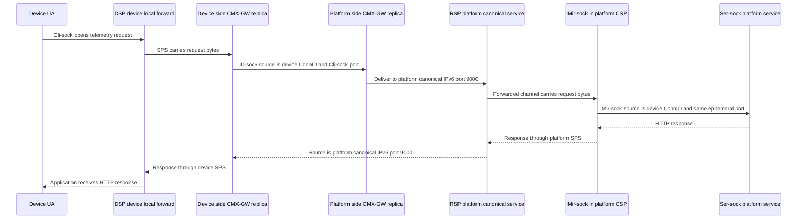

This is why the example is not merely "SSH port forwarding works." The property under test is that the CMX-GW and endpoint CSPs preserve the paper's source-identity semantics at the socket boundaries where plain SSH would normally lose them.

## Testbed Topology

The default topology is:

- 2 replicated `portable-openssh-busybox` gateway pods
- 1 Kubernetes Service in front of the gateway pods
- 10 IoT device endpoint pods
- 1 IoT platform endpoint pod
- one known platform service port: `9000`
- one canonical IPv6 per IoT device
- one canonical IPv6 for the IoT platform service

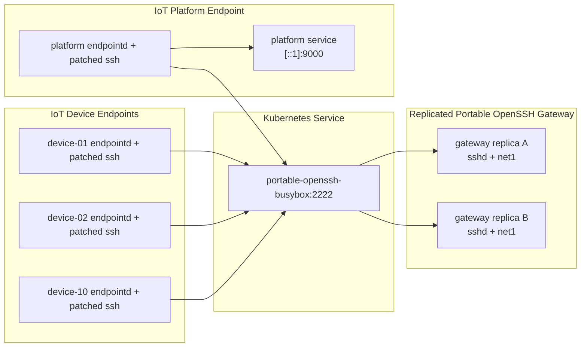

The important point is that the devices and the platform connect to the same Kubernetes Service. The Service may place each SSH session on either gateway replica.

## Identity Model

Each logical endpoint has a stable identity:

- `gw_tag`
- configured `canonical_gateway_mac`
- device or platform `mac_dev`
- canonical IPv6 derived by the allocator
- SSH username equal to the full expanded canonical IPv6 without colons
- generated SSH keypair stored in the dashboard database

For the default test:

- device MACs are generated from `02:10:00:00:00:01` through `02:10:00:00:00:0a`
- platform MAC is `02:20:00:00:00:01`
- `gw_tag` is `9101`
- `canonical_gateway_mac` is `f6:db:2b:39:78:94`
- service port is `9000`

The `canonical_gateway_mac` is a logical identity-root MAC stored in the shared database through the dashboard settings. It is not the live MAC of whichever OpenSSH gateway replica accepted a session. That distinction keeps the canonical IPv6 stable across pod restarts, node changes, and load-balanced SSH landings.

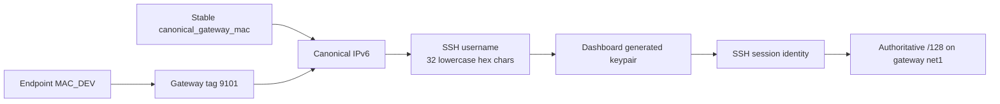

The username is not just an account name. It is a reversible encoding of the canonical IPv6 identity. In the paper's terminology, that canonical IPv6 becomes the ConnID used by the ID-sock and Mir-sock to identify the original requester.

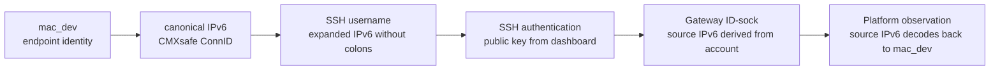

The important security point is the direction of trust. The gateway does not accept a device-provided source IPv6 as identity; it derives the ID-sock address from the authenticated account. The endpoint can still contribute the ephemeral port because that port identifies the concrete client-side flow, not the durable device identity.

## Authoritative And Mirror Addresses

The paper distinguishes between identity-preserving sockets at different places in the path. The Kubernetes proof needs one additional operational distinction: the same canonical IPv6 can be authoritative in the CMX-GW while also appearing as a local mirror on endpoints.

### Authoritative canonical IPv6

The authoritative address is allocator-managed:

- attached to `net1` inside the gateway replica that accepted the SSH session
- moved when the session moves to another replica
- used as the real cross-replica rendezvous address
- has exactly one active gateway owner at a time

### Local mirror canonical IPv6

The local mirror address is endpoint-local:

- attached to the endpoint helper dummy interface `cmx0`
- used so patched OpenSSH can bind source sockets to canonical identities
- can exist on many endpoints at the same time
- is not advertised outside the endpoint pod
- is not owned by the allocator

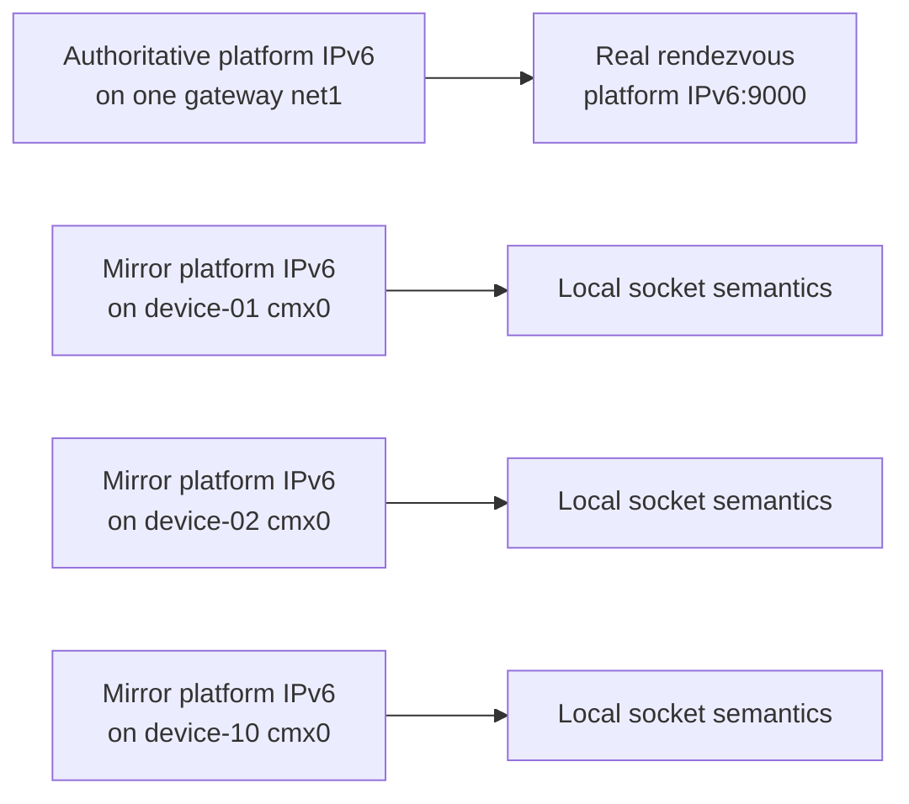

There is no conflict between one authoritative owner and many local mirrors, because only the authoritative address participates in gateway routing. The local mirrors exist only so the patched CSP can create Mir-socks or expose a DSP using the service's real canonical identity.

## Components In The Test

The script orchestrates these components:

| Component | Role |
| --- | --- |
| `portable-openssh-busybox` Deployment | Replicated OpenSSH gateway. It owns authoritative canonical IPv6 addresses on `net1`. |
| `portable-openssh-busybox` Service | Load-balanced SSH entry point used by all endpoints. |
| `net-identity-allocator` | Source of truth for canonical IPv6 assignment and movement. |
| node agent | Applies and moves explicit IPv6 addresses inside pod network namespaces. |
| SSH dashboard | Creates canonical Unix users, generates keys, and renders `passwd`, `group`, and `authorized_keys`. |
| `cmxsafe-iot-device-*` pods | IoT device endpoint clients. Each runs `endpointd` and patched `ssh`. |
| `cmxsafe-iot-platform` pod | IoT platform endpoint. It runs `endpointd`, patched `ssh`, and a lightweight HTTP telemetry and monitor service on port `9000`. |
| `cmx0` dummy interface | Endpoint-local mirror-address interface managed by `endpointd`. |
| `net1` gateway interface | Gateway-side authoritative canonical IPv6 interface. |

## Assumptions

The test assumes:

- Docker and the local Kubernetes cluster are online
- the allocator stack and node agent are available
- Multus and the explicit IPv6 network are available
- the Portable OpenSSH dashboard can reach PostgreSQL
- the gateway can run with `GatewayPorts clientspecified`
- endpoint pods can run with `NET_ADMIN` so `endpointd` can manage `cmx0`
- the patched Portable OpenSSH `10.2p1` bundle can be built with Docker

The default script uses a lightweight `python:3.12-alpine` endpoint image. Each endpoint pod installs `iproute2` at startup if it is missing.

## Reproduce From A Fresh Clone

This section is the cold-start path for a Windows PowerShell user with Docker Desktop already running and Docker Desktop Kubernetes enabled.

The commands assume:

- Docker Desktop is already started
- Docker Desktop Kubernetes uses the `docker-desktop` context
- the Docker Desktop Kubernetes node container is named `desktop-control-plane`
- the machine has internet access to clone the repository, install Helm charts, pull container images, and download the Portable OpenSSH source bundle

### 1. Install or check local command-line tools

The test path needs `git`, `docker`, `kubectl`, and `helm`.

If any of these are missing on Windows, install them with:

```powershell
winget install --id Git.Git -e
winget install --id Kubernetes.kubectl -e
winget install --id Helm.Helm -e
```

Then open a new PowerShell window and verify the tools:

```powershell
git --version
docker version
kubectl version --client
helm version
```

### 2. Clone the repository

```powershell
git clone https://github.com/cmxsafe/CMXsafeMAC-IPv6.git
cd CMXsafeMAC-IPv6
```

If the repository already exists, update it instead:

```powershell
cd CMXsafeMAC-IPv6
git pull
```

### 3. Verify Docker Desktop Kubernetes

```powershell
kubectl config use-context docker-desktop
kubectl get nodes
docker inspect desktop-control-plane | Out-Null
```

The final command is important because the install script imports locally built project images into the Docker Desktop Kubernetes node container. If your node container has a different name, pass it later with `-NodeContainer <name>`.

### 4. Install Tetragon

The project install script checks that Tetragon is already running, but intentionally does not install it.

Install it with the repository values file:

```powershell
helm repo add cilium https://helm.cilium.io
helm repo update
helm upgrade --install tetragon cilium/tetragon --namespace kube-system -f .\k8s\tetragon-values.yaml
kubectl rollout status daemonset/tetragon -n kube-system --timeout=300s
```

You can confirm the running pods with:

```powershell
kubectl get pods -n kube-system | Select-String tetragon
```

If Tetragon is already installed and healthy, this step can be skipped.

### 5. Deploy the CMXsafe base stack

This script deploys the allocator, PostgreSQL, node agent, Multus network definitions, optional monitor components, and imports the local images into the Docker Desktop Kubernetes node:

```powershell
powershell -NoProfile -ExecutionPolicy Bypass -File .\tools\install-docker-desktop-kind-stack.ps1
```

If the Docker Desktop node container is not named `desktop-control-plane`, use:

```powershell
powershell -NoProfile -ExecutionPolicy Bypass -File .\tools\install-docker-desktop-kind-stack.ps1 -NodeContainer <your-node-container-name>
```

For a fully fresh image rebuild, add `-ForceRebuild -ForceImageImport`.

### 6. Optional base-stack sanity check

This is not required by the IoT fan-out test, but it is a useful quick check that managed MAC, managed IPv6, explicit IPv6, and canonical moves work before running the larger OpenSSH proof:

```powershell
powershell -NoProfile -ExecutionPolicy Bypass -File .\tools\tests\core\test-local-e2e.ps1 -CleanupSamplesAfter
```

### 7. Run the IoT fan-out proof

The fan-out script applies the Portable OpenSSH gateway and dashboard manifests, builds the patched OpenSSH bundle, stages it into the gateway runtime PVC, creates canonical users and keys, deploys the endpoint pods, and runs the direct-plus-reverse forwarding validation:

```powershell
powershell -NoProfile -ExecutionPolicy Bypass -File .\tools\tests\openssh\test-cmxsafe-k8s-iot-fanout.ps1
```

To remove the temporary endpoint pods, Secrets, and ConfigMaps automatically at the end:

```powershell
powershell -NoProfile -ExecutionPolicy Bypass -File .\tools\tests\openssh\test-cmxsafe-k8s-iot-fanout.ps1 -CleanupEndpointResources
```

A successful run ends with:

```text
CMXsafe IoT fan-out test passed.
```

The first run is slower because it may download Multus, CNI plugins, Docker base images, the Tetragon chart, and the Portable OpenSSH source bundle. Later runs should reuse most of that local state.

### 8. Useful inspection commands

```powershell
kubectl get pods -A
kubectl get pods -n mac-allocator -o wide
kubectl get pods -n mac-ssh-demo -o wide
kubectl get pvc -n mac-ssh-demo
kubectl logs -n mac-ssh-demo deploy/portable-openssh-busybox --tail=100
```

To remove only the fan-out endpoint resources after an inspection run:

```powershell
kubectl delete pod,secret,configmap -n mac-ssh-demo -l cmxsafe-test=iot-fanout --ignore-not-found=true
```

## Bootstrap Sequence

The script bootstraps the environment in this order:

1. Apply the explicit IPv6 network manifest.
2. Apply the Portable OpenSSH gateway manifest.
3. Apply the Portable OpenSSH dashboard manifest.
4. Scale the gateway deployment to 2 replicas.
5. Build the patched Portable OpenSSH bundle.
6. Stage the bundle into the gateway runtime PVC.
7. Restart the gateway deployment.
8. Open local port-forwards to the allocator and dashboard APIs.
9. Ensure managed allocator records exist for both gateway replicas.
10. Create or update the 10 device users and 1 platform user through the dashboard.
11. Run dashboard reconcile so users, groups, and keys are rendered.
12. Restore `sshd_config` with `GatewayPorts clientspecified`.
13. Restart the gateway deployment again.
14. Deploy the device and platform endpoint pods.

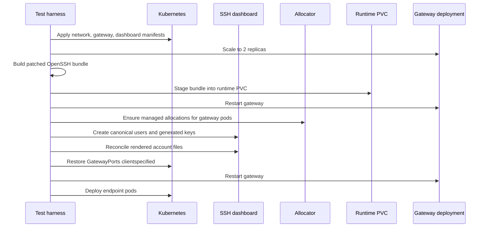

## Endpoint Pod Setup

The script generates one temporary ConfigMap and one Secret per endpoint identity.

The ConfigMap includes:

- `endpointd.py`
- `cmxsafe-ssh`
- `endpoint-init.sh`
- `start-master.sh`
- `install-forward.sh`
- `install-reverse.sh`
- `stop-session.sh`
- `session-running.sh`
- `iot-platform-service.py`

Each endpoint pod mounts:

- the generated script ConfigMap at `/opt/cmxsafe`
- its private key Secret at `/credentials`
- the Portable OpenSSH runtime PVC at `/opt/openssh`
- an `emptyDir` at `/var/run`

Each endpoint exports:

- `CMXSAFE_ROLE`
- `CMXSAFE_CANONICAL_USER`
- `CMXSAFE_SELF_IPV6`
- `CMXSAFE_SERVICE_PORT`

The platform endpoint additionally starts the HTTP telemetry and monitor service from [cmxsafe-iot-platform-service.py](../../tools/tests/openssh/cmxsafe-iot-platform-service.py) on port `9000`.

## Session Startup Design

The script uses a two-phase SSH startup sequence.

This is important because a remote forward can fail if it tries to bind before the gateway pod has the authoritative canonical `/128` on `net1`.

### Phase 1. Start an SSH control-master session

The endpoint starts a real SSH control-master session with:

- `cmxsafe-ssh`
- patched OpenSSH client
- endpoint-local `endpointd`
- a Unix control socket under `/var/run`

This creates a real server-side session channel. The gateway forced-command hook then:

1. reads the canonical username
2. reconstructs the exact canonical IPv6 from the username
3. calls `POST /explicit-ipv6-assignments/ensure` with that IPv6 and the accepting gateway `pod_uid`
4. waits until the allocator reports the address as applied

### Phase 2. Wait for authoritative address visibility

The harness does not rely only on the allocator row. It also checks the gateway pod directly:

```bash
ip -6 addr show dev net1 | grep -F '<canonical-ipv6>/128'
```

This avoids a bind race where `sshd` attempts to create a listener before the kernel actually exposes the `/128`.

### Phase 3. Install the forward over the existing master

Once the session and address are ready:

- the platform endpoint installs the reverse forward
- each device endpoint installs its local forward

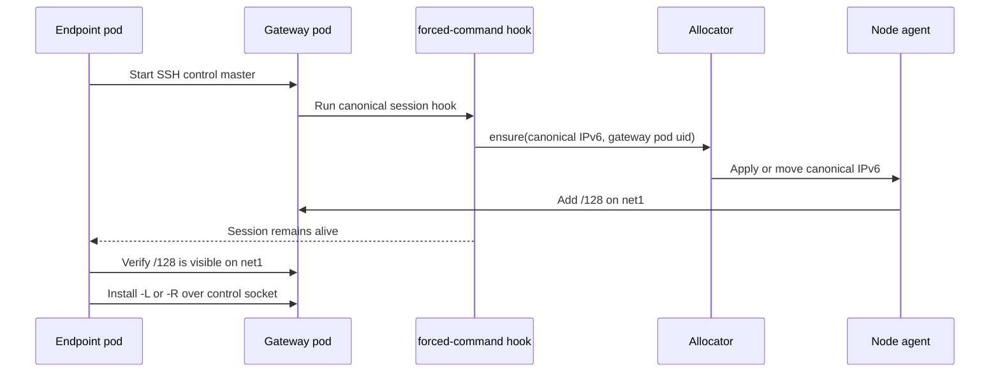

### Server-side forwarding readiness gate

The current gateway also enforces canonical readiness inside patched `sshd` itself. Before `sshd` accepts either a DSP-originated `direct-tcpip` channel or an RSP `tcpip-forward` request for a canonical user, it calls the configured `CMXSAFE_CANONICAL_READY_HOOK`.

In the Kubernetes gateway this hook is `/opt/ssh-policy/ensure-canonical-ready.sh`. The hook asks the allocator to ensure the exact authenticated user's canonical IPv6 on the gateway pod that accepted the SSH session, then waits until the node agent has applied that `/128` on `net1`.

This matters because a client may request forwarding immediately, for example:

```bash
cmxsafe-ssh -N \
  -R '[platform-canonical-ipv6]:9000:[::1]:9000' \
  platform-user@portable-openssh-busybox
```

That form does not need the older operational sequence of "open a master, wait externally, then run `ssh -O forward`" to avoid racing the reverse-listener bind. The server blocks the forwarding request until the canonical IPv6 is ready, then lets OpenSSH bind the listener.

The endpoint helper is still needed when CMXsafe Mir-sock semantics are required. A plain unwrapped `ssh -N -R ...` can prove that the gateway waits before binding the canonical RSP, but it cannot create endpoint-local peer mirror addresses on `cmx0`; for end-to-end identity propagation to the platform service, use `cmxsafe-ssh` or another client wrapper that runs `endpointd`.

## Forwarding Model

In CMXsafe terms, the platform endpoint exposes the Ser-sock through an RSP. In implementation terms, the platform endpoint asks the CMX-GW to listen on the platform canonical IPv6 and the well-known service port:

```bash
ssh -S /var/run/cmxsafe-reverse.sock -O forward \
  -R '[platform-canonical-ipv6]:9000:[::1]:9000' \
  platform-user@portable-openssh-busybox
```

Each device endpoint creates the DSP. The DSP deliberately listens on the same platform canonical IPv6 and service port, so the device application connects to the service identity rather than to an arbitrary local loopback alias:

```bash
ssh -S /var/run/cmxsafe-forward.sock -O forward \
  -L '[platform-canonical-ipv6]:9000:[platform-canonical-ipv6]:9000' \
  device-user@portable-openssh-busybox
```

So the known service port stays `9000` at every service-facing point:

- platform service accepts the reverse-forward target at `::1:9000`
- gateway reverse listener is `[platform-canonical-ipv6]:9000`
- device local forward listens on `[platform-canonical-ipv6]:9000`

This mirrors the paper's idea that the service is represented by socket proxies without changing the service identity observed by applications.

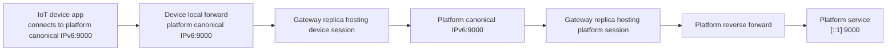

The patched OpenSSH path preserves the true source tuple on the final platform-side connection:

- source IPv6 = device canonical IPv6 derived from the authenticated SSH account on the gateway
- source port = real ephemeral source port selected by the device-side client

The device-side local source address is not trusted as identity. The gateway derives the identity socket from the authenticated canonical Unix user, so a real IoT device cannot fake its CMXsafe IPv6 identity just by choosing a local source address. The only value intentionally propagated from the local client connection is the ephemeral source port.

The platform side follows the same trust rule at the CMX-GW boundary. The reverse listener on the gateway must be the canonical IPv6 derived from the authenticated platform SSH user; for canonical users, patched `sshd` rejects a remote-forward request that tries to listen on a different IPv6 address.

The reverse-forward target inside the platform endpoint does not need to be the platform canonical IPv6. It can be `[::1]:9000`, a pod-local address, or another service-local address, because that socket is the real Ser-sock behind the proxy boundary. Once the service is exposed as an RSP, packets seen by requesters are associated with the gateway-side RSP tuple, `[platform-canonical-ipv6]:9000`.

This is different from the device-side DSP. The DSP is the local service identity that the device application connects to, so the test intentionally uses `ssh -L '[platform-canonical-ipv6]:9000:[platform-canonical-ipv6]:9000'`. That keeps the client-facing destination aligned with the platform service identity before the traffic enters the CMX-GW.

If the device-side DSP instead used a local loopback listener, for example `ssh -L '[::1]:9000:[platform-canonical-ipv6]:9000'`, the communication would still work. The CMX-GW would still derive the outgoing ID-sock source IPv6 from the authenticated device account, and the platform would still observe the device canonical IPv6 after the traffic crosses the gateway.

The difference is local identity preservation on the IoT device itself. With the loopback DSP variant, packets between the device application and the local SSH client are addressed to `::1:9000`, not to `[platform-canonical-ipv6]:9000`. That may be acceptable for devices that only need the CMX-GW-to-platform identity guarantee and do not need local Security Context rules or local packet inspection keyed on the platform canonical IPv6.

In that simplified device-side mode, the endpoint helper would not need to create the platform canonical IPv6 as a peer mirror on the IoT device just to bind the local DSP listener. The helper may still be needed for other local canonical sockets, and it remains important on the platform side where the Mir-sock preserves each device ConnID toward the Ser-sock.

For HTTP responses, the gateway does not trust a local platform source address either. The response leaves through the already accepted reverse-forward listener socket, whose gateway-side local tuple is `[platform-canonical-ipv6]:9000`, so the response source identity remains the platform canonical IPv6 and service port.

The request and response socket tuples can be read like this:

| Segment | CMXsafe term | Source tuple | Destination tuple | Trust decision |
| --- | --- | --- | --- | --- |
| Device app to local DSP | Cli-sock to DSP | Endpoint-local ephemeral tuple | `[platform-canonical-ipv6]:9000` | Source port is captured; source address is not trusted as identity. |
| Device CMX-GW to platform CMX-GW | ID-sock to RSP | `[device-canonical-ipv6]:ephemeral-port` | `[platform-canonical-ipv6]:9000` | Source IPv6 is derived from authenticated device account. |
| Platform CSP to Ser-sock | Mir-sock to Ser-sock | `[device-canonical-ipv6]:ephemeral-port` | `[::1]:9000` | Source tuple mirrors the gateway ID-sock. |
| Platform CMX-GW response leg | RSP back to ID-sock | `[platform-canonical-ipv6]:9000` | `[device-canonical-ipv6]:ephemeral-port` | Service identity is the authenticated platform reverse listener. |

## Test Message

The application message used by this proof is intentionally simple HTTP telemetry.

```http
POST /message HTTP/1.1
Host: [platform-canonical-ipv6]:9000
Content-Type: application/json

{
  "type": "telemetry",
  "sequence": 1,
  "device_pod": "cmxsafe-iot-device-01",
  "device_mac": "02:10:00:00:00:01",
  "content": "initial telemetry from cmxsafe-iot-device-01 mac=02:10:00:00:00:01"
}
```

Each IoT device sends that request to its own local forwarded endpoint:

```text
http://[platform-canonical-ipv6]:9000/message
```

Before installing that listener, the endpoint helper ensures the platform canonical IPv6 exists locally on `cmx0` as a `peer` mirror address. That allows the device application to connect to the real service identity locally while the gateway still derives the outgoing source identity from the authenticated device account.

The IoT platform runs a lightweight IPv6 HTTP service on port `9000`. The server binds inside the platform pod so it can also be inspected through `kubectl port-forward`, while the SSH reverse forward still targets the local platform service at `[::1]:9000`.

The service is reverse-forwarded into the CMXsafe gateway at `[platform-canonical-ipv6]:9000`.

The monitor derives identity from the source IPv6 itself. In this test, the canonical explicit IPv6 layout is:

```text
2-byte gw_tag | 6-byte canonical_gateway_mac | 2-byte counter | 6-byte device MAC
```

For endpoint identities, the counter is `0000`. The final 6 bytes of the observed source IPv6 are decoded as the IoT device MAC, while the middle 6 bytes identify the stable CMXsafe gateway identity root configured for the test.

The platform response is JSON. It reports what the platform service observed at the final socket:

```json
{
  "ok": true,
  "client": "9101:f6db:2b39:7894:0:210:0:1",
  "device_mac": "02:10:00:00:00:01",
  "port": 39152,
  "path": "/message",
  "method": "POST",
  "content": "initial telemetry from cmxsafe-iot-device-01 mac=02:10:00:00:00:01",
  "pod": "cmxsafe-iot-platform",
  "service_port": 9000
}
```

The exact `client`, `device_mac`, `port`, and `content` values change per device and per connection:

- `client` must equal the IoT device canonical IPv6
- `device_mac` is decoded by the platform from the source canonical IPv6, not trusted from the JSON body
- `port` is the preserved device-side ephemeral TCP source port
- `path` is `/message` for the main telemetry probe and `/healthz` for local platform readiness checks
- `content` is the telemetry payload displayed by the platform monitor
- `pod` identifies the platform endpoint pod that served the request
- `service_port` confirms that the known platform service port stayed `9000`

This is therefore a synthetic HTTP telemetry probe. It is not trying to model a full IoT application protocol yet. The purpose is to make the socket identity and payload observable and easy to assert while proving that the direct-plus-reverse SSH proxy chain preserves the canonical source IPv6, decoded MAC identity, source port, and message content end to end.

## Live Platform Monitor

The platform service also exposes a lightweight live monitor:

- `GET /monitor` returns a small browser UI
- `GET /monitor/events` streams incoming messages with Server-Sent Events
- `GET /monitor/status` reports the current number of connected monitor subscribers

The monitor does not record messages in files, a database, or a persistent in-memory history. It only fans out newly received messages to currently connected browsers. If the monitor is closed, messages continue to be accepted by the platform service but are not retained for later viewing.

After a normal test run, the endpoint pod is left running. Open the monitor with:

```powershell
kubectl port-forward -n mac-ssh-demo pod/cmxsafe-iot-platform 19000:9000
```

Then browse to:

```text
http://127.0.0.1:19000/monitor
```

When a device sends a telemetry request, the monitor displays:

- decoded device MAC
- observed source canonical IPv6
- preserved source ephemeral port
- receive timestamp
- gateway tag and stable canonical gateway MAC decoded from the canonical IPv6
- platform pod name
- message content

Because the monitor is live-only, open the browser page first and then send or rerun traffic. To send one manual message from `cmxsafe-iot-device-01` through the already installed SSH local forward:

```powershell
$platformIpv6 = "9101:f6db:2b39:7894:0:220:0:1"
$payload = [Convert]::ToBase64String([Text.Encoding]::UTF8.GetBytes('{"type":"telemetry","content":"manual live monitor check"}'))
kubectl exec -n mac-ssh-demo cmxsafe-iot-device-01 -- python3 -c "import base64, urllib.request; data = base64.b64decode('$payload'); req = urllib.request.Request('http://[$platformIpv6]:9000/message', data=data, headers={'Content-Type':'application/json'}, method='POST'); print(urllib.request.urlopen(req, timeout=10).read().decode('utf-8'))"
```

Use the actual platform canonical IPv6 printed by your test run if it differs from the example above.

The monitor should immediately show a new message whose device MAC was decoded from the connection source IPv6, not from the JSON body.

## Natural Device Session Distribution

Kubernetes Service load balancing is not guaranteed to produce an exact `5/5` split for long-lived SSH sessions.

The harness now keeps that behavior visible instead of normalizing it away:

1. starts all 10 device sessions through the normal Service
2. queries the allocator to see which gateway pod owns each device canonical IPv6
3. counts device ownership per gateway replica
4. reports the natural distribution
5. proceeds with validation without forcing a balanced split

This is more realistic for the core CMXsafe question: endpoints may land on any gateway replica, and communication should still work because the canonical IPv6 identity moves to whichever replica accepted the SSH session.

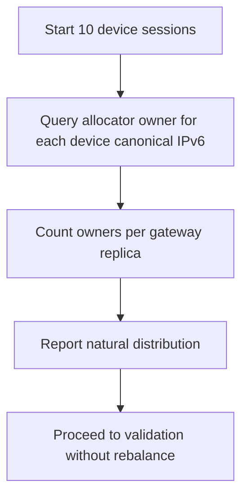

## Execution

Run from the repository root:

```powershell
powershell -NoProfile -ExecutionPolicy Bypass -File .\tools\tests\openssh\test-cmxsafe-k8s-iot-fanout.ps1
```

Useful parameters:

| Parameter | Default | Meaning |
| --- | --- | --- |
| `GatewayReplicas` | `2` | Number of gateway replicas used by the test. |
| `DeviceCount` | `10` | Number of IoT device endpoint pods. |
| `ServicePort` | `9000` | Known service port used end to end. |
| `GatewayGwTag` | `9101` | Gateway tag used to derive canonical identities. |
| `CanonicalGatewayMac` | `f6:db:2b:39:78:94` | Stable identity-root MAC embedded into canonical IPv6 usernames and mirrored into allocator settings. |
| `IoTMacPrefix` | `02:10:00:00:00` | Prefix for generated IoT device MACs. |
| `PlatformMac` | `02:20:00:00:00:01` | MAC identity for the IoT platform service. |
| `CleanupEndpointResources` | disabled | Deletes temporary endpoint pods, secrets, and ConfigMap at the end. |

To clean endpoint resources automatically after the run:

```powershell
powershell -NoProfile -ExecutionPolicy Bypass -File .\tools\tests\openssh\test-cmxsafe-k8s-iot-fanout.ps1 -CleanupEndpointResources
```

## Validation Criteria

The test fails immediately if any validation check fails.

It validates:

- the gateway deployment has 2 ready replicas
- the patched Portable OpenSSH bundle is staged into the runtime PVC
- canonical users exist and have generated private keys
- dashboard reconcile succeeds
- endpoint `endpointd` sockets are ready
- platform telemetry service answers on `::1:9000`
- platform reverse forwarding rejects a non-canonical listen address for the platform user
- platform reverse session gets an authoritative canonical IPv6 on one gateway replica
- each device session gets its own authoritative canonical IPv6 on one gateway replica
- device session distribution is reported as it naturally lands through the Service
- all devices can post telemetry to `http://[platform-canonical-ipv6]:9000/message`
- the platform service observes the expected device canonical IPv6 for each device
- the platform service decodes the expected device MAC from that source IPv6
- the platform service returns the expected message content
- after moving the platform session to the other gateway replica, all devices still reach the service

The success output ends with a table similar to:

```text
CMXsafe IoT fan-out test passed.
Platform canonical IPv6: 9101:f6db:2b39:7894:0:220:0:1
Initial platform gateway pod: portable-openssh-busybox-...
Moved platform gateway pod:   portable-openssh-busybox-...

DevicePod             DeviceMac          DeviceIPv6                   ObservedPort Content
---------             ---------          ----------                   ------------ -------
cmxsafe-iot-device-01 02:10:00:00:00:01  9101:f6db:2b39:7894:0:210:0:1        47424 initial telemetry from ...
...
cmxsafe-iot-device-10 02:10:00:00:00:0a  9101:f6db:2b39:7894:0:210:0:a        41184 initial telemetry from ...
```

The exact observed source ports vary on each run because they are real ephemeral ports.

## Performance And Timing

This test measures end-to-end orchestration and correctness, not maximum dataplane throughput.

The live validation run on the local Docker Desktop Kubernetes environment completed in about 5 minutes. That time includes:

- applying manifests
- building or reusing the patched OpenSSH bundle image
- exporting and staging the bundle into the runtime PVC
- restarting the gateway deployment twice
- reconciling dashboard-rendered user state
- deploying 11 endpoint pods
- starting 11 SSH control-master sessions
- installing 11 forwarding rules
- reporting natural device session distribution
- moving the platform reverse session
- validating all 10 devices before and after the move

Most of that time is bootstrap and orchestration cost. It is not representative of steady-state forwarding latency.

In steady state, the performance-relevant path is:

1. device application connects to local `platform-canonical-ipv6:9000`
2. patched SSH local forward carries the flow to the device gateway replica
3. gateway routes to platform canonical IPv6 on `net1`
4. platform gateway replica delivers through the reverse SSH session
5. platform service receives the request with device canonical source identity

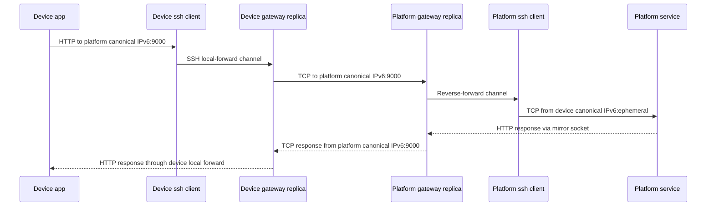

The response leg is important: the platform application can answer from its local service socket, but the gateway-side TCP response is emitted from the authenticated platform reverse listener, not from an arbitrary endpoint-selected address.

## Why The Readiness Checks Matter

During development, two races were found and fixed in the harness.

### JSON spacing in allocator polling

The gateway forced-command hook initially looked for compact JSON patterns such as `"pod_uid":"..."`.

The allocator returns normal JSON with spaces, such as `"pod_uid": "..."`.

The hook now accepts normal JSON spacing when checking:

- `pod_uid`
- `last_applied_at`

### Address visibility before remote bind

The allocator can report an assignment as applied before the harness attempts the next SSH action, but remote-forward listener creation is sensitive to the exact moment the kernel exposes the `/128` on `net1`.

The harness therefore waits for both:

- allocator ownership
- `ip -6 addr show dev net1` visibility inside the selected gateway pod

That is why the remote listener can reliably bind to `[platform-canonical-ipv6]:9000`.

## What The Test Does Not Prove

This test does not prove:

- maximum concurrent connection capacity
- long-duration soak stability
- raw throughput under saturation
- multi-node behavior
- multiple active platform instances sharing one canonical identity
- the full Security Context marking/filtering model described in the paper

Those are separate tests.

The intended ownership model remains:

- one authoritative platform canonical IPv6 owner at a time
- many endpoint-local mirrors are allowed
- many device identities can connect concurrently to that one platform service identity

The test is still useful for the SC work because it proves the required ConnID material exists at the right socket boundaries. Once SC marking and filtering are layered on top, the policy engine can key its rules on the same source identity and protected service socket demonstrated here.

## Cleanup

By default, endpoint pods are left running so they can be inspected after the run.

To remove only the fan-out endpoint resources:

```powershell
kubectl delete pod,secret,configmap -n mac-ssh-demo -l cmxsafe-test=iot-fanout --ignore-not-found=true
```

Or rerun the script with:

```powershell
powershell -NoProfile -ExecutionPolicy Bypass -File .\tools\tests\openssh\test-cmxsafe-k8s-iot-fanout.ps1 -CleanupEndpointResources
```

## Related Documents

- [portable-openssh-canonical-routing.md](./portable-openssh-canonical-routing.md)
- [explicit-ipv6-apply-move-pipeline.md](./explicit-ipv6-apply-move-pipeline.md)
- [portable-openssh-dashboard.md](./portable-openssh-dashboard.md)
- [busybox-portable-openssh.md](./busybox-portable-openssh.md)
